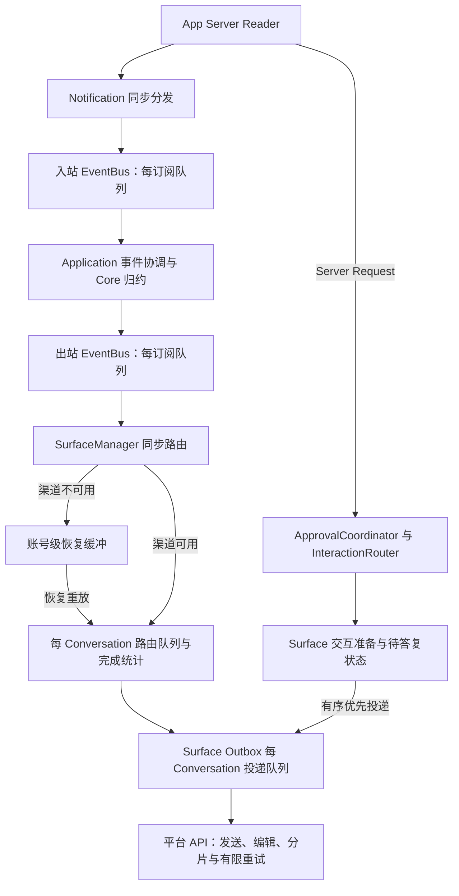
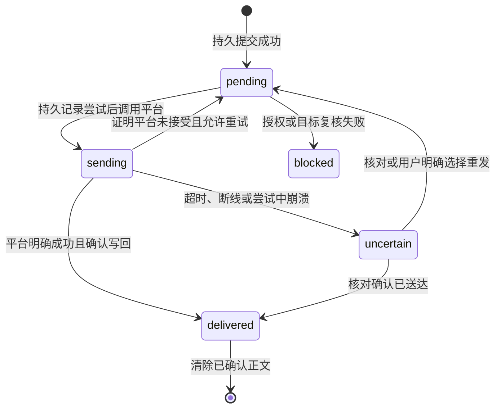

# 关键输出积压链路审查

状态：2026-09-27 链路审查完成；跨层思考快照合并和完整交互期限已提交，定向复查及完整门禁通过。用户随后要求关键结果跨重启保留，硬预算阶段转为先设计有限磁盘投递箱，草案待批准，尚未实现持久化。模块化结构整理已收尾，见[模块审查记录](modularity-review.md)。本专题仅处理关键输出积压、交互等待和投递反馈，不继续扩展模块拆分。

## 结论

风险来自多级内存队列的叠加，不能只给一个 `push()` 增加硬上限。当前实现保护关键输出不因普通容量耗尽而被丢弃，但不保证关键积压有硬上界，也不保证已入队消息已被平台确认。持续终态输入、渠道长时间不可用、平台慢响应和路由富化等待都可能造成积压。

审查时 SurfaceManager 的运行中路由没有使用合并键，同键思考快照全部排队，下游 Outbox 的合并无法消除上游内存。本批已联合出站总线和运行中路由修复这一缺口，区分思考分段、首条状态与终态；未改变故障缓冲的最新状态策略。纯关键输出的硬预算和跨重启保留仍待持久化方案实施，不能把快照合并当作全链路治理完成。

## 两条主链路



Reader 不等待平台网络请求。JSON-RPC Response 直接关联 pending 请求；Notification 发布到总线；Server Request 单独派发异步任务。入口见 [json-rpc.ts](../src/codex-client/json-rpc.ts) 的 `handleMessage` / `dispatchServerRequest` 与 [组件图](../src/bootstrap/gateway-component-graph.ts) 的 `startInternal`、入站订阅。

审批请求并不是普通 OutputEvent；`serverRequest/resolved` 通知通过入站订阅失效交互。不能靠删除输出队列中的消息替代协议拒绝或取消。

## 修复前的各层容量、所有权与反馈

| 层 | 现有约束 | 审查结论与代码入口 |
| --- | --- | --- |
| Reader / Server Request | 默认同时处理阈值 64；超限显式返回错误，Reader 不等待请求处理 | [json-rpc.ts](../src/codex-client/json-rpc.ts)。拒绝响应任务同样被跟踪，64 是业务处理准入阈值，不应宣称所有待发送响应任务绝对不超过 64 |
| 入站 EventBus | 组件图配置容量 2,000，每个订阅单独排队 | [event-bus.ts](../src/event-bus/event-bus.ts)。除 `/delta`、`/outputDelta` 外的通知按关键处理；普通满载可丢，纯关键可超过容量 |
| 出站 EventBus | 配置容量 1,000，每个订阅独立队列；消费者异常记录后继续 | Core 通过 [events.ts](../src/conversation-core/events.ts) 的 `isCriticalOutputEvent` 分类；最终正文、完成、警告及多类状态为关键。多个订阅分别持有排队条目，不一定复制载荷内容，但都会延长载荷存活 |
| 不可用 Surface 恢复缓冲 | 每账号数组；默认 100 条告警，达到十倍阈值后淘汰白名单过程/状态；思考按键合并 | [surface-manager.ts](../src/bootstrap/surface-manager.ts) 的 `bufferPendingOutput` / `shedBacklogOutput`。全部为结果/错误时继续增长，十倍阈值不是总条目硬上限 |
| 运行中 Surface 路由队列 | 每 Conversation 默认 200，完成统计读取共享 250 ms 预算，账户查询另有预算 | `deliverOutput` 每个事件入队；未传 `decision.coalesceKey`。等待只影响本会话，但同会话关键快照仍可增长。跨会话 worker 数也没有总量预算 |
| 渠道 Outbox | 复用 [ConversationDeliveryQueue](../src/surfaces/conversation-delivery-queue.ts)，默认每会话 200；同会话串行，不同会话并发 | 关键项超过容量继续保留。正文缓冲/卡片数/分片数限制只约束单条或活动流，不能推导出整个进程的字节上界 |
| 平台 API | 平台实现有超时及受控重试；结果未知禁止盲目重发 | [Telegram 执行器](../src/surfaces/telegram/api-executor.ts)、[飞书 Client](../src/surfaces/feishu/client.ts)、[微信 Outbox](../src/surfaces/weixin/outbox.ts)。有限单次调用不等于有限排队时间，不能靠增加重试次数治理积压 |
| 交互 | InteractionRouter 默认容量 100，Surface PendingInteractionRegistry 默认容量 100；不可用时安全拒绝；同会话串行调度 | [interaction-router.ts](../src/approval/interaction-router.ts)、[pending-interaction-registry.ts](../src/surfaces/pending-interaction-registry.ts)。容量约束有效，但优先发送只排在既有关键项之后，积压会延长占用 |

关键性在各层并不完全相同：例如 Core 将 `turn.started` 视为可丢弃，微信投递策略再将其视为关键；下游提升关键级别不能补救上游已经丢弃的事件。这是后续调整预算必须核对的分层合同，不能直接把某一层的 critical 值当作端到端承诺。

基础行为见 [bounded-queue.ts](../src/event-bus/bounded-queue.ts)：`push` 满载先淘汰一个非关键项；若全是关键项则继续追加。`pushPriority` 保留既有关键项的顺序，优先于非关键项。合并只影响仍在等待的同键条目，不影响在途任务。

## 审查时发现与优先级

1. **P1：关键输出无端到端数量/字节预算。** EventBus、恢复缓冲和两级 Conversation 队列都可保留超容量关键项。不同会话不断出现时，单会话容量也不足以约束总体占用。风险是慢消费者或长时间故障下进程内存持续增长；本次没有模拟 OOM，也不声称测得生产故障阈值。
2. **P1：运行中路由未应用合并策略。** `resolveSurfaceDelivery` 返回 `coalesce` 与 key，但 `deliverOutput` 只传 critical。完成统计等待期间，同键思考快照全部滞留路由层。EventBus 同样不支持按事件键合并，修复路由层不能被当成全链路治理完成。
3. **P1：交互发送前等待缺乏独立期限。** [Telegram](../src/surfaces/telegram/interactions.ts) 和 [飞书](../src/surfaces/feishu/interactions.ts) 在准备消息成功后才启动 `expiresInMs` 答复计时；`waitForInteractionPreparation` 只竞争准备完成与取消信号，没有超时。InteractionRouter 等待前一交互的队列也没有排队计时。关闭、断线或已被其他客户端处理时仍可取消，但不能把答复期限当作全链路期限。微信在发送前已建立计时器，三渠道不能机械统一改动。
4. **P1 设计约束：缺乏跨层投递结果反馈。** `EventBus.publish` 返回 void；`SurfaceOutputPort.handle` 通常只把任务放入 Outbox。SurfaceManager 的“已提交到 Surface 队列”不是平台确认。普通发送失败在队列诊断边界记录后继续，不能据此自动重放原事件，否则分片部分成功或结果未知时会重复发送。`runOrdered` 可反馈其调用结果，但也没有账号整体健康或预算反馈协议。
5. **P2：容量术语会误导修复。** Surface 恢复缓冲部分注释、README 和测试名称使用“硬上限”，实际只对可淘汰过程事件执行减载。实现与既有“结果始终保留”测试一致；后续应先修正术语，再讨论真正硬边界。
6. **P2：关闭不是可靠投递保证。** SurfaceManager 停止时清空恢复缓冲；投递队列取消有序交互，默认取消普通在途操作，允许排空的队列最多等待配置期限，超时记录未投递数量并清理。恢复数组清空处未提供逐项未投递结算。所有缓冲都在内存，不支持 Gateway 重启后原样重放。

## 修复前隔离复现与验证

使用临时 Node/tsx 夹具直接调用本地队列和 SurfaceManager，Surface 的启停、输出均为内存桩；没有连接 App Server、平台或当前用户账号。检查私有队列仅用于本次只读审查取证，不新增生产观察接口。

| 场景 | 输入 | 观察 |
| --- | --- | --- |
| 纯关键基础队列 | capacity=2，同步压入 10,000 条关键项 | size=10,000 |
| 不可用 Surface 仅收到终态 | 告警阈值=1，减载阈值=10，发送 1,200 个不同 Turn 完成事件 | 启动前恢复数组为 1,200，启动后夹具收到全部 1,200 |
| 运行中同键思考积压 | 前一 Turn 完成统计等待可控 Promise；后一 Turn 同键思考快照 1,000 条 | 路由队列等待项为 1,000，释放等待后夹具收到全部 1,000；证明该层未合并，不证明真实平台发送了 1,000 条 |

这些是确定性容量/顺序复现，不是吞吐、内存基准或渠道实机压力测试。代码证据另有可长期复跑的既有合同：

```bash
./node_modules/.bin/vitest run tests/bounded-queue.test.ts \
  tests/conversation-delivery-queue.test.ts tests/surface-manager.test.ts \
  tests/interaction-router.test.ts
```

结果：4 个文件、107 项通过。覆盖关键项溢出保留、优先项顺序、同键合并、会话隔离、恢复顺序、不可用时交互拒绝和关闭取消；基础队列既有测试还明确验证 150,001 个关键项可同时保留。没有把这些“现状合同通过”误写成“积压问题已经解决”。

## 下一阶段处理顺序与验收

| 阶段 | 工作 | 验收与边界 |
| --- | --- | --- |
| A：完成链路审查 | 本文、容量层级、隔离复现、现有保护与缺口 | 已完成；本提交只变更文档 |
| B：跨层治理可合并的中间快照 | 联合出站 EventBus、运行中路由、恢复缓冲和 Outbox 定义思考分段及合并规则；修正“硬上限”术语 | 保留首条可见状态、每段 final、段间顺序以及正文/Turn 完成；慢富化、故障重放、跨会话及关闭均需合同测试。不得直接用默认 key 覆盖上一段终态，也不得将上游积压转移到下游 |
| C：限制交互准备等待 | 明确 Router 排队、Surface 准备、用户答复三个阶段的时限与取消归属 | 超时安全拒绝，移除尚未发送项；迟到完成不能恢复过期交互。保留单次授权、外部 resolved 失效和同会话关键顺序；不将普通积压等同于已批准 |
| D：设计全链路预算与过载反馈 | 定义账号/会话的数量、字节、最老等待时间和减载状态，区分路由接受与平台确认 | 不能只把积压转移到上一级，不能让 Reader 等待平台；新输入准入不能阻止原生 TUI、已运行 Turn 或后台任务继续产生事件，必须覆盖这些来源 |
| E：压力及恢复验证 | 慢 API、断网、纯终态、持续新会话、交互插入、关闭、恢复重放、未知结果 | 检查上界、事件去向、关键顺序、取消与不重复发送；平台交互/协议行为如有变化，按对应锁定来源和合同验证 |

D 阶段尚有必须明确的产品合同：无限持续关键输入、有限内存、Reader 不阻塞和所有输出最终可靠送达不能在下游无限期不可用时同时保证。需要明确超载时哪些请求被显式拒绝、已接受结果如何结算以及哪些结果可由 App Server 权威历史恢复。并非所有警告或交互都能从历史重建。不能擅自新增持久消息正文队列、写入 StateStore、重放未知结果、自动终止共享 App Server，或以删除绑定冒充恢复。

本审查未决定新的容量配置或持久化格式。根据后续要求，实施按关联链路推进，B/C/D 的合同需联合审查，代码仍可分批提交；真正的硬上界治理不得提前宣布完成。

## 过载方案补充：待确定的设计合同

用户未选择“触及硬上限后停止整个 Gateway”或“保留全部关键项并接受无限增长”，而是要求评估更好的可引入机制。以下为设计建议，尚未实施，不代表用户已经授权新增持久化或允许丢弃关键输出。

优先评估分层限额、渠道故障隔离和权威状态恢复的组合：

1. 会话、渠道账号和进程共同计量排队项与在途任务，分别考虑数量、载荷大小和等待时间。仅对单个队列设限不足以保护整体；载荷计量也不等于 JavaScript 堆内存精确上界。
2. 慢渠道先进入降级状态，限制该渠道新执行请求并安全取消超时交互，其他渠道继续工作。原生 TUI、已有 Turn 和后台任务仍可能产生输出，准入限制不能替代输出过载处理。
3. 对当前受支持 App Server 查询能重建的状态，评估只保留有限恢复标记，恢复后重新查询并明确呈现补查结果。标记本身也要有总量边界；具体事件是否可重建必须逐类验证，不能把全部输出都归为可恢复。补查不等于重放原始事件，不能宣称原消息已经送达。
4. 投递结果至少区分待发送、平台确认成功、明确失败和结果未知；结果未知不得自动重发。审批取消必须沿原 Server Request 返回安全决定，不能在恢复后重新授权。
5. 对不可重建的关键输出，仍需确定最终过载合同。失败结算和告警能避免静默丢弃，但不能等价替代现有关键输出保留承诺。日志只记录脱敏身份、类别和数量，不落正文。

可选的独立磁盘投递箱只能扩大有限故障窗口，不能解决无限输入，也不能保证平台恰好收到一次。若决定采用，必须先明确允许持久化的最小载荷范围、容量与保留期限、凭据和审批内容排除、目录权限与敏感内容保护、确认与未知结果处理、备份、格式升级失败恢复及回滚；不能写入 StateStore 或形成完整会话历史副本。此选项目前仅评估，不新增依赖、配置或存储格式。

不依赖最终过载选择的工作仍可推进：跨层快照合并、Router 排队至 Surface 准备及答复的统一期限、取消传播和迟到结果失效测试。全链路压力验收必须覆盖纯终态、持续新会话及恢复标记本身的积压，不能只测试可合并快照。

## 模块与依赖选型评估

检查现有依赖、EventBus、ConversationDeliveryQueue 和 Surface 诊断接口后，当前建议优先补齐现有链路合同，暂不替换队列或新增外部服务。这是基于单进程本地 Gateway 的适配判断，尚未通过候选库原型或压力对比证明为最优方案。

| 候选 | 官方能力与适配判断 |
| --- | --- |
| [p-queue](https://github.com/sindresorhus/p-queue) | 提供并发、优先级、限速及取消接口，但操作超时从开始执行计，不包含排队。无法直接替代本项目完整交互期限、思考分段合并和关键顺序合同，当前替换收益不足 |
| [Bottleneck](https://github.com/SGrondin/bottleneck) | 提供限速、并发及队列高水位策略；部分策略丢弃已有任务。适合独立评估平台限速需求，不能把通用溢出策略直接用于关键输出 |
| [Cockatiel](https://github.com/connor4312/cockatiel) | 提供熔断、超时、重试及并发隔离；可在渠道调用保护复杂度确实上升时评估。当前已有重试和取消路径，必须避免重复策略和额外排队，不自动重试结果未知的写操作 |
| [BullMQ](https://docs.bullmq.io/) | 基于 Redis，提供分布式任务与崩溃恢复；官方说明最坏情形仍为至少一次投递。当前采用会新增外部服务、任务持久化和部署责任，也不能保证平台消息不重复；暂不采用 |

模块落点先保持现有顶层边界：通用预算记账能力放在 `event-bus` 内独立文件，Surface 事件分类、账号投递健康和反馈放在 `surfaces`，交互期限与排队取消归 `approval`，Bootstrap 只负责装配和生命周期。预算对象必须跨相关队列共享，并明确转交、合并、完成、取消和失败时的释放规则，不能每层独立计数后宣称全局有界。是否需要单独顶层模块，取决于实施后实际公共接口和依赖方向，不预建通用可靠性框架。

权威状态恢复暂列后续设计：先逐类验证可重建内容、部分发送和未知结果，再决定是否实施；不能把这一项未经验证的机制作为第一批容量修复的可靠性保证。现有 `pino`、Surface 投递身份与阶段诊断可先用于验证反馈，现有 `fast-check` 可用于预算守恒和取消顺序的性质测试，不因本次审查新增观测或测试依赖。


## 本批实施与复查进度

- 出站 EventBus 支持注入合并键选择器，Bootstrap 注入 Surface 的分段策略；运行中 SurfaceManager 路由复用同一策略。首条状态独立，后续等待快照可被同段 final 替换，final 与同会话其他事件构成顺序边界。分段元数据最多 1,000 个 Conversation，淘汰不会复用旧键。
- 故障缓冲继续采用现有最新状态策略；Telegram/飞书 Outbox 继续保留自身消息创建、编辑和分段生命周期。基础队列保护关键项的溢出合同未改变，没有提前声称纯关键输出已有硬上界。
- InteractionRouter 使用单调时钟从请求进入开始计时，向 Surface 传剩余期限，覆盖 Router 排队、Outbox 准备与用户答复；超时复用现有取消链路。接受结果前检查截止时间，防止事件循环拥塞时迟到批准先于计时器回调生效。
- 三渠道真实 Outbox 加内存平台夹具已验证排队中和发送中超时、取消后的标识复用；真实隔离 App Server 已验证渠道取消、Thread 取消和准备期超时均返回 MCP cancel（3 项通过）。首次沙箱执行因私有 Socket 目录检查失败，提升执行权限后通过；未操作当前共享 App Server。
- 慢路由 1,000 条快照测试覆盖总线合并启用和关闭两种情况，两种情况下均保留首条、终态、下一段及最终正文。它验证队列语义，不是物理内存基准或真实平台吞吐测试。
- 共享硬预算与持久化尚未实施，按下述设计推进。开发测试发现并修复严格可选属性类型错误及夹具微任务调度假设；类型检查、受影响代码 Lint、文档检查及相关队列/渠道/模块边界定向测试通过。
- 修复提交 `69113242` 的正常 pre-commit 全部门禁通过：344 个测试文件通过、10 个跳过；4,481 项通过、98 项跳过；另有类型/版本、生产与测试 Lint、WebUI 构建及 Lint、翻译字典、文档索引、Shell 与 tarball 安装冒烟通过。3 项真实 App Server 审批合同另行显式启用运行通过；全量默认跳过的真实环境合同不算通过。源码全局安装与真实平台实机验收不在本批范围。

## 有限磁盘投递箱设计草案

状态：用户已明确要求“关键结果必须跨重启保留，先设计有限磁盘投递箱”。这取代先前将磁盘投递箱列为可选后续工作的建议；目前只授权设计，未创建数据库、密钥、持久载荷或新配置。

### 保证范围与不能混淆的确认

目标是保留已经成功提交到投递箱的未确认关键结果，直到平台确认、或用户明确处理；Gateway 正常重启和进程崩溃不清空这些结果。记录不得因超过保留天数、重试次数或容量而自动删除。已确认正文及时清除，投递箱不提供完整历史查询。

必须区分：收到协议通知、生成输出事件、持久事务提交、开始平台请求、平台确认以及确认写回成功。只有事务成功才可标记“已持久接收”；现有 EventBus.publish 和 SurfaceOutputPort.handle 均不提供这个保证。未持久提交的内存事件在崩溃时仍可能丢失，不能宣传从 App Server 产生事件那一刻起零丢失。

当前协议链路没有逐条通知的持久接收确认或任意位置重放合同。有限磁盘写满后，即使停止渠道新输入，原生 TUI 和已运行 Turn 仍会产出结果。投递箱能保护已接收记录，不能保证无限输入的全部新结果都被接收。这是实施前需要接受的可靠性边界，不可用增加磁盘容量掩盖。

### 建议模块与技术选择

新增独立顶层 `delivery` 模块具有实际职责依据：拥有待投递结果的持久状态、额度、顺序、租用与确认；不拥有 Thread 状态、业务绑定、平台 SDK 或授权规则。与前一阶段纯内存方案相比，持久任务生命周期已形成需要独立维护的边界。

- Core 继续产生平台无关输出，不导入数据库。
- Bootstrap 装配持久接收入口、Worker、Surface 投递器及授权复核回调；不把持久业务状态机塞进组合根。
- `delivery/index.ts` 提供窄接口和结果联合：持久接收成功、容量拒绝、存储故障；内部 SQLite Worker 拥有连接和事务，禁止外部跨目录读取实现。
- Surface 为关键结果提供可等待实际投递结果的专用接口，保留普通中间状态的同步 handle。平台发送、分片、消息 ID、错误分类和可重试判断留在 Surface。
- StateStore 不改 schema、不存正文；投递箱只保留确认目标所需身份快照，恢复时通过 Application/现有授权接口复核，不能用旧快照自行授权。
- 依赖允许表在实施时依据上述方向调整；本草案不提前放宽模块边界。

首选现有运行环境的 `node:sqlite` 和 Node Worker，不增加 Redis 服务或 npm 数据库依赖。项目已使用 DatabaseSync，但该接口同步执行，因此磁盘事务必须放入独立 Worker，不能直接放在 Reader 主线程。[Node SQLite 文档](https://nodejs.org/api/sqlite.html)说明同步执行特性；实现只使用项目最低 Node 22.13.0 已提供的接口，不能照搬当前文档的新 API。

建议单写者、独立数据库和 rollback journal，明确设置耐久同步模式；SQLite 事务只解决本地提交，不能与平台网络发送形成原子事务。同步模式、日志及目录同步行为须根据运行平台验证，参见 [SQLite synchronous](https://www.sqlite.org/pragma.html#pragma_synchronous)。初版不引入分布式锁、Redis、通用工作流引擎或自动任务重试框架。

### 数据边界与最小记录

独立投递箱存放于用户数据目录，远离 npm 替换的安装目录。拟定记录字段：schema/载荷格式版本、随机 deliveryId、账号/Conversation、Workspace/Provider/Actor 归属快照、Thread/Turn/Item 标识、每会话顺序号、事件类别、创建时间、持久状态、尝试标识、确认的分片位置及必要平台消息 ID。

载荷不是整个原始 OutputEvent 的无条件 JSON 副本。逐类定义受控投递载荷，包含重启后重建同一结果所必需的正文、完成统计和展示字段；不读取 Codex 内部 session 文件补全载荷。第一版分类必须覆盖全部 OutputEvent 联合，新增类型未分类时拒绝进入可靠投递入口，不能默认为可丢弃。

| 类别 | 设计处理 |
| --- | --- |
| 最终正文、Turn 完成、操作终态、子代理完成、结果类警告及通知 | 逐类定义最小持久投递载荷；不可只存 Thread ID 后宣称原始结果已保留 |
| text delta、思考/计划中间状态、可替换健康与额度快照 | 保留内存合并策略，不建立永久历史；关键性和可持久恢复性分别分类 |
| 审批、权限授予、用户输入、MCP elicitation 请求 | 不保存可恢复授权或交互正文；进程关闭和期限结束沿原协议安全取消，不在重启后重新激活 |
| 图片、文件等依赖临时本地路径的结果 | 只保存路径不能保证恢复；必须将必要文件快照纳入同一总预算，或明确列为尚未支持的恢复能力，不能静默降低保证 |
| 凭据、OAuth Token、Cookie、Authorization、未受控内部异常 | 禁止进入载荷、索引、错误记录和日志 |

原始结果正文可能包含用户私密内容，采用独立密钥的 AES-256-GCM 载荷加密，关联身份、版本和 deliveryId 纳入认证附加数据；不复用渠道 OAuth Token。目录与数据库/密钥使用当前用户私有权限，Windows 采用当前 SID ACL。密钥管理、备份和轮换需与载荷格式共同验收，缺失或损坏时失败关闭，不能生成新密钥覆盖旧密钥。索引身份元数据仍有隐私属性，不宣称整个数据库均为密文。

### 状态、顺序与投递确认



每个 Conversation 按持久顺序号发送，其他 Conversation 可并行，Worker 和平台执行槽都有限额。分片发送必须在每个已确认分片后记录进度；只重试已证明未送达的部分。进程在平台成功与本地确认之间崩溃时记录归为 uncertain，不自动重发整条。没有可靠平台查询或幂等能力时，保留数据并要求明确处理，不能声称恰好一次投递。

uncertain 默认阻止同会话后续有序关键结果越过它；其他会话继续。恢复后复核当前账号、Actor、Workspace、Provider 和绑定关系；配置变化、撤权或 Thread 已转移时转为 blocked，旧结果不得跟随新绑定发给另一会话。未确认记录只在明确处理或确认送达后删除。

### 有限容量与磁盘故障

以下为待压力验证的初始设计值，不是已生效的配置：全局未确认载荷 256 MiB / 20,000 条，单账号 64 MiB / 5,000 条，单条载荷 4 MiB，主线程到 Worker 的待提交窗口 8 MiB / 128 条；附件计入全局和账号载荷额度。80% 高水位先限制新执行请求，低于 60% 才恢复，避免频繁切换。单条超限不能截断后标为成功。

载荷额度不等于物理磁盘上界。实施需要另外预算数据库页、索引、rollback journal、加密开销、附件临时文件及升级备份；候选数据库页预算 512 MiB，另留同量日志空间和至少 64 MiB 控制余量，备份独立预检额外空间。额度检查和记录插入同事务，控制状态更新也要有预留空间；空闲磁盘检查只是提前预警，最终以写入和同步结果为准。

Worker 邮箱必须先申请主线程额度再 postMessage，限制复制和等待确认的载荷，不能把内存积压移入消息端口。账号额度耗尽只影响该账号；全局数据库不可写或磁盘满时暂停所有依赖它的可靠接收及新执行输入，保留现有数据库并暴露明确故障。审批安全取消；不杀共享 App Server、不删除绑定、不删除未确认数据腾空间。

尚未持久提交的输出不得继续无限留在内存。达到待提交窗口上限时必须停止相关实时订阅接收或停止 Gateway 自身消费，并明确记录覆盖缺口；Reader 不得等待平台调用。停止订阅不会停止上游生成结果，缺口不能承诺全部恢复。这一条是方案的硬边界，需要在实施批准时明确接受。

### 数据建立、备份、升级、失败恢复和回滚

1. 首次启用只创建新的投递库及独立密钥，不转换 StateStore，不自动导入旧进程内存。启用前说明无法补回此前未保存的输出。
2. Runtime 只接受当前 schema 和载荷版本；未知版本、认证失败、数据库损坏均失败关闭，保留原文件，不自动迁移或删除。
3. 初版采用停写备份：暂停准入、等待 Worker 当前事务完成、关闭连接后备份完整数据库和附件，密钥独立备份；记录校验值并实际做隔离恢复验证。不能复制正在写入的单个主库文件冒充一致备份。[SQLite 备份说明](https://www.sqlite.org/backup.html)可用于后续在线备份评估，初版不依赖较新 Node backup API。
4. 未来每次升级明确支持的旧版本范围。先空间预检和停写备份，在副本完成显式迁移、完整性/载荷解密/计数/顺序检查，再原子替换；失败保留旧库和旧程序可读版本。
5. 升级后尚未恢复投递时可还原备份与旧程序。已发生新的平台投递后不能直接还原旧快照自动重发；必须暂停发送、核对确认记录，将无法确认的尝试转 uncertain 后再恢复，避免回滚造成重复消息。
6. 停用功能或卸载不能自动清空未确认投递箱。先展示待处理数量，明确完成、导出或人工清理方案；日志及普通状态命令只展示身份和计数。

### 实施批次与验收门槛

1. 批准数据范围、容量/满盘合同及备份回滚方案后，先实现 `delivery` schema、加密、Worker 窗口和离线崩溃恢复测试，不连接真实用户账号。
2. 接入全部关键输出生产入口及 Surface 实际投递确认；普通内存 handle 与可靠入口必须有明确分类，不能只有 Core 主入口持久化而遗漏 Bootstrap、后台任务或通知来源。
3. 联合实现共享内存预算、账号准入与持久存量计量，覆盖合并、取消、交接、失败和关闭。已有未送达关键记录不按 TTL 清理。
4. 平台幂等、消息查询或分片恢复能力逐渠道查锁定官方来源和测试，按实际能力处理 uncertain；不为恢复私自增加协议能力。
5. 故障注入覆盖：提交前/提交后 kill、平台调用前/确认前/确认写回前 kill、部分分片、同会话顺序、跨账号隔离、持续新会话、磁盘满、权限拒绝、密钥丢失、库损坏、旧 schema、授权撤销、附件消失、备份恢复和回滚。纯终态测试必须验证记录可重启读取，不能只核对日志数量。

本草案仍待持久化方案批准，不安装依赖、不新增数据库、不修改用户数据。当前已实施的内存合并与交互期限可独立交付，不构成跨重启可靠投递已完成。
