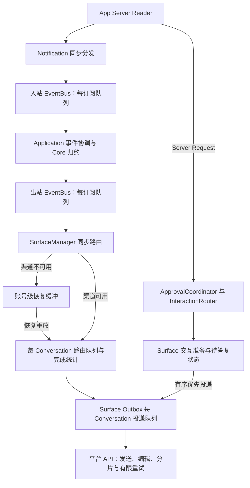

# 关键输出积压链路审查

状态：2026-09-27 第一阶段链路审查完成，尚未实施队列行为修复。模块化结构整理已收尾，见[模块审查记录](modularity-review.md)。本专题仅处理关键输出积压、交互等待和投递反馈，不继续扩展模块拆分。

## 结论

风险来自多级内存队列的叠加，不能只给一个 `push()` 增加硬上限。当前实现保护关键输出不因普通容量耗尽而被丢弃，但不保证关键积压有硬上界，也不保证已入队消息已被平台确认。持续终态输入、渠道长时间不可用、平台慢响应和路由富化等待都可能造成积压。

发现一项可先局部治理的缺口：SurfaceManager 的运行中路由计算了合并键，却没有传给路由队列；同键思考快照会先在该层全部排队，下游 Outbox 的合并不能消除上游已占用的内存。修复须区分思考分段、首条状态与终态，不能直接把故障缓冲的合并规则套到正常流。

## 两条主链路



Reader 不等待平台网络请求。JSON-RPC Response 直接关联 pending 请求；Notification 发布到总线；Server Request 单独派发异步任务。入口见 [json-rpc.ts](../src/codex-client/json-rpc.ts) 的 `handleMessage` / `dispatchServerRequest` 与 [组件图](../src/bootstrap/gateway-component-graph.ts) 的 `startInternal`、入站订阅。

审批请求并不是普通 OutputEvent；`serverRequest/resolved` 通知通过入站订阅失效交互。不能靠删除输出队列中的消息替代协议拒绝或取消。

## 各层容量、所有权与反馈

| 层 | 现有约束 | 审查结论与代码入口 |
| --- | --- | --- |
| Reader / Server Request | 默认同时处理阈值 64；超限显式返回错误，Reader 不等待请求处理 | [json-rpc.ts](../src/codex-client/json-rpc.ts)。拒绝响应任务同样被跟踪，64 是业务处理准入阈值，不应宣称所有待发送响应任务绝对不超过 64 |
| 入站 EventBus | 组件图配置容量 2,000，每个订阅单独排队 | [event-bus.ts](../src/event-bus/event-bus.ts)。除 `/delta`、`/outputDelta` 外的通知按关键处理；普通满载可丢，纯关键可超过容量 |
| 出站 EventBus | 配置容量 1,000，每个订阅独立队列；消费者异常记录后继续 | Core 通过 [events.ts](../src/conversation-core/events.ts) 的 `isCriticalOutputEvent` 分类；最终正文、完成、警告及多类状态为关键。多个订阅分别持有排队条目，不一定复制载荷内容，但都会延长载荷存活 |
| 不可用 Surface 恢复缓冲 | 每账号数组；默认 100 条告警，达到十倍阈值后淘汰白名单过程/状态；思考按键合并 | [surface-manager.ts](../src/bootstrap/surface-manager.ts) 的 `bufferPendingOutput` / `shedBacklogOutput`。全部为结果/错误时继续增长，十倍阈值不是总条目硬上限 |
| 运行中 Surface 路由队列 | 每 Conversation 默认 200，完成统计读取共享 250 ms 预算，账户查询另有预算 | `deliverOutput` 每个事件入队；未传 `decision.coalesceKey`。等待只影响本会话，但同会话关键快照仍可增长。跨会话 worker 数也没有总量预算 |
| 渠道 Outbox | 复用 [ConversationDeliveryQueue](../src/surfaces/conversation-delivery-queue.ts)，默认每会话 200；同会话串行，不同会话并发 | 关键项超过容量继续保留。正文缓冲/卡片数/分片数限制只约束单条或活动流，不能推导出整个进程的字节上界 |
| 平台 API | 平台实现有超时及受控重试；结果未知禁止盲目重发 | [Telegram 执行器](../src/surfaces/telegram/api-executor.ts)、[飞书 Client](../src/surfaces/feishu/client.ts)、[微信 Outbox](../src/surfaces/weixin/outbox.ts)。有限单次调用不等于有限排队时间，不能靠增加重试次数治理积压 |
| 交互 | InteractionRouter 默认容量 100，Surface PendingInteractionRegistry 默认容量 100；不可用时安全拒绝；同会话串行调度 | [interaction-router.ts](../src/approval/interaction-router.ts)、[pending-interaction-registry.ts](../src/surfaces/pending-interaction-registry.ts)。容量约束有效，但优先发送只排在既有关键项之后，积压会延长占用 |

关键性在各层并不完全相同：例如 Core 将 `turn.started` 视为可丢弃，微信投递策略再将其视为关键；下游提升关键级别不能补救上游已经丢弃的事件。这是后续调整预算必须核对的分层合同，不能直接把某一层的 critical 值当作端到端承诺。

基础行为见 [bounded-queue.ts](../src/event-bus/bounded-queue.ts)：`push` 满载先淘汰一个非关键项；若全是关键项则继续追加。`pushPriority` 保留既有关键项的顺序，优先于非关键项。合并只影响仍在等待的同键条目，不影响在途任务。

## 具体发现与优先级

1. **P1：关键输出无端到端数量/字节预算。** EventBus、恢复缓冲和两级 Conversation 队列都可保留超容量关键项。不同会话不断出现时，单会话容量也不足以约束总体占用。风险是慢消费者或长时间故障下进程内存持续增长；本次没有模拟 OOM，也不声称测得生产故障阈值。
2. **P1：运行中路由未应用合并策略。** `resolveSurfaceDelivery` 返回 `coalesce` 与 key，但 `deliverOutput` 只传 critical。完成统计等待期间，同键思考快照全部滞留路由层。EventBus 同样不支持按事件键合并，修复路由层不能被当成全链路治理完成。
3. **P1：交互发送前等待缺乏独立期限。** [Telegram](../src/surfaces/telegram/interactions.ts) 和 [飞书](../src/surfaces/feishu/interactions.ts) 在准备消息成功后才启动 `expiresInMs` 答复计时；`waitForInteractionPreparation` 只竞争准备完成与取消信号，没有超时。InteractionRouter 等待前一交互的队列也没有排队计时。关闭、断线或已被其他客户端处理时仍可取消，但不能把答复期限当作全链路期限。微信在发送前已建立计时器，三渠道不能机械统一改动。
4. **P1 设计约束：缺乏跨层投递结果反馈。** `EventBus.publish` 返回 void；`SurfaceOutputPort.handle` 通常只把任务放入 Outbox。SurfaceManager 的“已提交到 Surface 队列”不是平台确认。普通发送失败在队列诊断边界记录后继续，不能据此自动重放原事件，否则分片部分成功或结果未知时会重复发送。`runOrdered` 可反馈其调用结果，但也没有账号整体健康或预算反馈协议。
5. **P2：容量术语会误导修复。** Surface 恢复缓冲部分注释、README 和测试名称使用“硬上限”，实际只对可淘汰过程事件执行减载。实现与既有“结果始终保留”测试一致；后续应先修正术语，再讨论真正硬边界。
6. **P2：关闭不是可靠投递保证。** SurfaceManager 停止时清空恢复缓冲；投递队列取消有序交互，默认取消普通在途操作，允许排空的队列最多等待配置期限，超时记录未投递数量并清理。恢复数组清空处未提供逐项未投递结算。所有缓冲都在内存，不支持 Gateway 重启后原样重放。

## 隔离复现与现有验证

使用临时 Node/tsx 夹具直接调用本地队列和 SurfaceManager，Surface 的启停、输出均为内存桩；没有连接 App Server、平台或当前用户账号。检查私有队列仅用于本次只读审查取证，不新增生产观察接口。

| 场景 | 输入 | 观察 |
| --- | --- | --- |
| 纯关键基础队列 | capacity=2，同步压入 10,000 条关键项 | size=10,000 |
| 不可用 Surface 仅收到终态 | 告警阈值=1，减载阈值=10，发送 1,200 个不同 Turn 完成事件 | 启动前恢复数组为 1,200，启动后夹具收到全部 1,200 |
| 运行中同键思考积压 | 前一 Turn 完成统计等待可控 Promise；后一 Turn 同键思考快照 1,000 条 | 路由队列等待项为 1,000，释放等待后夹具收到全部 1,000；证明该层未合并，不证明真实平台发送了 1,000 条 |

这些是确定性容量/顺序复现，不是吞吐、内存基准或渠道实机压力测试。代码证据另有可长期复跑的既有合同：

```bash
./node_modules/.bin/vitest run tests/bounded-queue.test.ts \
  tests/conversation-delivery-queue.test.ts tests/surface-manager.test.ts \
  tests/interaction-router.test.ts
```

结果：4 个文件、107 项通过。覆盖关键项溢出保留、优先项顺序、同键合并、会话隔离、恢复顺序、不可用时交互拒绝和关闭取消；基础队列既有测试还明确验证 150,001 个关键项可同时保留。没有把这些“现状合同通过”误写成“积压问题已经解决”。

## 下一阶段处理顺序与验收

| 阶段 | 工作 | 验收与边界 |
| --- | --- | --- |
| A：完成链路审查 | 本文、容量层级、隔离复现、现有保护与缺口 | 已完成；本提交只变更文档 |
| B：先治理可合并的中间快照 | 为运行中路由定义思考分段规则，合并待处理同段快照；修正“硬上限”术语 | 保留首条可见状态、每段 final、段间顺序以及正文/Turn 完成；慢富化、故障重放、跨会话及关闭均需合同测试。不得直接用默认 key 覆盖上一段终态 |
| C：限制交互准备等待 | 明确 Router 排队、Surface 准备、用户答复三个阶段的时限与取消归属 | 超时安全拒绝，移除尚未发送项；迟到完成不能恢复过期交互。保留单次授权、外部 resolved 失效和同会话关键顺序；不将普通积压等同于已批准 |
| D：设计全链路预算与过载反馈 | 定义账号/会话的数量、字节、最老等待时间和减载状态，区分路由接受与平台确认 | 不能只把积压转移到上一级，不能让 Reader 等待平台；新输入准入不能阻止原生 TUI、已运行 Turn 或后台任务继续产生事件，必须覆盖这些来源 |
| E：压力及恢复验证 | 慢 API、断网、纯终态、持续新会话、交互插入、关闭、恢复重放、未知结果 | 检查上界、事件去向、关键顺序、取消与不重复发送；平台交互/协议行为如有变化，按对应锁定来源和合同验证 |

D 阶段尚有必须明确的产品合同：无限持续关键输入、有限内存、Reader 不阻塞和所有输出最终可靠送达不能在下游无限期不可用时同时保证。需要明确超载时哪些请求被显式拒绝、已接受结果如何结算以及哪些结果可由 App Server 权威历史恢复。并非所有警告或交互都能从历史重建。不能擅自新增持久消息正文队列、写入 StateStore、重放未知结果、自动终止共享 App Server，或以删除绑定冒充恢复。

本审查未决定新的容量配置或持久化格式。下一批先做 B 的局部修复，配套合同通过后再进入 C/D；真正的硬上界治理不得提前宣布完成。
