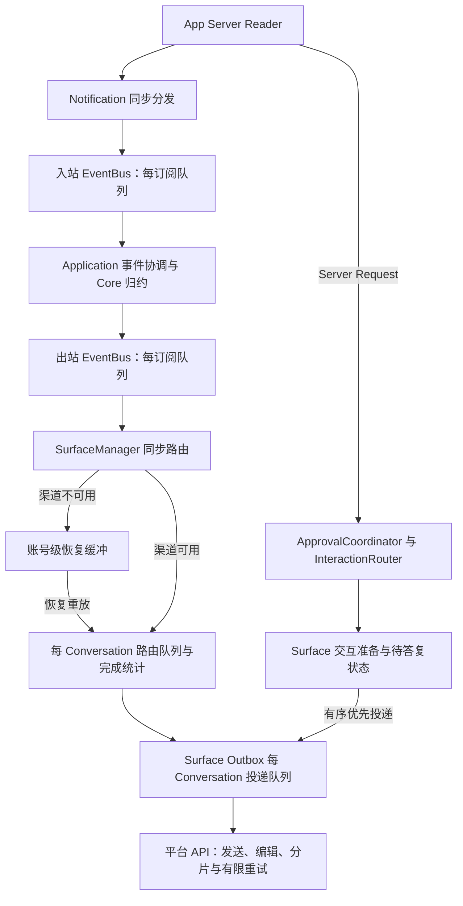
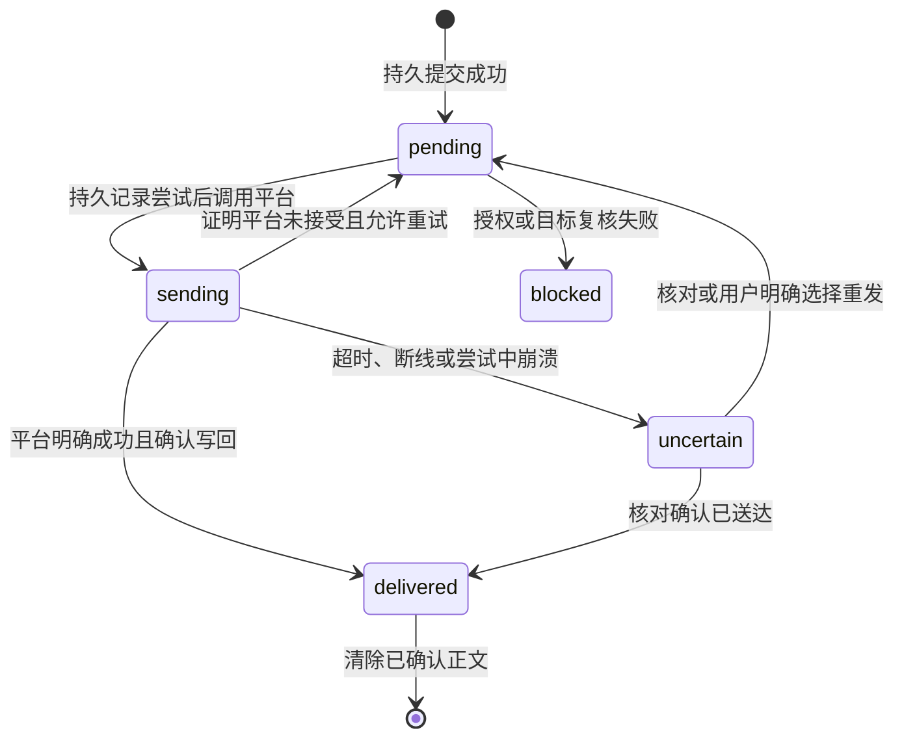

# 关键输出积压链路审查

状态：关键终态有限磁盘投递已实现，飞书和 Telegram 已完成各自限定范围的实机验收；2026-09-28 前轮三项问题及后续发现的 TG 正常终态被误判未知、飞书旧流卡片绕过当前目标两项 P1，均已修复并提交为 `f7dc13b2`，正常提交门禁 4,673 项通过、99 项跳过。最新一轮覆盖真实临时 Journal、Worker、EventBus、SurfaceManager、渠道 Outbox 和隔离平台端口，24 个文件、564 项通过；证据与限制见文末最新修复记录。用户已完成分支部署重启；本轮关键安装模块核对一致，飞书长文独立投递实例的预览、附件及后续消息顺序已再次获得客户端确认，生产对话短正文投递正常。验收范围与剩余缺口见文末部署验收记录。最新提交基线、隔离验证及剩余缺口统一见[当前验收跟踪](#当前验收跟踪)，渠道结论见[验收矩阵](channel-acceptance-matrix.md)。模块结构结论见[模块审查记录](modularity-review.md)，当前运维合同以[投递箱运维](delivery.md)为准。

## 当前结论与历史记录边界

关键终态已接入独立加密投递箱、有界 Worker、全局/账号容量、执行准入与渠道实际发送确认。原文仅在平台确认并成功写回，或用户明确处理后清除。共享 App Server 不随 Gateway 故障停止。已持久提交前的接收缺口和平台成功到本地确认之间的不确定窗口仍存在，不承诺恰好一次或无限输入零丢失。

以下修复前链路、问题证据、过载选型和设计草案保留阶段历史，不作为当前未完成清单；历史段落中的“待批准”“尚未实施”仅表示当时状态。当前待办及验证结果统一见文末验收跟踪。本专题不继续扩展模块拆分。


## 修复前的两条主链路



Reader 不等待平台网络请求。JSON-RPC Response 直接关联 pending 请求；Notification 发布到总线；Server Request 单独派发异步任务。入口见 [json-rpc.ts](../src/codex-client/json-rpc.ts) 的 `handleMessage` / `dispatchServerRequest` 与 [组件图](../src/bootstrap/gateway-component-graph.ts) 的 `startInternal`、入站订阅。

审批请求并不是普通 OutputEvent；`serverRequest/resolved` 通知通过入站订阅失效交互。不能靠删除输出队列中的消息替代协议拒绝或取消。

## 修复前的各层容量、所有权与反馈

| 层 | 现有约束 | 审查结论与代码入口 |
| --- | --- | --- |
| Reader / Server Request | 默认同时处理阈值 64；超限显式返回错误，Reader 不等待请求处理 | [json-rpc.ts](../src/codex-client/json-rpc.ts)。拒绝响应任务同样被跟踪，64 是业务处理准入阈值，不应宣称所有待发送响应任务绝对不超过 64 |
| 入站 EventBus | 组件图配置容量 2,000，每个订阅单独排队 | [event-bus.ts](../src/event-bus/event-bus.ts)。除 `/delta`、`/outputDelta` 外的通知按关键处理；普通满载可丢，纯关键可超过容量 |
| 出站 EventBus | 配置容量 1,000，每个订阅独立队列；消费者异常记录后继续 | Core 通过 [events.ts](../src/conversation-core/events.ts) 的 `isCriticalOutputEvent` 分类；最终正文、完成、警告及多类状态为关键。多个订阅分别持有排队条目，不一定复制载荷内容，但都会延长载荷存活 |
| 不可用 Surface 恢复缓冲 | 每账号数组；默认 100 条告警，达到十倍阈值后淘汰白名单过程/状态；思考按键合并 | [surface-manager.ts](../src/bootstrap/surface-manager.ts) 的 `bufferPendingOutput` / `shedBacklogOutput`。全部为结果/错误时继续增长，十倍阈值不是总条目硬上限 |
| 运行中 Surface 路由队列 | 每 Conversation 默认 200，完成统计读取共享 250 ms 预算，账户查询另有预算 | `deliverOutput` 每个事件入队；未传 `decision.coalesceKey`。等待只影响本会话，但同会话关键快照仍可增长。跨会话 worker 数也没有总量预算 |
| 渠道 Outbox | 复用 [ConversationDeliveryQueue](../src/surfaces/conversation-delivery-queue.ts)，默认每会话 200；同会话串行，不同会话并发 | 关键项超过容量继续保留。正文缓冲/卡片数/分片数限制只约束单条或活动流，不能推导出整个进程的字节上界 |
| 平台 API | 平台实现有超时及受控重试；结果未知禁止盲目重发 | [Telegram 执行器](../src/surfaces/telegram/api-executor.ts)、[飞书 Client](../src/surfaces/feishu/client.ts)、[微信 Outbox](../src/surfaces/weixin/outbox.ts)。有限单次调用不等于有限排队时间，不能靠增加重试次数治理积压 |
| 交互 | InteractionRouter 默认容量 100，Surface PendingInteractionRegistry 默认容量 100；不可用时安全拒绝；同会话串行调度 | [interaction-router.ts](../src/approval/interaction-router.ts)、[pending-interaction-registry.ts](../src/surfaces/pending-interaction-registry.ts)。容量约束有效，但优先发送只排在既有关键项之后，积压会延长占用 |

关键性在各层并不完全相同：例如 Core 将 `turn.started` 视为可丢弃，微信投递策略再将其视为关键；下游提升关键级别不能补救上游已经丢弃的事件。这是后续调整预算必须核对的分层合同，不能直接把某一层的 critical 值当作端到端承诺。

基础行为见 [bounded-queue.ts](../src/event-bus/bounded-queue.ts)：`push` 满载先淘汰一个非关键项；若全是关键项则继续追加。`pushPriority` 保留既有关键项的顺序，优先于非关键项。合并只影响仍在等待的同键条目，不影响在途任务。

## 审查时发现与优先级

1. **P1：关键输出无端到端数量/字节预算。** EventBus、恢复缓冲和两级 Conversation 队列都可保留超容量关键项。不同会话不断出现时，单会话容量也不足以约束总体占用。风险是慢消费者或长时间故障下进程内存持续增长；本次没有模拟 OOM，也不声称测得生产故障阈值。
2. **P1：运行中路由未应用合并策略。** `resolveSurfaceDelivery` 返回 `coalesce` 与 key，但 `deliverOutput` 只传 critical。完成统计等待期间，同键思考快照全部滞留路由层。EventBus 同样不支持按事件键合并，修复路由层不能被当成全链路治理完成。
3. **P1：交互发送前等待缺乏独立期限。** [Telegram](../src/surfaces/telegram/interactions.ts) 和 [飞书](../src/surfaces/feishu/interactions.ts) 在准备消息成功后才启动 `expiresInMs` 答复计时；`waitForInteractionPreparation` 只竞争准备完成与取消信号，没有超时。InteractionRouter 等待前一交互的队列也没有排队计时。关闭、断线或已被其他客户端处理时仍可取消，但不能把答复期限当作全链路期限。微信在发送前已建立计时器，三渠道不能机械统一改动。
4. **P1 设计约束：缺乏跨层投递结果反馈。** `EventBus.publish` 返回 void；`SurfaceOutputPort.handle` 通常只把任务放入 Outbox。SurfaceManager 的“已提交到 Surface 队列”不是平台确认。普通发送失败在队列诊断边界记录后继续，不能据此自动重放原事件，否则分片部分成功或结果未知时会重复发送。`runOrdered` 可反馈其调用结果，但也没有账号整体健康或预算反馈协议。
5. **P2：容量术语会误导修复。** Surface 恢复缓冲部分注释、README 和测试名称使用“硬上限”，实际只对可淘汰过程事件执行减载。实现与既有“结果始终保留”测试一致；后续应先修正术语，再讨论真正硬边界。
6. **P2：关闭不是可靠投递保证。** SurfaceManager 停止时清空恢复缓冲；投递队列取消有序交互，默认取消普通在途操作，允许排空的队列最多等待配置期限，超时记录未投递数量并清理。恢复数组清空处未提供逐项未投递结算。所有缓冲都在内存，不支持 Gateway 重启后原样重放。

## 修复前隔离复现与验证

使用临时 Node/tsx 夹具直接调用本地队列和 SurfaceManager，Surface 的启停、输出均为内存桩；没有连接 App Server、平台或当前用户账号。检查私有队列仅用于本次只读审查取证，不新增生产观察接口。

| 场景 | 输入 | 观察 |
| --- | --- | --- |
| 纯关键基础队列 | capacity=2，同步压入 10,000 条关键项 | size=10,000 |
| 不可用 Surface 仅收到终态 | 告警阈值=1，减载阈值=10，发送 1,200 个不同 Turn 完成事件 | 启动前恢复数组为 1,200，启动后夹具收到全部 1,200 |
| 运行中同键思考积压 | 前一 Turn 完成统计等待可控 Promise；后一 Turn 同键思考快照 1,000 条 | 路由队列等待项为 1,000，释放等待后夹具收到全部 1,000；证明该层未合并，不证明真实平台发送了 1,000 条 |

这些是确定性容量/顺序复现，不是吞吐、内存基准或渠道实机压力测试。代码证据另有可长期复跑的既有合同：

```bash
./node_modules/.bin/vitest run tests/bounded-queue.test.ts \
  tests/conversation-delivery-queue.test.ts tests/surface-manager.test.ts \
  tests/interaction-router.test.ts
```

结果：4 个文件、107 项通过。覆盖关键项溢出保留、优先项顺序、同键合并、会话隔离、恢复顺序、不可用时交互拒绝和关闭取消；基础队列既有测试还明确验证 150,001 个关键项可同时保留。没有把这些“现状合同通过”误写成“积压问题已经解决”。

## 历史计划：处理顺序与验收

| 阶段 | 工作 | 验收与边界 |
| --- | --- | --- |
| A：完成链路审查 | 本文、容量层级、隔离复现、现有保护与缺口 | 已完成；本提交只变更文档 |
| B：跨层治理可合并的中间快照 | 联合出站 EventBus、运行中路由、恢复缓冲和 Outbox 定义思考分段及合并规则；修正“硬上限”术语 | 保留首条可见状态、每段 final、段间顺序以及正文/Turn 完成；慢富化、故障重放、跨会话及关闭均需合同测试。不得直接用默认 key 覆盖上一段终态，也不得将上游积压转移到下游 |
| C：限制交互准备等待 | 明确 Router 排队、Surface 准备、用户答复三个阶段的时限与取消归属 | 超时安全拒绝，移除尚未发送项；迟到完成不能恢复过期交互。保留单次授权、外部 resolved 失效和同会话关键顺序；不将普通积压等同于已批准 |
| D：设计全链路预算与过载反馈 | 定义账号/会话的数量、字节、最老等待时间和减载状态，区分路由接受与平台确认 | 不能只把积压转移到上一级，不能让 Reader 等待平台；新输入准入不能阻止原生 TUI、已运行 Turn 或后台任务继续产生事件，必须覆盖这些来源 |
| E：压力及恢复验证 | 慢 API、断网、纯终态、持续新会话、交互插入、关闭、恢复重放、未知结果 | 检查上界、事件去向、关键顺序、取消与不重复发送；平台交互/协议行为如有变化，按对应锁定来源和合同验证 |

D 阶段尚有必须明确的产品合同：无限持续关键输入、有限内存、Reader 不阻塞和所有输出最终可靠送达不能在下游无限期不可用时同时保证。需要明确超载时哪些请求被显式拒绝、已接受结果如何结算以及哪些结果可由 App Server 权威历史恢复。并非所有警告或交互都能从历史重建。不能擅自新增持久消息正文队列、写入 StateStore、重放未知结果、自动终止共享 App Server，或以删除绑定冒充恢复。

本审查未决定新的容量配置或持久化格式。根据后续要求，实施按关联链路推进，B/C/D 的合同需联合审查，代码仍可分批提交；真正的硬上界治理不得提前宣布完成。

## 历史方案：当时待确定的过载合同

用户未选择“触及硬上限后停止整个 Gateway”或“保留全部关键项并接受无限增长”，而是要求评估更好的可引入机制。以下为设计建议，尚未实施，不代表用户已经授权新增持久化或允许丢弃关键输出。

优先评估分层限额、渠道故障隔离和权威状态恢复的组合：

1. 会话、渠道账号和进程共同计量排队项与在途任务，分别考虑数量、载荷大小和等待时间。仅对单个队列设限不足以保护整体；载荷计量也不等于 JavaScript 堆内存精确上界。
2. 慢渠道先进入降级状态，限制该渠道新执行请求并安全取消超时交互，其他渠道继续工作。原生 TUI、已有 Turn 和后台任务仍可能产生输出，准入限制不能替代输出过载处理。
3. 对当前受支持 App Server 查询能重建的状态，评估只保留有限恢复标记，恢复后重新查询并明确呈现补查结果。标记本身也要有总量边界；具体事件是否可重建必须逐类验证，不能把全部输出都归为可恢复。补查不等于重放原始事件，不能宣称原消息已经送达。
4. 投递结果至少区分待发送、平台确认成功、明确失败和结果未知；结果未知不得自动重发。审批取消必须沿原 Server Request 返回安全决定，不能在恢复后重新授权。
5. 对不可重建的关键输出，仍需确定最终过载合同。失败结算和告警能避免静默丢弃，但不能等价替代现有关键输出保留承诺。日志只记录脱敏身份、类别和数量，不落正文。

可选的独立磁盘投递箱只能扩大有限故障窗口，不能解决无限输入，也不能保证平台恰好收到一次。若决定采用，必须先明确允许持久化的最小载荷范围、容量与保留期限、凭据和审批内容排除、目录权限与敏感内容保护、确认与未知结果处理、备份、格式升级失败恢复及回滚；不能写入 StateStore 或形成完整会话历史副本。此选项目前仅评估，不新增依赖、配置或存储格式。

不依赖最终过载选择的工作仍可推进：跨层快照合并、Router 排队至 Surface 准备及答复的统一期限、取消传播和迟到结果失效测试。全链路压力验收必须覆盖纯终态、持续新会话及恢复标记本身的积压，不能只测试可合并快照。

## 模块与依赖选型评估

检查现有依赖、EventBus、ConversationDeliveryQueue 和 Surface 诊断接口后，当前建议优先补齐现有链路合同，暂不替换队列或新增外部服务。这是基于单进程本地 Gateway 的适配判断，尚未通过候选库原型或压力对比证明为最优方案。

| 候选 | 官方能力与适配判断 |
| --- | --- |
| [p-queue](https://github.com/sindresorhus/p-queue) | 提供并发、优先级、限速及取消接口，但操作超时从开始执行计，不包含排队。无法直接替代本项目完整交互期限、思考分段合并和关键顺序合同，当前替换收益不足 |
| [Bottleneck](https://github.com/SGrondin/bottleneck) | 提供限速、并发及队列高水位策略；部分策略丢弃已有任务。适合独立评估平台限速需求，不能把通用溢出策略直接用于关键输出 |
| [Cockatiel](https://github.com/connor4312/cockatiel) | 提供熔断、超时、重试及并发隔离；可在渠道调用保护复杂度确实上升时评估。当前已有重试和取消路径，必须避免重复策略和额外排队，不自动重试结果未知的写操作 |
| [BullMQ](https://docs.bullmq.io/) | 基于 Redis，提供分布式任务与崩溃恢复；官方说明最坏情形仍为至少一次投递。当前采用会新增外部服务、任务持久化和部署责任，也不能保证平台消息不重复；暂不采用 |

模块落点先保持现有顶层边界：通用预算记账能力放在 `event-bus` 内独立文件，Surface 事件分类、账号投递健康和反馈放在 `surfaces`，交互期限与排队取消归 `approval`，Bootstrap 只负责装配和生命周期。预算对象必须跨相关队列共享，并明确转交、合并、完成、取消和失败时的释放规则，不能每层独立计数后宣称全局有界。是否需要单独顶层模块，取决于实施后实际公共接口和依赖方向，不预建通用可靠性框架。

权威状态恢复暂列后续设计：先逐类验证可重建内容、部分发送和未知结果，再决定是否实施；不能把这一项未经验证的机制作为第一批容量修复的可靠性保证。现有 `pino`、Surface 投递身份与阶段诊断可先用于验证反馈，现有 `fast-check` 可用于预算守恒和取消顺序的性质测试，不因本次审查新增观测或测试依赖。


## 前一批实施与复查进度（69113242）

- 出站 EventBus 支持注入合并键选择器，Bootstrap 注入 Surface 的分段策略；运行中 SurfaceManager 路由复用同一策略。首条状态独立，后续等待快照可被同段 final 替换，final 与同会话其他事件构成顺序边界。分段元数据最多 1,000 个 Conversation，淘汰不会复用旧键。
- 故障缓冲继续采用现有最新状态策略；Telegram/飞书 Outbox 继续保留自身消息创建、编辑和分段生命周期。基础队列保护关键项的溢出合同未改变，没有提前声称纯关键输出已有硬上界。
- InteractionRouter 使用单调时钟从请求进入开始计时，向 Surface 传剩余期限，覆盖 Router 排队、Outbox 准备与用户答复；超时复用现有取消链路。接受结果前检查截止时间，防止事件循环拥塞时迟到批准先于计时器回调生效。
- 三渠道真实 Outbox 加内存平台夹具已验证排队中和发送中超时、取消后的标识复用；真实隔离 App Server 已验证渠道取消、Thread 取消和准备期超时均返回 MCP cancel（3 项通过）。首次沙箱执行因私有 Socket 目录检查失败，提升执行权限后通过；未操作当前共享 App Server。
- 慢路由 1,000 条快照测试覆盖总线合并启用和关闭两种情况，两种情况下均保留首条、终态、下一段及最终正文。它验证队列语义，不是物理内存基准或真实平台吞吐测试。
- 共享硬预算与持久化尚未实施，按下述设计推进。开发测试发现并修复严格可选属性类型错误及夹具微任务调度假设；类型检查、受影响代码 Lint、文档检查及相关队列/渠道/模块边界定向测试通过。
- 修复提交 `69113242` 的正常 pre-commit 全部门禁通过：344 个测试文件通过、10 个跳过；4,481 项通过、98 项跳过；另有类型/版本、生产与测试 Lint、WebUI 构建及 Lint、翻译字典、文档索引、Shell 与 tarball 安装冒烟通过。3 项真实 App Server 审批合同另行显式启用运行通过；全量默认跳过的真实环境合同不算通过。源码全局安装与真实平台实机验收不在本批范围。

## 有限磁盘投递箱设计记录

状态：用户已批准实施，持久接收、平台确认与重启恢复链路已接通，下文保留设计决策及验收目标；实施结果见末尾跟踪，实际运维合同见 [投递箱运维](delivery.md)。不能将开发夹具通过等同于真实平台实机验收。开发只使用隔离临时目录，没有修改用户运行数据或连接真实渠道账号。

### 保证范围与不能混淆的确认

目标是保留已经成功提交到投递箱的未确认关键结果，直到平台确认、或用户明确处理；Gateway 正常重启和进程崩溃不清空这些结果。记录不得因超过保留天数、重试次数或容量而自动删除。已确认正文及时清除，投递箱不提供完整历史查询。

必须区分：收到协议通知、生成输出事件、持久事务提交、开始平台请求、平台确认以及确认写回成功。只有事务成功才可标记“已持久接收”；现有 EventBus.publish 和 SurfaceOutputPort.handle 均不提供这个保证。未持久提交的内存事件在崩溃时仍可能丢失，不能宣传从 App Server 产生事件那一刻起零丢失。

当前协议链路没有逐条通知的持久接收确认或任意位置重放合同。有限磁盘写满后，即使停止渠道新输入，原生 TUI 和已运行 Turn 仍会产出结果。投递箱能保护已接收记录，不能保证无限输入的全部新结果都被接收。这是实施前需要接受的可靠性边界，不可用增加磁盘容量掩盖。

### 建议模块与技术选择

新增独立顶层 `delivery` 模块具有实际职责依据：拥有待投递结果的持久状态、额度、顺序、租用与确认；不拥有 Thread 状态、业务绑定、平台 SDK 或授权规则。与前一阶段纯内存方案相比，持久任务生命周期已形成需要独立维护的边界。

- Core 继续产生平台无关输出，不导入数据库。
- Bootstrap 装配持久接收入口、Worker、Surface 投递器及授权复核回调；不把持久业务状态机塞进组合根。
- `delivery/index.ts` 提供窄接口和结果联合：持久接收成功、容量拒绝、存储故障；内部 SQLite Worker 拥有连接和事务，禁止外部跨目录读取实现。
- Surface 为关键结果提供可等待实际投递结果的专用接口，保留普通中间状态的同步 handle。平台发送、分片、消息 ID、错误分类和可重试判断留在 Surface。
- StateStore 不改 schema、不存正文；投递箱只保留确认目标所需身份快照，恢复时通过 Application/现有授权接口复核，不能用旧快照自行授权。
- 依赖允许表在实施时依据上述方向调整；本草案不提前放宽模块边界。

首选现有运行环境的 `node:sqlite` 和 Node Worker，不增加 Redis 服务或 npm 数据库依赖。项目已使用 DatabaseSync，但该接口同步执行，因此磁盘事务必须放入独立 Worker，不能直接放在 Reader 主线程。[Node SQLite 文档](https://nodejs.org/api/sqlite.html)说明同步执行特性；实现只使用项目最低 Node 22.13.0 已提供的接口，不能照搬当前文档的新 API。

建议单写者、独立数据库和 rollback journal，明确设置耐久同步模式；SQLite 事务只解决本地提交，不能与平台网络发送形成原子事务。同步模式、日志及目录同步行为须根据运行平台验证，参见 [SQLite synchronous](https://www.sqlite.org/pragma.html#pragma_synchronous)。初版不引入分布式锁、Redis、通用工作流引擎或自动任务重试框架。

### 数据边界与最小记录

独立投递箱存放于用户数据目录，远离 npm 替换的安装目录。拟定记录字段：schema/载荷格式版本、随机 deliveryId、账号/Conversation、Workspace/Provider/Actor 归属快照、Thread/Turn/Item 标识、每会话顺序号、事件类别、创建时间、持久状态、尝试标识、确认的分片位置及必要平台消息 ID。

载荷不是整个原始 OutputEvent 的无条件 JSON 副本。逐类定义受控投递载荷，包含重启后重建同一结果所必需的正文、完成统计和展示字段；不读取 Codex 内部 session 文件补全载荷。第一版分类必须覆盖全部 OutputEvent 联合，新增类型未分类时拒绝进入可靠投递入口，不能默认为可丢弃。

| 类别 | 设计处理 |
| --- | --- |
| 最终正文、Turn 完成、操作终态、子代理完成、结果类警告及通知 | 逐类定义最小持久投递载荷；不可只存 Thread ID 后宣称原始结果已保留 |
| text delta、思考/计划中间状态、可替换健康与额度快照 | 保留内存合并策略，不建立永久历史；关键性和可持久恢复性分别分类 |
| 审批、权限授予、用户输入、MCP elicitation 请求 | 不保存可恢复授权或交互正文；进程关闭和期限结束沿原协议安全取消，不在重启后重新激活 |
| 图片、文件等依赖临时本地路径的结果 | 只保存路径不能保证恢复；必须将必要文件快照纳入同一总预算，或明确列为尚未支持的恢复能力，不能静默降低保证 |
| 凭据、OAuth Token、Cookie、Authorization、未受控内部异常 | 禁止进入载荷、索引、错误记录和日志 |

原始结果正文可能包含用户私密内容，采用独立密钥的 AES-256-GCM 载荷加密，关联身份、版本和 deliveryId 纳入认证附加数据；不复用渠道 OAuth Token。目录与数据库/密钥使用当前用户私有权限，Windows 采用当前 SID ACL。密钥管理、备份和轮换需与载荷格式共同验收，缺失或损坏时失败关闭，不能生成新密钥覆盖旧密钥。索引身份元数据仍有隐私属性，不宣称整个数据库均为密文。

### 状态、顺序与投递确认



每个 Conversation 按持久顺序号发送，其他 Conversation 可并行，Worker 和平台执行槽都有限额。分片发送必须在每个已确认分片后记录进度；只重试已证明未送达的部分。进程在平台成功与本地确认之间崩溃时记录归为 uncertain，不自动重发整条。没有可靠平台查询或幂等能力时，保留数据并要求明确处理，不能声称恰好一次投递。

uncertain 默认阻止同会话后续有序关键结果越过它；其他会话继续。恢复后复核当前账号、Actor、Workspace、Provider 和绑定关系；配置变化、撤权或 Thread 已转移时转为 blocked，旧结果不得跟随新绑定发给另一会话。未确认记录只在明确处理或确认送达后删除。

### 有限容量与磁盘故障

以下初始设计值已由后续实现采用，实际合同见投递箱运维文档；压力验证不等于平台吞吐承诺：全局未确认载荷 256 MiB / 20,000 条，单账号 64 MiB / 5,000 条，单条载荷 4 MiB，主线程到 Worker 的待提交窗口 8 MiB / 128 条；附件计入全局和账号载荷额度。80% 高水位先限制新执行请求，低于 60% 才恢复，避免频繁切换。单条超限不能截断后标为成功。

载荷额度不等于物理磁盘上界。实施需要另外预算数据库页、索引、rollback journal、加密开销、附件临时文件及升级备份；候选数据库页预算 512 MiB，另留同量日志空间和至少 64 MiB 控制余量，备份独立预检额外空间。额度检查和记录插入同事务，控制状态更新也要有预留空间；空闲磁盘检查只是提前预警，最终以写入和同步结果为准。

Worker 邮箱必须先申请主线程额度再 postMessage，限制复制和等待确认的载荷，不能把内存积压移入消息端口。账号额度耗尽只影响该账号；全局数据库不可写或磁盘满时暂停所有依赖它的可靠接收及新执行输入，保留现有数据库并暴露明确故障。审批安全取消；不杀共享 App Server、不删除绑定、不删除未确认数据腾空间。

尚未持久提交的输出不得继续无限留在内存。达到待提交窗口上限时必须停止相关实时订阅接收或停止 Gateway 自身消费，并明确记录覆盖缺口；Reader 不得等待平台调用。停止订阅不会停止上游生成结果，缺口不能承诺全部恢复。这一条是方案的硬边界，需要在实施批准时明确接受。

### 数据建立、备份、升级、失败恢复和回滚

1. 首次启用只创建新的投递库及独立密钥，不转换 StateStore，不自动导入旧进程内存。启用前说明无法补回此前未保存的输出。
2. Runtime 只接受当前 schema 和载荷版本；未知版本、认证失败、数据库损坏均失败关闭，保留原文件，不自动迁移或删除。
3. 初版采用停写备份：暂停准入、等待 Worker 当前事务完成、关闭连接后备份完整数据库和附件，密钥独立备份；记录校验值并实际做隔离恢复验证。不能复制正在写入的单个主库文件冒充一致备份。[SQLite 备份说明](https://www.sqlite.org/backup.html)可用于后续在线备份评估，初版不依赖较新 Node backup API。
4. 未来每次升级明确支持的旧版本范围。先空间预检和停写备份，在副本完成显式迁移、完整性/载荷解密/计数/顺序检查，再原子替换；失败保留旧库和旧程序可读版本。
5. 升级后尚未恢复投递时可还原备份与旧程序。已发生新的平台投递后不能直接还原旧快照自动重发；必须暂停发送、核对确认记录，将无法确认的尝试转 uncertain 后再恢复，避免回滚造成重复消息。
6. 停用功能或卸载不能自动清空未确认投递箱。先展示待处理数量，明确完成、导出或人工清理方案；日志及普通状态命令只展示身份和计数。

### 实施批次与验收门槛

1. 批准数据范围、容量/满盘合同及备份回滚方案后，先实现 `delivery` schema、加密、Worker 窗口和离线崩溃恢复测试，不连接真实用户账号。
2. 接入全部关键输出生产入口及 Surface 实际投递确认；普通内存 handle 与可靠入口必须有明确分类，不能只有 Core 主入口持久化而遗漏 Bootstrap、后台任务或通知来源。
3. 联合实现共享内存预算、账号准入与持久存量计量，覆盖合并、取消、交接、失败和关闭。已有未送达关键记录不按 TTL 清理。
4. 平台幂等、消息查询或分片恢复能力逐渠道查锁定官方来源和测试，按实际能力处理 uncertain；不为恢复私自增加协议能力。
5. 故障注入覆盖：提交前/提交后 kill、平台调用前/确认前/确认写回前 kill、部分分片、同会话顺序、跨账号隔离、持续新会话、磁盘满、权限拒绝、密钥丢失、库损坏、旧 schema、授权撤销、附件消失、备份恢复和回滚。纯终态测试必须验证记录可重启读取，不能只核对日志数量。

### 实施跟踪（2026-09-27）

- 已实现：独立 `delivery` 模块使用现有 Node SQLite 与 Worker，提供 AES-256-GCM 载荷、事务容量限制、私有密钥、单写者锁、会话顺序和重启时 `sending → uncertain`。StateStore schema 不变，不新增 npm 依赖。
- 链路已接通：EventBus 同步取得归属快照，Bootstrap 有界异步提交，Coordinator 调度，三渠道 Outbox 等待实际发送并持久记录分片检查点。未知结果不自动重发，同会话后续输出等待，其他会话继续。入箱遵守渠道展示规则；已入箱结果不会因后来隐藏或无发送分支而被当作成功删除。
- 关联控制已接通：共享总线硬预算、128 条 / 8 MiB 待提交窗口、Worker 控制预留、账号/全局容量、80%/60% 执行准入、512 项渠道队列，以及请求/关闭期限。磁盘或全局接收故障停止 Gateway，保留共享 App Server；账号故障隔离账号。审批等待前序结果且消耗原期限，取消不恢复授权。
- 授权复查覆盖 Actor、Workspace、Provider、Thread 绑定及每个实际平台调用前的变化；后台任务合法解绑后仍核查原归属，Thread 转移不得将旧输出发往新会话。图片快照计入单条和总预算，不依赖重启前临时路径。
- 运维入口已完成：离线 `status/list/retry/confirm`，重发须显式接受重复风险；单写者冲突失败关闭。人工停写备份、密钥单独保管及隔离恢复流程见运维文档；不提供隐式迁移、自动清库或密钥轮换。
- 已验证：真实 Worker、异常进程退出后恢复、SQLite 满页拒绝且保留旧记录、容量及高低水位、密文篡改/版本/密钥拒绝、备份恢复、图片恢复、检查点失败、排队取消、撤权、三渠道模拟平台确认及安全回退；EventBus → SurfaceManager → SQLite → 重启 → Telegram Outbox 全链路通过。复查修复了排空回归、取消回执泄漏、后台解绑竞态和隐藏输出误确认。
- 真实隔离 App Server 验证已显式运行：执行准入与 3 项 MCP 安全取消合同，共 4 项通过。未操作用户共享实例或真实渠道账号。飞书、微信参考仓库已按用户授权下载至锁定提交，只读查阅，未升级基线。
- 首次全量门禁发现启动清理夹具遗漏新增的投递箱准备接口，18 项失败，提交被阻止；已补齐夹具并加入准备阶段停止测试，32 项启动清理测试通过。
- 提交状态：定向验证完成后由正常 pre-commit 执行全量门禁；门禁结论以提交及交付记录为准，不把默认跳过的真实合同算作通过。
- 验证边界：尚未做真实三渠道账号、Windows 实机、物理断电/设备故障及全部 kill 切点矩阵。当前覆盖隔离进程崩溃和事务/检查点故障注入；不承诺硬件违背 fsync 时仍耐久，不承诺恰好一次，也不承诺补回持久提交前的接收缺口。


### 关联审查修复（2026-09-27，bd9140ae 后续）

只读审查复现了三处跨模块合同缺口，本批按链路修复：

1. Telegram 将 110 万字符级持久正文套用流式预览截断后，渠道返回成功，投递箱删除原文。可靠终态现在以入箱全文生成文件；新增真实 Worker → Coordinator → Telegram Outbox → 检查点确认回归，覆盖发送前仍保留、成功清除、失败重启仍可读取全文。
2. 后台任务正常解绑后，历史 Workspace 选择值仍可通过授权。恢复授权现在查询当前 Registry，并同时核对原绑定与 Conversation 选择涉及的 Workspace；新增解绑、撤销、重启、阻塞且不调用平台的完整回归。
3. `delivery.overloaded` 被计划任务归为永久授权失败。容量回调现在贯通 Composition、Executor 和 Scheduler，在调度容量检查、异步验证后创建 Thread 前复核；Turn 启动竞态归为临时容量失败并清理新后台绑定。真实 SQLite 调度回归覆盖超载、竞态、任务仍 active 及恢复后运行。

不修改数据库 schema、载荷格式或 RPC 字段，不引入依赖。首轮相关 5 个文件 142 项测试通过；新增恢复、装配和启动清理相关 4 个文件 57 项测试通过。类型、版本、运行目录边界和文档索引通过；真实隔离 App Server 执行准入合同 1 项通过，其余未选中的 35 项不算通过。用户随后要求不主动提交：本批保留工作区改动，不执行提交及提交门禁。定向 Lint 曾发现容量回调的未绑定方法告警，已将接口明确为函数属性并通过复查。


### 修复后继续审查：飞书内容完整性

- 飞书可靠正文的 CardKit → Post 回退仍可能截断后确认成功。隔离真实 Outbox 复现：4,990 个四字节字符加末尾标识，共 5,003 字符 / 19,973 字节；模拟 `card-create-failed` 后，Post 的 JSON 编码字节预算触发截断，末尾标识丢失，但 `deliver` 成功且检查点均正常结束。`outbox.ts` 的单卡回退传入 `maximumChunks=1`，`outbox-content.ts` 截断不向持久回执报告完整性，Coordinator 因而仍可清除原文。已按后续修复请求接通：Post 回退按编码字节共享分片预算；截断进入回执完整性状态，正文以完整附件补足，缺失或失败则保留记录。
- 正常卡片、流式终态、Post 回退和完整附件统一遵守完整性确认：预览可以截断，可靠记录只有在完整内容已有确认依据时才能清除。分片预算未扩大；未知发送结果仍拒绝自动回退重发。
- 首轮 3 个相关文件 53 项测试通过，覆盖普通与引用回复的四字节字符、分片不足时完整文件补足、附件不可用/发送失败后原文跨重启保留、流式终态完整文件只发一次。类型/版本及定向 Lint 通过；后续 8 个文件 143 项回归通过，覆盖飞书流式、操作、状态、交互取消和队列，并验证附件确认前记录仍为 sending。文档索引检查通过。保持工作区修改，不暂存、不提交。


### 回复流式恢复关联修复

- 复现：相同长正文在流式创建明确失败后，无回复目标可分成 5 条 Post 并确认完整附件；有回复目标却将 100,078 字节一次性传给 `replyPost`，超限失败取消附件补发，记录成为 uncertain 并阻塞该会话后续可靠输出。
- 修复：Outbox 统一承担 Post 字节分片、首片回复和后续普通发送；静态卡片降级、流式恢复及结束失败降级共用入口，不增加消息预算。完整附件仍须确认后才允许清除原文，未知 Post 结果不继续补发。
- 回归：真实 Worker → Coordinator → Feishu Outbox → 检查点，验证首片回复、单片编码字节上限、完整附件确认前保留、附件失败/取消与 Post 未知失败后原文跨重启可读取，以及同会话后续结果仅在前序成功后发送。首轮 3 个文件 79 项通过；加入 Post 未知失败边界后，5 个文件 87 项通过（两批含重叠用例，不作累计）。类型/版本、运行目录边界、定向 Lint、文档检查和 diff 格式检查通过。复查确认流式模块无直接回复 Post 旁路；未调用真实渠道或共享 App Server。不暂存、不提交。


### 提交前链路复核

用户随后授权“链路审查提交”。本批统一纳入正文完整性、恢复 Workspace 授权、计划任务容量准入及飞书回复恢复修复；Provider 转发设计文档和对应总索引改动不纳入。复核确认分片与附件共用可靠回执、失败记录跨重启保留、后续会话输出遵守顺序、临时容量拒绝不永久撤销周期任务。同步修正 Surface README 中“关键输出仅存内存”的旧说明。提交通过正常 pre-commit 执行全量门禁，最终结果以提交记录及交付说明为准。


## 当前验收跟踪

- 已提交基线：`8129746a` 修复可靠正文完整性、流式回复分片、恢复 Workspace 授权与计划任务容量准入；`08e3f989` 补齐隔离故障矩阵；`fac9666d` 统一飞书长正文预览与附件提示，已部署并重启 Gateway。后续 `d997f1df` 记录 TG 实机验收，`a6288f72` 补齐 TG 四个隔离中断切点。上述提交均通过各自完整门禁；`a6288f72` 对应 352 个测试文件、4,568 项通过，99 项跳过。前文“不提交”是各批次当时的授权状态，已被后续提交授权取代。
- 2026-09-28 隔离验证已完成：`tests/persistent-output-faults.test.ts` 新增 8 个 SIGKILL 切点及 2 个压力场景，合计 10 项分别执行通过；没有修改生产逻辑或持久格式。
- 进程切点：提交前、提交后、调用平台前、started 检查点后、平台模拟成功后、首片 confirmed 后、确认删除前、确认删除后。使用实际 Worker、Coordinator 和飞书 Outbox，恢复后核对全文、检查点、pending/uncertain 状态、同会话屏障及其他账号可调度；提交前没有记录属于明确接收缺口。此矩阵覆盖公开阶段边界，不覆盖 SQLite 事务内部每个指令切点或物理断电。
- 持续积压：独立 Node 进程、4 个账号、8 个停滞平台槽、分批提交 8,192 个新 Conversation，每条 4 KiB。默认额度下保留 3,852 条、拒绝 4,340 条；后四个采样的记录数和主库大小不再增长。逻辑计费 268,222,464 字节（含每条检查点预留），主库 17.125 MiB；采样 RSS 相比基线最多增加约 28.77 MiB，后四次 GC 后主线程堆约 5.16–5.17 MiB。Worker 邮箱峰值 34 项（含控制命令）/128 KiB 待提交正文，关闭约 4 ms。该探针故意持续提交以验证硬拒绝，不代表生产忽略暂停准入。
- 跨层突发：实际 EventBus → SurfaceManager → PersistentSurfaceOutput → Worker/Coordinator → 飞书 Outbox，先挂起 8 个平台调用，再同步发布 8,192 个新会话结果。沿故障回调停止接收后，重开投递库保留 128 条 pending 与 8 条 uncertain，未额外启动平台发送；快照 mailbox-full 与总线硬预算溢出均可观察。此次停止及总线排空约 56 ms，RSS 增量约 3.86 MiB。尚未持久接收的输入不承诺保留。
- 测量范围：以上是本次 Linux / Node 24 隔离夹具的离散采样，RSS 包含 Worker，heapUsed 仅主线程；不是操作系统绝对峰值、长期泄漏证明、设备耐久或真实平台吞吐承诺。断言使用宽松资源上界，具体测量值不作为跨机器 SLA。
- 真实环境进度：飞书独立实例最终正文、生产过程正文，以及 Telegram 生产长代码和普通超长最终正文已分别完成下文限定范围的验收。其余正文分支、真实投递故障恢复、微信新投递链路、Windows 实机及物理断电/设备故障仍待验证；模拟平台夹具不能替代这些验收。
- 范围边界：隔离探针不操作真实渠道账号、共享 App Server、服务状态或用户数据库。平台验收顺序见[渠道验收矩阵](channel-acceptance-matrix.md#下一轮集中验收)。


本批复现入口（需要当前 Worker 构建产物）：

```bash
npm test -- tests/persistent-output-faults.test.ts
# 查看隔离压力测量输出；此入口要求 dist 已构建
npx vitest run tests/persistent-output-faults.test.ts --silent=false --reporter=verbose
```


### 飞书真实发送验收（2026-09-28）

用户授权在当前绑定飞书会话发送测试。使用独立验收进程和独立临时投递箱，通过现有 `PersistentSurfaceOutput → Worker/Coordinator → FeishuOutbox → FeishuMessageClient` 发送合成的 `text.completed` 验收载荷；读取当前 Thread 绑定、Workspace 与 Actor allowlist，并在平台操作前复核，未改写生产绑定、配置或投递库。此项验证真实飞书 API 与投递确认，不代表合成载荷经过 App Server Reader/Core，也不代表生产 Gateway 队列故障验收。

- 标识：`FEISHU-LIVE-20260928-01`。正文 30,988 字符、88,646 UTF-8 字节，包含 300 行编号数据，末尾为 `FEISHU-LIVE-20260928-01-END`。
- 原文 SHA-256：`1a9189632bf5eac0b7ffa1548a2048d6ceebde5e46e89fc4ab6ccb57800aef1a`。
- 平台返回顺序：预览 `sendMarkdownCard` 确认 → 完整 `sendFile` 确认 → `NEXT-OK` 后续卡片确认。验收投递箱最终 records=0，faults 为空。
- 客户端验收通过：用户明确确认“三项收到，附件末尾正确”，即预览、完整附件、NEXT-OK 后续消息按序收到，附件可打开且末尾标记完整。此确认结合平台检查点完成本项真实发送验收；未对用户下载副本另做 SHA-256 比对。
- 尚未执行：真实平台限流、CardKit → Post 失败降级、真实发送期间 Gateway 重启，以及引用回复验收。本轮不通过高频刷消息或断网制造故障。

- 截图复核：用户提供的飞书截图显示预览提示、`codex-final-answer.txt`（86 KB）和 NEXT-OK 消息依次出现，与平台回执和用户确认一致。截图中的长预览及命令执行详情卡列为呈现优化候选，未认定为丢失、重复发送或投递失败，本批不修改展示策略。
- 提交前复查：隔离测试只使用临时目录与模拟平台，不调用真实账号；补充断言总线硬预算溢出次数及非预期存储故障，防止压力报告掩盖错误。文档区分独立真实投递实例、生产 Reader/Core 和未完成的故障验收。本批仅提交测试和验收记录，不包含 Provider 转发设计文档及其索引。


### 当前会话生产链路验收（2026-09-28）

- 标识：`FEISHU-PROD-20260928-02`。本次正文由当前模型直接输出，通过共享 App Server、Reader/Core、运行中 Gateway 持久投递箱和飞书 Outbox 发送，不使用独立发送脚本。
- 通过官方只读 `thread/turns/list` 核对该模型消息：31,848 字符、32,018 UTF-8 字节、001–060 共 60 行编号，正文以 BEGIN 开始、以 END 结束；SHA-256 为 `29e3ef8b2fdcabc719922f18970a521173cbb760f03dd243e15df8e82a644919`。未读取 Codex 内部会话文件，未恢复或修改 Turn。
- Gateway 日志中同一 Item 的 `text.completed` 投递完成；只读统计该 Conversation 生产投递库，无未确认记录。用户截图可见末段代码预览、“内容过长，已截断”提示及 31 KB 文本附件；截图本身仅证明附件消息可见，用户随后明确确认附件编号和末尾均完整。
- 本次消息 phase 为 `commentary`，验证的是生产流式过程正文完成后的完整附件保护。不能将其等同于生产 `final_answer` 超长分支已验收；该分支此前仅有独立真实发送实例的验收证据。
- 用户端验收通过：用户明确确认附件“编号和末尾均完整”，且首张正文卡片“有引用‘开始’”。生产过程正文的分片、完整附件和首张正文卡片的回复关系已获得客户端确认。用户进一步明确附件本身没有引用；代码核对 `sendCompleteContentFile` / `enqueueCompletedAnswerFile` 均走 `sendFile(chatId, ...)`，Client 上传后向会话创建普通文件消息，不携带回复目标。附件引用不计为通过，作为独立呈现缺口记录。后续已发送 NEXT-OK 标记，其到达情况未单独取得明确反馈；尚未启动重启或故障注入。
- 展示观察：截断提示未在同一卡片明确指向后续完整附件，暂列文案一致性候选；不将预览截断认定为附件丢失。


### 长正文呈现完善（附件引用暂缓）

用户要求先完善现有链路，附件引用最后处理。本批将静态长正文预览收敛为最多 1,200 字符；统一静态、流式终态和 Post 字节分片的附件预览提示，只在完整文件可用且已有发送路径时指向附件。可靠过程正文的静态长输出也复用预览加附件路径；流式已发送内容不回撤。附件失败/缺失仍保留原文，不扩大消息预算或引入新的持久格式。命令详情卡的折叠和附件回复 API 均未改动。

首轮 4 个测试文件 92 项通过；补充静态过程正文预览回归后，同组最终 93 项通过（不累计）。覆盖有/无附件、静态过程正文、流式过程正文、Post 降级、附件失败后跨重启保留及确认前不清除记录。类型/版本、Runtime 目录边界、定向 Lint、文档索引和 diff 检查通过。2026-09-28 已从当前构建部署并仅重启 Gateway，服务就绪；三个飞书变更模块的安装产物与构建 SHA-256 一致，共享 App Server 原进程保持运行。服务就绪不替代新版呈现的客户端验收。本批已提交为 `fac9666d`，正常 pre-commit 完整门禁通过。附件引用按用户要求暂缓；随后 Telegram 验收进展见下节。


### Telegram 生产最终回复验收（2026-09-28）

用户切换 Telegram 并授权测试；只读核对当前 Thread 绑定及 Workspace 后，由当前模型直接输出 `TG-PROD-20260928-01` 最终回复，经过 App Server → Reader/Core → 生产持久投递箱 → Telegram。90 行代码测试数据触发现有长代码 document 分支，输出预览及 `codex-response.md`。

- 官方只读 `thread/turns/list` 核验 phase 为 `final_answer`，5,553 字符 / UTF-8 字节，001–090 共 90 行编号，END 标记完整；原文 SHA-256 为 `1eb142b790608953401de48d2e5e2c24baf1d00fbd4c5a24c19916a518eea469`。只读查询当前 Conversation 投递库，无未确认记录。
- 用户截图显示预览说明“共 96 行”及 5.4 KB 的附件，附件引用预览消息；96 为包含标记、空行与代码围栏的总行数，并非编号数据行数。
- 客户端验收通过：用户打开文件后明确确认编号 001–090 和末尾 `TG-PROD-20260928-01-END` 完整，并确认预览 → 附件 → 独立 `TG-PROD-20260928-01-NEXT-OK` 三项均收到、顺序正确。未对客户端下载副本另作 SHA-256 比对。
- 范围：后续标记在下一 Turn 发送，因此仅证明跨 Turn 后续可送达；不替代同 Turn 连续最终消息顺序验收。本次通过长代码条件触发附件，普通正文条件由下一轮单独验证，平台限流、发送失败或重启恢复仍未覆盖。本轮未注入网络或重启故障。


### Telegram 普通超长正文验收（2026-09-28）

用户授权继续当前 TG 会话测试。只读复核绑定及 Workspace 后，当前模型直接输出 `TG-PROD-20260928-02` 生产最终回复，无代码围栏，经 App Server → Reader/Core → 生产持久投递箱 → Telegram 发送预览与文件。

- 官方只读历史核验 phase 为 `final_answer`，17,150 字符 / UTF-8 字节，超过普通正文 16,000 字符阈值；001–090 共 90 行编号、总计 183 行，END 标记完整，无代码围栏。原文 SHA-256 为 `7b6f27ca03063d5a607ea4477c32fdd0c501f7ad6c5b539fb2b98ec0d6b244d6`。当前 Conversation 投递库无未确认记录。
- 用户反馈“预览前最多 24 行 · 共 183 行 文件是正常的”，确认预览可见及文件正常；183 行包含 90 行编号、空行与首尾标记，与官方原文一致。普通超长正文文件分支实机通过，未对客户端下载副本另作哈希比对。
- 本次反馈未单独明确预览与附件的到达顺序，不追加这一结论；前轮长代码测试的三项顺序确认继续按前轮范围保留。本轮没有另发 NEXT-OK，也不声称同 Turn 连续最终输出或故障恢复通过。未注入网络或重启故障。


### Telegram 隔离故障验证（2026-09-28）

审查现有测试：`tests/persistent-output-faults.test.ts` 的 8 个 SIGKILL 切点使用飞书 Outbox；`tests/persistent-output.test.ts` 已覆盖 TG 完整附件确认前保留、发送异常及重开投递库后原文恢复。本批补充 TG 附件平台确认与本地检查点之间的真实子进程中断，避免重复已有正常发送测试。

复用现有故障测试文件、实际 DeliveryJournal Worker、Coordinator 和 TelegramOutbox；平台 API 使用模拟实现，全部数据和平台接收日志位于临时目录，不读取真实 Token，不访问 Telegram，不停止当前 Gateway 或共享 App Server。每个场景预先持久提交首条长正文、同会话后续正文和另一会话正文，切点用检查点/模拟 API 返回位置触发，不使用固定延时猜测。

| 已执行切点 | 中断前证据 | 重启后的断言 |
| --- | --- | --- |
| 预览 confirmed 后、附件调用前 | 预览检查点已持久化，附件接收计数为 0 | 首条 uncertain、原文完整；同会话后续不得越过，另一会话继续 |
| 附件 started 后、平台调用前 | started 已持久化，模拟平台尚未接收附件 | 不自动重发附件；保留原文与 started 检查点 |
| 模拟平台收到附件后、confirmed 落盘前 | 独立模拟平台接收日志含全文哈希，本地仍为 started | 重开后 uncertain；恢复调度不造成第二次附件接收 |
| 全部 confirmed 后、acknowledge 删除前 | 预览及附件均已确认，记录尚在 | 保留 uncertain 与全部检查点，不把完整检查点等同于允许自动重发 |

本批四个切点已执行。恢复阶段启动实际 Coordinator，等待同账号另一会话成功，并核对平台调用计数及投递记录：仅另一会话产生发送，原会话首条保持 uncertain、后续保持 pending。模拟平台收到附件的场景在独立日志文件保留全文哈希；其余场景明确没有附件接收。停止恢复调度并关闭后，再通过独立 Journal 显式 retry 读取原文，逐字和 SHA-256 均一致；该离线读取步骤不参与“不自动重发”的断言。

执行入口为 `npm test -- tests/persistent-output-faults.test.ts tests/persistent-output.test.ts`，由入口构建当前 Worker 后运行；两文件 41 项通过，包含新增 4 个 TG SIGKILL 场景。定向 Lint 通过。此证据覆盖实际投递组件与模拟平台，不覆盖 Telegram 网络、完整 Gateway 服务重启、跨账号恢复、Windows 或物理断电。真实账号、故障窗口及可影响的会话尚未选定，当前不对生产注入故障。

### PR 分支复查与最低 Node 版本修复（2026-09-28）

PR #195 的首轮 Linux/macOS CI 在 Node 22.13.0 发现两项失败。本地同版本复现大记录恢复扫描的 `statement has been finalized`；较新 Node 22 未复现。投递箱启动校验及候选记录查找改为按序号逐条查询，维持有界载荷内存、会话顺序与原有加密校验，不修改 Schema 或恢复合同。CLI 帮助测试将十余次命令调用拆成独立用例，保留原有帮助与拒绝输入断言，避免共用单个 5 秒期限。构建当前 Worker 后，Node 22.13.0 下 `persistent-output.test.ts` 与 `delivery-cli.test.ts` 共 42 项通过；macOS 和完整 CI 结果以修复提交的检查为准，不沿用此前本地门禁作为远程通过证据。

### 合并前微信完整性链路复查（2026-09-28）

`a6a6f8a1` 的五项远程检查均通过后，分支复查仍发现微信文件超限降级的确认缺口：1,000,110 字符正文仅发送 20,000 字符，没有发送附件、末尾缺失，但持久记录被清除且未报告故障。隔离复现使用真实 Journal、Coordinator 和微信 Outbox，平台 API 为模拟实现。

修复让微信截断文本和文件预览进入共享内容不完整状态；仅在完整附件及检查点确认后满足完整性要求。文件超限、端口缺失或发送失败不再以预览成功清除原文，沿现有 `uncertain` 合同保留并阻塞同会话后续结果，无 Schema 或协议变更。固定微信上游 `v2.4.9` 的文件发送实现与测试已核对，不改变平台合同或文件上限。

新增五个跨层回归覆盖完整附件、恰好 1,000,000 字节、发送失败、端口缺失及多字节正文超限；附件确认前后核对记录状态，并重新启动实际 Worker/Coordinator/Outbox，验证未确认记录及原文保留、同会话后续不越过和其他会话继续。`persistent-output.test.ts`、`weixin-outbox.test.ts`、`delivery-receipt.test.ts` 共 80 项通过，类型/版本和定向 Lint 通过。此证据为隔离验证，尚未部署或进行微信实机验收。

### 过程通知与渠道状态处理链路复查（2026-09-28）

压缩开始提示在源码与已安装产物中均存在。缺口在共享分类：此前 `contextCompaction/running` 未进入投递箱，同会话前序持久输出未确认或渠道离线时会被 SurfaceManager 丢弃。`e7afd6a9` 已将其与压缩完成纳入同一持久顺序；覆盖离线重启恢复、在线前序正文未确认，以及隐藏普通操作时的独立提示。正常提交门禁通过，4,610 项测试通过、99 项跳过，包含 tarball 安装冒烟。此提交尚未部署，不能把本地修复当作生产已生效，也不能据此认定某一次用户未收到提示的唯一原因。

本轮关联审查覆盖 Notification 适配、Core 事件发布、EventBus 同步观察与异步消费、SurfaceManager 分类、Journal/Coordinator、渠道 Outbox 与回执、断线清理及审批等待。进一步发现如下问题（以下为修复前证据，当前进度见本节末尾）：

| 优先级 | 问题与关联位置 | 证据、影响与待处理方向 |
| --- | --- | --- |
| P1 | [EventBus](../src/event-bus/event-bus.ts) 同步登记持久输出，[SurfaceManager](../src/bootstrap/surface-manager.ts) 异步消费其他事件，并按整个 Conversation 的 `hasOutstanding` 跳过非持久事件 | 隔离夹具同一同步调用内依次发布 `turn.started` 和最终正文，渠道仅收到正文；不需要平台变慢或队列满。在线前序正文未确认时，任务开始、子代理启动、计划、断线与恢复事件均未到达渠道。应按语义区分独立通知、最新状态和正文增量；独立通知需要顺序保留，状态需要有界合并及终态淘汰，不能把全部非持久事件当作可直接丢弃。 |
| P1 | [TG Outbox](../src/surfaces/telegram/outbox.ts) 的 `connection.lost` 同时承担平台提示与 `clearThreadOutput` | 该事件被上层跳过时，不仅没有提示，还跳过流式状态、操作日志计时器、回复关联、审批操作展示状态和 typing 的清理。Core 已清理其自身状态，不能替代渠道清理。路由缺失已复现；残留状态对真实平台后续编辑的具体影响尚未实机注入验证。应把必须执行的本地状态处理与可以等待的平台提示分离，避免仅增加持久分类后仍让清理等待前序未知投递。 |
| P2 | [SurfaceManager](../src/bootstrap/surface-manager.ts) 复用 `reportShedBacklogOutput` 记录不同丢弃原因 | 两种隔离复现均出现“恢复队列超过硬上限”，但恢复队列 `pending=0`，没有容量故障。应区分渠道离线、前序持久结果等待、状态合并和真正预算耗尽，并关联 Conversation/Thread/Turn；禁止记录正文。 |

复现使用临时目录中的真实加密 Journal/Worker、Coordinator、EventBus、SurfaceManager 和 Telegram Outbox，平台 API 为隔离桩；没有连接生产 App Server 或发送真实渠道消息。`same-tick` 场景只观察到 `text.completed`；`in-flight` 场景在阻塞正文发送时发布上述五类过程事件，释放后同样只观察到 `text.completed`。不能将没有看到过程消息等同于模型未运行，也不能把结果持久投递通过推广为全部事件链路无缺口。

审批和问题沿独立 `PersistentInteractionPort` 等待前序结果，等待计入原期限；取消或超时安全结束，不持久化交互内容。正文、附件、操作终态和 Turn 完成沿持久回执确认，未知结果保留并阻止同会话后续结果越过。此次未发现这些已覆盖路径的新静默清除缺陷；不构成所有平台故障的穷尽证明。

后续修复验收应把上述阶段连起来：同批事件发布、前序消息在途、前序结果未知、断线与恢复、进程重启、显示选项和取消。优先保证本地生命周期处理必达，再完善独立通知的可靠发送和最新状态的有界合并；不能让迟到的“运行中”覆盖已完成状态，也不能通过无限队列或阻塞 Reader 保证不丢。


#### 本轮关联修复进度（工作区，未提交、未部署）

- 共享分类将 Turn 开始、子代理启动/联系、连接中断/恢复和 Thread 占用/名称变化纳入现有持久投递顺序；沿用 schema v1，回退前排空与备份要求见投递运维。微信继续遵循渠道展示白名单。
- SurfaceOutputPort 增加同步本地生命周期观察能力。生产实时事件在登记持久结果时更新本地状态；TG/飞书可靠重放不再重新执行本地清理。TG 断线立即清理正文流、操作/计划缓存、回复关联、审批展示和输入状态；飞书同时修正执行缓存使用错误 Thread 前缀的问题，并清理流式刷新计时器。
- 最新展示状态按目标、Thread、Turn、事件类型及 Item/MCP 名称合并，最多 512 项和 8 MiB，发送前复核原归属。前序持久结果排空或渠道恢复时唤醒；操作终态、Turn 完成、新 Turn 和断线淘汰过时快照。被淘汰但仍由排队闭包持有的内容继续计入字节预算，释放后才扣除。状态缓存不保存到磁盘、不复制历史；正文增量依赖完整 Item，CLI 输入镜像只在有界内存保留。
- 普通等待不再记录为“恢复队列超过硬上限”。旧内存恢复路径的减载诊断改用准确文案，并补 Conversation/Thread/Turn 关联；日志不包含正文或凭据。

新增 `surface-output-chain.test.ts` 覆盖同批开始/正文、在途前序正文、独立通知顺序、最新状态合并、终态/断线淘汰、归属变化、条数/字节预算。真实持久恢复测试扩展到 Turn 开始；TG 测试验证旧断线通知迟到重放不清除新轮次；飞书测试验证断线清除流式计时器及活动操作状态后可继续展示思考。构建当前 Worker 后，14 个相关测试文件共 306 项通过；类型、定向 Lint 和文档检查另行执行。相关故障套件同时覆盖未知发送保留与审批等待期限。平台 API 为隔离桩，没有实机断线注入或本轮生产验收，不能把这些结果当作线上已生效。


#### 再次关联审查发现（2026-09-28，修复前）

前述 306 项通过不覆盖已经进入渠道自身发送队列的旧任务。本轮只读审查用隔离脚本调用实际 Outbox/SurfaceManager/Journal，平台 API 使用阻塞桩，确认两项 P1：

1. **失效未传播至渠道发送队列。** 阻塞一条先行消息，将思考状态放进 Outbox，再调用本地 `observe(connection.lost)`；解除阻塞后 TG 和飞书仍发送“思考中”。清空状态 Map 不会取消队列闭包；原始 reasoning generation 为 0 时，清空后 `?? 0` 仍通过校验。须让已排队的可过期状态携带失效标识，在实际平台调用前复核，并覆盖断线、轮次完成和新轮次；可靠历史通知不受该取消策略影响。
2. **最新状态合并止于上游缓存，下游仍排队旧快照并丢掉最新值。** `scheduleSnapshot` 在 `handle` 前释放快照；`handle` 仅将工作交给 Outbox，并不等待发送。隔离场景阻塞第一个账户状态请求，逐次发布 601 个账户状态（最后一个为 Pro），解除阻塞后发送 512 条旧状态，最新 Pro 未发送；渠道队列记录 89 次硬预算告警，而持久故障回调为空。现有测试只阻塞持久正文，导致快照留在上游缓存，未覆盖此分支。应使最新状态的合并、预算及结算延伸至实际渠道队列，队列拒收不能当作完成，也不能继续盲目重发未知平台结果。

该次只读审查未修改实现、未调用真实平台、未提交或部署。后续修复验收要求增加“渠道队列已有慢请求、无持久结果阻塞”的场景，以及旧状态入队后断线/结束的场景，再更新完成结论。


#### 渠道实际结算链路修复（2026-09-28，工作区）

- `SurfaceManager → deliverSnapshot → SnapshotDelivery/DeliveryReceipt → ConversationDeliveryQueue → 平台检查点` 接通状态的实际结算与发送前归属复核。上游持续保留同键最新替换值，在途内容与替换内容共同计费；成功、失败或取消结算后才释放相应预算，不把下游入队当成送达。
- 共享失效判断到达 TG/飞书实际队列，旧思考、计划与运行状态在断线、轮次终态、新轮次后取消；TG 延时操作刷新也纳入回执，过期运行记录不会被后续完成卡再次刷出。可靠结果与历史生命周期通知不被状态取消策略删除。
- 同一会话的状态与持久投递共用调度，CLI 输入镜像可以先于同批结果展示；归属变化在实际平台操作前拒绝。普通任务显式清除工作线程继承的旧回执，避免取消首个任务时连带取消后续消息。
- 队列达到硬预算时允许同键原位替换，拒绝新增其他键；取消未执行任务释放预算。状态结果未知时不自动重发该条，记录未确认诊断，后续最新状态可继续处理。

新增慢渠道无持久积压压力、渠道队列内失效、实际发送前归属变化、未知发送结果、在途与替换载荷预算、同批输入/结果顺序、异步回执隔离、操作计时器过期及满预算替换回归。复查同时发现 TG 计划展示会在发送前记入去重缓存，初次失败后可能抑制后续计划；现已改为队列执行时更新，失败清理展示缓存，后续新计划仍可展示，不自动重发旧计划。

验证：构建后执行 15 个相关测试文件，339 项通过；随后针对新增取消回执、共享预算和有界队列补测 4 个文件，78 项通过；最后的队列上下文与计划失败修复复测 5 个文件，149 项通过。各批次存在重叠，不累加为总测试数。类型与运行时边界检查、改动文件 Lint、文档索引和链接检查、差异空白检查均通过。未执行提交专用全量 gate，未提交、推送、部署或重启；平台调用使用隔离桩，没有新增生产验收结论。


#### 后续链路关联复查：2 项 P1、1 项 P2（2026-09-28）

本次只读审查当前工作区实现，使用 `/tmp` 隔离脚本直接加载当前 TypeScript 源码；Journal 使用临时目录和现有 Worker，平台 API 全部为桩。未修改实现、未调用真实渠道、未提交或部署。前述通过的回归不覆盖以下组合场景，不能据此认定链路已经闭环。

1. **P1：断线清理会吞掉已排队的可靠正文，却仍确认送达。** TG `text-streams.complete` 在已有流时排队的闭包只保存 key；飞书 `completeStream` 同样在执行时从 Map 找正文。实时 `observe(connection.lost)` 清空该 Map 后，两个 `flush` 都直接返回。`DeliveryReceipt.release` 只确认曾保留过排队操作，没有判定该正文是否存在实际送达依据，Coordinator 随后 ACK。复现：阻塞先行平台消息，接收同一 Item 的正文增量，再把完整正文交给可靠端口，随后断线并解除阻塞。两渠道均返回 `acknowledged`，检查点为空，平台只收到先行消息。接通 EventBus、SurfaceManager 和真实临时 Journal 后同样仅收到先行消息与断线通知，`waitForPersistentOutput` 成功且无 fault，完整正文没有发出。修复必须让可靠终态持有独立于可清理流缓存的发送内容，缺少内容送达依据不能 ACK；覆盖流式正文、Turn 完成及断线/恢复组合。
2. **P1：永久隔离账号没有释放其临时快照，仍可拖停健康渠道。** `suspendPersistentAccount` 停止 Surface 并移除 active，但没有移除该账号的 `snapshots` 和 `snapshotOwners`；未入队快照因此永久占用共享 512 项/8 MiB 预算。复现：账号 A 启动失败时缓存 512 个运行状态，永久隔离 A 并确认其 stop 已执行，再向正常账号 B 发布一条账户状态，B 没有输出且收到 `mailbox-full`。生产组合根对该错误调用整个 Gateway 的 `requestStop`，账号隔离被升级成全局停机。修复应在永久隔离时淘汰该账号尚未投递的临时状态，并取消排队/在途状态，依实际结算释放其预算；持久结果继续保留，不可一并删除。需要双账号故障隔离回归。
3. **P2：真实 Core 发布顺序下，CLI 输入镜像落到结果后面。** `publishUserMessage` 先调用 `markTurnStarted`，再发布 `user.message`。开始通知现在属于持久记录，导致输入镜像在 `scheduleSnapshot` 的 `hasOutstanding` 检查中等待整个 Conversation 的持久记录排空。复现同批发布“开始、输入镜像、完整回答、完成”，两渠道实际处理顺序均为 `turn.started → text.completed → turn.completed → user.message`。现有顺序测试只发布“输入镜像、回答”，省略了 Core 必经的开始事件。修复应把输入镜像当作有到达顺序的临时展示事件，允许它在前序持久通知之后、后续结果之前发送，而不是等待所有后来结果排空；不要求把输入正文持久化。

核验范围包括流式缓存清理、可靠回执和 Journal ACK、Core 输出顺序与持久/临时分流、永久账号隔离与组合根故障处理。修复优先级为正文误确认、隔离预算、输入顺序；本次仅更新审查记录。


#### 本轮三项关联修复与复查（2026-09-28，工作区）

1. **可靠正文与流缓存分离持有。** TG、飞书已排队的终态闭包持有对应正文状态，断线清空实时 Map 不再使终态无操作返回；只删除同一状态引用，避免旧任务移除新状态。可靠正文回执要求平台成功检查点，空操作不能 ACK。飞书正文与 Turn 完成共享终态结算，正文/完成信息不重复发送，未知失败不从完成路径再次发送正文。
2. **永久账号隔离释放临时预算。** SurfaceManager 移除该账号快照并传播取消；ConversationDeliveryQueue 通过实际结算回调归还所有权。排队任务取消即可释放，在途任务仍计费直到返回；持久结果不随快照移除。双账号夹具覆盖离线积满 512 项及运行中积满 512 项，隔离后健康账号可继续发送，原账号已入箱结果仍在磁盘。
3. **输入镜像按到达顺序穿插。** Bootstrap 只在内存登记持久记录的实时序号；Coordinator 完成前序结果后，先排入早于当前结果的 CLI 输入镜像，再发送当前结果。提交失败清理序号，恢复记录没有实时序号，未知旧结果继续阻塞同会话。Coordinator.submit 返回是否实际入箱，未改变 schema v1，也未持久化用户输入正文。

复查扩大至飞书操作卡、Thread 状态卡和共享回执后，发现临时回执被当成持久回执而绕过去重；已改为区分两类回执，电脑操作卡在队列执行时更新去重缓存，发送失败清理缓存，后续同内容的新状态仍可展示。未知状态更新不会在同次尝试中重建消息；后续新状态可恢复展示。旧测试中要求已失效运行卡仍被发送的预期已按取消合同调整，终态仍保留；需要验证实际创建失败或更新失败的用例改为先等待运行卡创建尝试，不再被同步终态提前取消而漏测。

新增完整链路使用真实临时加密 Journal/Worker、EventBus、SurfaceManager、TG/飞书 Outbox，覆盖断线前已排队正文、正文未知后重启、旧结果对新输入镜像的顺序屏障、跨会话继续、双账号隔离及 Core 的开始/输入/正文/完成顺序；平台 API 均为隔离桩。另覆盖无平台确认的空任务拒绝、排队与在途取消的不同结算时点、飞书正文/完成信息共同排队和新状态解除旧去重阻塞。

验证：本批先扩展运行 19 个文件，发现飞书操作卡去重及旧状态预期共 8 项失败；完成上述关联修正后，通过 `npm test --` 重新构建并执行相同 19 个文件，共 454 项全部通过（不与前述历史批次累加）。`npm run check` 和全部改动源码/测试的 Lint 通过；`npm run docs:check` 通过（74 个 Markdown 文件，索引与本地链接一致），`git diff --check` 通过。未运行提交专用全量 gate。未提交、推送、部署、重启或发送生产消息；本轮不新增实机验收结论。提交前缺口、容量硬限及平台结果未知的原有边界继续适用，不能推广为无限输入零丢失。


#### 再次链路模块关联审查：两项 P1 待修复（2026-09-28）

本轮只读审查实现并更新本文；未修改源码或测试，未暂存、提交、推送、部署或调用真实平台。沿可靠回执、空输出语义、流式终态缓存、生命周期清理、Conversation 目标与持久确认追踪。复现脚本位于 `/tmp/codexc-review-current.mjs`，通过 `/tmp/codexc-review-source-loader.mjs` 加载当前源码；使用真实临时加密 Journal/Worker、EventBus、SurfaceManager 和 TG/飞书 Outbox，平台为隔离桩。临时目录在结束后删除。

1. **P1：TG 正常终态或有意省略的空 commentary 被记为未知，阻塞同会话后续结果。**
   - 关联位置：[TG 可靠入口](../src/surfaces/telegram/outbox.ts) 的 `deliver`、[API 检查点](../src/surfaces/telegram/api-executor.ts) 的 `call`、[流式终态](../src/surfaces/telegram/text-streams.ts) 的 `flushState` / `sendHtmlFinal` / `sendRichFinal`、[共享回执](../src/surfaces/delivery-receipt.ts) 的 `release`、[Coordinator](../src/delivery/coordinator.ts) 的 `run`。
   - API 层把 `400 message is not modified` 记为 `rejected`，正文层把它当作“正文已经可见”并正常返回；新增的正文确认检查却只接受本次 `confirmed` 检查点，最终使 Coordinator 转成 `uncertain`。复现先通过增量显示 `FULL ANSWER`，再提交相同完整正文和 Turn 完成；平台只有一次正文发送，编辑返回未变化，Journal 留下 1 条 `uncertain` 正文和 1 条 `pending` 完成通知，检查点只有 `started/rejected`，fault 为 `delivery-uncertain`。
   - 同一检查还覆盖了按现有 TG 展示规则有意不发送的空白 commentary。复现先提交空白 commentary，再提交非空最终正文；前者没有平台操作却占据 `uncertain`，后者留在 `pending`。Core 当前会发布该完成事件；锁定 Codex `rust-v0.156.1` 的 AgentMessage 文本为普通字符串，固定版 `bespoke_event_handling.rs` 的完成事件测试也包含全空白文本，不能假设上游始终过滤。未证明生产中该场景发生频率。
   - 修复方向：在平台语义层把“目标正文已存在”的幂等结果转成受控确认依据；按展示语义在入箱前处理明确无需展示的空 commentary，或提供明确的受控无需发送结果。不得删除可靠正文的确认检查，也不能把所有无操作或 400 错误都当成功。补短正文 HTML/Rich 编辑未变化、空 commentary 后有最终正文、Journal 顺序与重启回归。

2. **P1：飞书结束流缓存未按 Thread 清理，也未校验当前 Conversation，可向旧目标写入完成信息并 ACK 新目标记录。**
   - 关联位置：[飞书流状态](../src/surfaces/feishu/text-streams.ts) 的 `clearThread`、`rememberFinishedStream`、`finishStreamsForTurn`，[Outbox](../src/surfaces/feishu/outbox.ts) 的 Turn 完成分支，以及 [SurfaceManager](../src/bootstrap/surface-manager.ts) 的当前事件授权/调度。
   - `finishedStreams` 用 `threadId:turnId` 建键，`clearThread` 却以 JSON 数组前缀匹配，因此断线清理不会删除任何正常结束流条目。完成事件只传入 Thread/Turn 和页脚，查到缓存后直接使用旧 `chatId/cardId`；Bootstrap 复核的是当前事件目标，无法发现下游把目标替换成旧卡片。
   - 复现：旧会话建立流卡并确认完整正文，发布断线通知，再提交同 Thread/Turn、目标为新会话且授权检查通过的完成事件。实际平台调用只有对 `old-card` 的页脚更新，新会话没有收到完成消息；持久等待成功、无 fault。此夹具验证的是已授权输出进入 Surface 后的目标错用，没有执行生产会话切换，也没有声称已发生真实跨会话泄露。
   - 修复不能只改前缀：应统一缓存键与生命周期清理，完成时显式核对当前 Conversation，拒绝使用其他目标的卡片；同时覆盖断线时仍在途的旧终态完成后重新登记缓存的路径。对目标不匹配的缓存应让当前目标走正常完成展示，不能把旧卡片成功更新作为新目标已送达。补断线前已缓存、断线时在途、同 Thread 转移目标和持久 ACK 的组合测试。

前轮 19 个文件、454 项通过仍是有效的既有验证，但没有覆盖本次三组复现，不能视为上述缺口已经解决。账号隔离预算、输入镜像实时序号、排队/在途结算和微信展示白名单本轮静态复查未确认新的问题；这不构成穷尽证明。当前先解决这两项后再做关联回归与复查，不以既有通过数量代替新增场景验证。

#### 两项 P1 与接收会话关联边界修复（2026-09-28）

本轮沿接收分类、实时观察、持久入箱、渠道队列、平台检查点、确认与后续消息推进，完成上一节两项 P1，并继续核对复用消息的关联模块。

| 关联链路 | 本轮修复与证据 |
| --- | --- |
| TG 编辑 → 检查点 → 可靠正文回执 → Journal → Turn 完成 | `TelegramApiExecutor.editMessageText` 只将该方法结构化返回的 `400 message is not modified` 归一为确认；正文、长分片、操作、思考和交互统一使用。HTML、Rich、非空 commentary 的真实临时投递箱回归均确认编辑并排空后续完成消息；网络同文案、其他方法、其他 400 和取消均不能获得确认。 |
| 空白 commentary → 入箱判定 → 重启恢复 → 后续正文 | 新事件按明确展示语义省略并清理对应流；schema v1 中已经排队的同类记录可结算，不伪造检查点。测试覆盖新事件与重启恢复两种入口，后续非空正文可送达，最终 Journal 为空；已存在的 `uncertain` 仍按原离线处理合同保留。 |
| 飞书流终态 → 结束缓存 → 断线失效 → 完成消息 | 活动流与结束缓存包含接收会话，结束缓存按实际 Thread 字段清理；在途终态通过对象归属检查阻止旧缓存复活，排队的缓存复用在实际发送前再次核验。已缓存、终态在途、完成消息排队三个断线切点均保留正文并只展示一次完成信息。 |
| 当前目标授权 → 平台缓存 → 实际发送目标 | TG/飞书正文流、回复 ID、计划、思考、操作消息及共享查询聚合都检查接收会话；旧会话完成不能删除新会话的回复关联。新目标不能借旧流卡片更新获得送达确认。测试覆盖活动流、已完成流、相同 Thread/Turn/Item 的目标变化，以及计划、思考、Computer Use 的跨会话复用。 |
| 操作终态 → 思考收尾 | 复查发现同一 Turn 的新目标操作仍可触发旧目标思考收尾；已在 TG/飞书收尾入口加入会话校验，并通过完整持久链路回归验证不编辑旧消息。 |

验证采用 `npm test --` 重建当前 `dist/` 后运行 24 个关联文件，共 564 项通过；覆盖 TG API/正文/交互、飞书各 Outbox 路径、微信回归、持久恢复/授权/故障、状态队列、回执和模块边界。新增组合场景集中在 [surface-output-chain.test.ts](../tests/surface-output-chain.test.ts)，计划和查询聚合另有会话隔离与清理合同。

`npm run check`、`npm run lint`、`npm run docs:check` 与 `git diff --check` 均通过。复查覆盖编辑错误分类、可靠正文确认要求、会话目标与回复 ID、排队和在途缓存失效、失败后不自动重发及相邻消息状态；本次确认的问题均已修复，未将检查通过解释为整个项目不存在其他问题。

开发中先出现长分片测试过早关闭队列，以及错误分类方法检查放错辅助函数引起的失败：前者改为等待可靠投递实际结算，后者恢复“消息已删除”的回退判定并将方法限制放到幂等编辑分类；最终关联批次全部通过。未用跳过或缩减断言绕过失败。

本轮不改变持久化格式、协议能力、依赖或容量合同。平台端口为隔离桩，没有向生产渠道发送消息，没有部署、重启、提交或推送；此前实机结论不能替代本轮改动的部署后验收。已进入 `uncertain` 的生产记录不自动修复或重发；提交前接收缺口、有限磁盘容量、平台成功到本地确认之间的不确定窗口仍适用。


#### 提交前关联复查（2026-09-28）

再次核对 EventBus 同步观察、SurfaceManager 持久与临时状态调度、队列取消和预算释放、平台回执、TG/飞书缓存归属与恢复路径，以及相关模块文档和测试覆盖，未发现新的阻断提交问题。保留前轮 24 个文件、564 项关联验证证据；本次正常提交由 `.githooks/pre-commit` 执行完整 `verify:commit` 门禁，不跳过或降级检查。提交范围仅包含本轮链路修复及其测试、文档，独立的 Provider 转发草案和 HTML 文件不纳入。


### 分支部署后的飞书验收（2026-09-28）

用户明确已部署分支并重启，随后授权在当前飞书会话验收。本轮未再次部署或重启，不修改生产配置、绑定、投递记录，也未注入断网或进程中断。

- 服务核对：Gateway 为 active/running，启动时间为 2026-09-28 04:49:32 PDT。安装目录中 `surface-manager`、`persistent-surface-output`、Delivery Coordinator、`snapshot-delivery`、`delivery-receipt`、飞书 Outbox/正文流和 `turn-reply-targets` 共 8 个关键构建文件，与当前 `f7dc13b2` 对应本地构建逐文件 SHA-256 相同；这是关键模块核验，不声称比对了完整安装目录。
- 真实长文标识：`FEISHU-DEPLOY-20260928-03`。从已安装包加载实现，使用独立临时投递箱，经 `PersistentSurfaceOutput → Worker/Coordinator → FeishuOutbox → FeishuMessageClient` 向当前 Thread 的飞书目标发送合成 `final_answer`；发送前及检查点复核绑定、Workspace 和 Actor allowlist。没有绕过当前授权目标，也未向生产投递库注入合成事件。
- 原文：001–300 共 300 行编号，30,992 字符、88,650 UTF-8 字节，最后一行为 `FEISHU-DEPLOY-20260928-03-END`。SHA-256 为 `183e3ff90f15f5343c4b30ee1f8e00302b94f5d4ebdf0289648158dec4407b4c`。
- 平台结果：预览 `sendMarkdownCard` → 完整 `sendFile` → NEXT-OK `sendMarkdownCard` 均有 started/confirmed 检查点；faults 为空，独立投递箱最终 records/pending/sending/uncertain/blocked 全部为 0。
- 客户端确认：用户明确回答“三项收到，顺序正确”“编号和末尾均完整”。据此确认本次安装版本的静态长文预览、完整附件和同一独立测试 Turn 内后续消息顺序通过；没有对客户端下载副本另作 SHA-256 比对。
- 生产路径：当前对话发送 `FEISHU-DEPLOY-20260928-03-PROD-OK` 短正文标记。该轮 commentary 消息在生产 Gateway 日志有 `text.completed` 投递完成记录；只读查询当前 Conversation 的生产投递库时未发现未确认记录。未使用会恢复状态或取得维护写锁的 `codexc delivery` 命令。
- 限制：合成长文未经过 App Server Reader/Core；当前生产短正文验证不能替代生产超长 `final_answer`、流式超限附件或真实故障验收。断线、限流、在途重启、跨会话切换、压缩开始通知仍以既有隔离测试为依据，本轮未实机注入。附件引用仍按用户要求暂缓。


### 合并后连接通知阻塞会话（2026-09-28）

生产只读核对发现：北京时间 20:43:25 的 `connection.lost` 记录仅有发送 started 检查点，随后重启恢复为 uncertain，阻塞该飞书会话后续三轮最终正文。飞书连接本身已就绪，回复已落盘，并非模型未生成。原先正常投递验收和隔离切点未覆盖辅助连接通知失去确认后继续交互的可用性要求。

关联修复将“占用存储”与“阻塞后续投递”分开：Surface 只允许未知连接中断/恢复通知解除屏障，Bootstrap 将认证载荷分类注入通用 Coordinator，Journal Worker 仅保留进程内调度例外。未知记录、检查点、磁盘计费及离线维护入口不变；实时失败和重启恢复使用同一策略，正文、状态与交互等待共同解除。正文、警告、终态及授权阻塞不享受例外。沿用 schema v1；旧版本回退会恢复这些通知的屏障。首轮修复时未修改生产存量；后续部署核对见下节。

验证：主关联批次 5 个文件、104 项通过；另有故障与归属专项 2 个文件、24 项通过，合计 7 个文件、128 项通过。覆盖 Journal/Worker、Coordinator、SurfaceManager/EventBus、TG/飞书 Outbox、交互等待、执行准入和模块边界。新增用例验证连接中断与恢复通知的实时失败、发送中断后的恢复、再次重启、状态刷新继续、未知正文/警告/授权阻塞不被绕过，以及记录检查点和容量保留。该批次使用隔离平台端口，不作为实机恢复证据。


#### 用户部署后的只读核对与启动屏障复查

用户报告已部署重启。只读核对 5 个关键安装构建（Coordinator、Journal、SQLite Journal、PersistentSurfaceOutput、Surface 持久分类）与上一轮修复一致；查询时 pending/sending 均为 0，仅保留原 connection.lost uncertain 记录及 started 检查点。结合用户“可以了”的反馈，确认此前积压解除；未重发或删除未知通知。systemd 状态检查权限请求被拒绝，因此不声称本轮通过该命令确认了服务状态。

后续代码复查发现启动分页恢复过程中解除单条通知屏障会提前调用 changed，可能在后续正文尚未计入前唤醒等待方。修复为恢复扫描完成前统一保持屏障，扫描期间只更新计数、不发空闲通知，所有页完成后再通知；新增 101 条、跨页恢复回归。本项是部署后的新增工作区修复，尚未部署。

本次新增启动屏障修复验证：4 个关联测试文件、93 项通过；类型与运行时边界检查、受影响文件 Lint、文档检查及差异格式检查通过。启动屏障补充修复未再次部署。

提交前再次复核分类、Worker 调度例外、存储计费、实时及分页恢复、交互等待和文档合同，未发现新的阻断项；本批次通过正常提交钩子执行完整门禁，Provider 草案及其索引改动不纳入。
