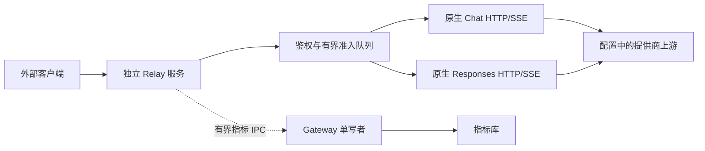

# Provider 模型 API 转发设计与边界

本文记录当前 Model Relay 的实现合同与验收边界。操作命令和配置示例以
[用户指南](user-guide.md#可选模型-api-转发)为准；文件职责以各模块 README 为准。
首版仅 CLP/Chat、三级限流、独立采集开关和旧管理页方案已被替代，不再作为执行计划保留；
逐批实施与故障修复记录可通过本文件的 Git 历史追溯。

## 当前范围

Relay 是独立可选服务，提供原生 Chat Completions、Responses 的 HTTP JSON/SSE 与受限模型列表。
客户端使用独立 Relay Key；上游账户和模型由已验证的配置绑定，不由请求正文或请求头选择。
不连接 App Server，不创建 Thread、Turn、审批、工作区或渠道消息，不执行客户端工具。

| 提供商 | 原生协议 | 材料来源 |
| --- | --- | --- |
| CLP | Chat | 共享受管账户的 API Key、独立 Cline 转发目录及按账户模型覆盖 |
| DeepSeek | Chat / Responses | 受管账户的独立 API Key 与模型目录 |
| OpenCode Go、CCG | Responses | 受管账户的独立 API Key 与模型目录 |
| 自定义主/切换提供商 | Responses | 已注册配置、可独立读取的 API Key 与有效模型目录 |

官方 Codex OAuth 登录态尚未接入 Relay。[只读 Codex 登录转发](relay-codex-auth-development.md)
是独立设计稿，不能把其中的 Provider ID、WSS 传输或模型缓存读取当成现有能力。

默认禁用、回环监听，可显式选择 IPv4 局域网地址或 `0.0.0.0`；后者监听所有 IPv4 网卡，
不保证仅内网可达。跨不可信网络使用用户管理的加密隧道。入口不开放 App Server 或管理 IPC。
Relay 与 Gateway 同机部署，通过私有 IPC 提交指标；多进程仍共享宿主资源及上游账户额度。

## 架构与所有权

| 模块 | 职责与边界 |
| --- | --- |
| [model-relay](../src/model-relay/README.md) | HTTP 入口、Key 鉴权、模型授权、全局准入、队列、撤销和单次指标结算 |
| [model-api](../src/model-api/README.md) | 请求形状、思考策略和协议观察；不读取配置、访问网络或执行工具 |
| [provider-proxy](../src/provider-proxy/README.md) | 共用 HTTP 生命周期、响应头/JSON 校验、背压、取消、协议交付及转储 |
| [runtime](../runtime/README.md) | 提供商材料、网络选择、配置发布、revision 复核、私有 IPC 和服务生命周期 |
| [observability](../src/observability/README.md) | 指标持久化与查询；Gateway 是唯一写入者 |
| [scripts](../scripts/README.md)、[WebUI](../webui/README.md) | 共用管理事务、命令、页面与受控服务操作 |

Chat 与 Responses 共用鉴权、队列、传输和指标基础能力，各自保留终态语义；不做协议互转、
自动协议探测、账户轮换或上游重试。Gateway 重启不停止 Relay 模型请求，但指标接收中断可能丢样本；
Relay 重启取消自身在途请求，不停止共享 App Server。

## 请求与交付链路

1. 限制连接、路径、方法、请求头与读取期限，校验单一 Bearer Key。
2. 原子预占有界上传/等待名额，捕获调用方、Key、代次、提供商、模型权限和取消信号。
3. 有界读取并验证正文，加入等待队列。
4. 按同 Key FIFO、跨 Key 轮转取得全局执行许可及可选速率令牌；上传未结束的 Key 不阻塞其他 Key。
5. 通过 Runtime 读取受信上游材料与网络目标；在异步准备后复核授权、revision、模型及取消状态，再按 Key 与模型覆盖策略处理思考字段。
6. 最后一次复核与创建上游连接之间没有异步间隔；只发送一次，不跟随重定向或自动重试。
7. 按原生协议交付 JSON/SSE，分别记录上游模型终态与客户端交付结果。
8. 释放许可并单次生成指标，放入有界发送器；客户端响应不等待指标 IPC 确认。

上传和等待使用独立预算，不占执行并发。执行许可覆盖出站准备、上游请求和客户端交付，
请求失败不返还已消费的速率令牌。取消后迟到的材料或网络结果不得出站或重复结算。

## API 与参数边界

仅开放 `POST /v1/chat/completions`、`POST /v1/responses` 和 `GET /v1/models`。
模型列表返回 Key 所绑定提供商的启用列表与当前账户目录的交集；不提供响应读取、取消或服务端会话管理端点。

请求保留解析后的普通 JSON 字段和值，由上游判断模型专用参数、工具声明、图片与扩展内容。CLP Chat 的 `cline-pass/deepseek-v4.1-flash` 路由策略例外：鉴权确定 CLP 账户及该精确模型后，固定出站 `providerOptions.gateway.only = ["deepseek"]`，覆盖客户端同名值，其他合法字段保留；畸形路由对象在出站前拒绝，不取消限定重试。JSON 与 SSE 均适用，其他模型及 Provider 不注入；探测依据见 [CLP 路由记录](cline-pass.md#上游路由限定探测)。
Relay 不下载远程图片，不读取请求里的本机路径。具体本地边界如下：

| 字段或条件 | 当前处理 |
| --- | --- |
| `model` | 非空、最多 200 字符、无受限控制字符，且通过 Key 与账户目录授权 |
| `stream` | 只能为布尔值；省略时按 `false` 交付 JSON，不强制全部流式 |
| Chat `messages` | 非空对象数组；不设 256 项上限 |
| Chat `n` | 省略、`null` 或 `1`；当前单选择交付不接受其他值 |
| Responses `input` | 字符串或对象数组；缺失/为 null 时须有非空字符串 `instructions` |
| Responses `store` | 省略或布尔值，出站统一为 `false`，不因 `true` 拒绝 |
| Responses `background` | 省略或布尔值；传入时改为 `false`，省略时不补 |
| Responses 历史引用 | 官方 DS 原样透传；其他提供商拒绝非 null 的 `previous_response_id`、`conversation` |
| 正文预算 | 入站及处理后的请求受 1 MiB 上限约束；输入项不另设 256 条上限 |

DS 历史引用由上游按其无状态合同忽略，客户端仍须携带完整上下文；其他提供商的引用可能
读取共享账户历史，而 Relay 尚无响应/会话归属校验。提供商分支只来自鉴权绑定。
资料见 [DeepSeek 接入边界](deepseek.md#responses-兼容性边界)与
[官方 Responses 参数说明](https://api-docs.deepseek.com/guides/responses_api/)。

思考策略默认跟随客户端。Key 强制关闭仅对已登记的提供商、模型及协议组合生效；其他组合保留模型策略或客户端参数，不阻止请求：通用 CLP Chat 使用 Cline 官方适配器的 `reasoning.enabled=false`；CLP 精确 DeepSeek 模型保留已验证的 `reasoning.effort=none`，DS Responses 使用 `reasoning.effort=none`，DS Chat 使用 `reasoning_effort=none`。
`extra_body` / `extraBody` 内的思考控制字段与关闭策略冲突时返回具体字段路径；
跟随客户端不增加该限制。不修改历史思考内容或隐藏上游输出。

普通端到端请求头透传；连接级头、客户端凭据、代理身份和 Codex/Relay 私有路由字段过滤，
由出站模块重建鉴权与传输头。响应头受白名单限制。诊断转储的脱敏规则不改变实际出站头。

两协议共享 HTTP 状态、Content-Type 和 JSON 解码检查，非法 JSON 返回
`invalid_upstream_json`。上游错误仅暴露受控分类，不返回未经约束的错误正文。
Chat 保留原始扩展字段与工具增量；流式结束后允许附带用量、重复相同结束原因且 delta 仅含空 content / assistant role 的统计尾帧，仍须收到 `[DONE]`。结束后追加内容、工具或不同结束原因仍拒绝；Responses 保留原生事件和 completed/failed/incomplete 终态。
终态前断流不得伪造成功；SSE 开始后用对应协议的失败事件结束，可写性丢失时只关闭并记录。
客户端应在有效终态后执行工具，上游完成不等于客户端已收到全部输出。

## CLP 转发模型目录与设置

Cline 的 Relay 模型来源独立于 Codex。WebUI「模型转发」中的「提供商模型」
首次打开时自动下载缺失的提供商目录，也可手动更新；所有 CLP 账户共享该目录。提供商每行一个“模型列表”按钮，弹窗统一管理模型启用和思考设置，所有关联 Key 共用启用列表。
`GET /v1/models` 只返回提供商启用列表与独立目录的交集；新下载条目默认关闭，不自动扩大授权。Key 仅绑定提供商，持久配置不再保存第二份模型列表。`model_relay.accounts[].models` 最多 256 个唯一模型 ID，空数组关闭全部模型。旧 Key 格式只由显式 `relay upgrade-models` 读取，升级与回滚见[用户指南](user-guide.md#可选模型-api-转发)。
同名模型可以分别用于 Relay 与 Codex，彼此设置互不覆盖。

上游密钥继续复用已有 CLP 账户，不需要额外申请。Relay 只读取账户注册、管理标记与凭据；
不读取或校验 Codex 模型目录、manifest、选中的模型、上下文同步状态或思考等级。
账户撤销、凭据轮换仍会撤销旧请求；仅修改 Codex 模型设置不会改变 Relay 的材料版本。
渠道仍由 Codex App Server 使用原有目录和工具执行流程。此拆分只覆盖 CLP；其他提供商维持原模型来源。
Relay 的请求采集、私有 IPC、Gateway 单写者及统计数据库不变，不重复经过 Codex Provider 统计代理。

模型文件来自 Cline 官方仓库：先查询 `main` 当前提交，再按该 SHA 下载
`sdk/packages/llms/src/catalog/catalog.generated.ts`，只解析 JSON 数据，不执行 TypeScript。
仅提取 `cline-pass/` 条目，保留名称、上下文、输出限制、能力及思考控制；不从相似模型名称推断。
下载使用共享代理、固定 HTTPS 来源、25 秒总预算和 16 MiB 上限，不跟随重定向，不发送账户凭据。
未知思考控制类型或等级、空目录和格式变化会拒绝整次更新。

目录保存为当前 Gateway TOML 同目录的 `cline-relay-models.json`（格式版本 1），不写入 Codex 模型目录或数据库。
界面显示来源提交与下载时间。更新先完整下载、校验，在管理事务内将旧文件备份至
`cline-relay-models.json.backup`，再原子替换；失败保留原目录，备份失败不替换。
需要回退目录时停止 WebUI，在保留私有权限的前提下用该 `.backup` 原子替换目录，再启动 WebUI；
目录回退不回退 Key 或配置。旧程序忽略该独立文件，无数据库迁移。
更新改变 Relay 可用模型集合，但不修改提供商启用列表或已保存策略；上游目录移除的模型将不再可调用，其他模型保持可用。Relay 启用且配置 CLP 账户时会在后台自动下载缺失目录；首次打开 WebUI 转发设置页也会自动补齐；CLI 查询提供商或为已注册 CLP 账户创建／修改 Key 时，若目录缺失，会先下载再继续操作。下载完成前该账户暂不可用，不阻塞其他提供商；已有有效文件直接复用，不自动更新版本。每个服务实例或页面实例自动尝试一次，失败记录固定服务日志或页面提示，可手动重试。损坏文件需显式更新修复，不自动覆盖，不回退 Codex 目录。关闭服务或页面时取消未完成的下载，服务最多等待 2 秒。后台落盘前在管理锁内复核目录仍缺失，避免覆盖并发手动更新。仅下载时间变化而模型数据相同时不会撤销在途请求。有显式模型覆盖时，重新编辑并预览保存才更新其策略能力快照；没有覆盖时，从当前目录派生跟随策略和关闭能力，目录更新后 Key 的条件关闭能力随之更新，不新增持久配置。
配置预览绑定目录 revision，期间更新目录后必须重新预览。

`toggle` 允许选择关闭；`effort.values` 提供明确等级，`default` / `null` 不等同于关闭。
预算型控制保留在目录中，此版不转换为等级，也不新增预算设置；未声明可用等级时仅支持跟随客户端。
目录保留 `modalities.input/output`；模型列表优先采用显式输入类型，缺失时按 Cline 的能力映射显示文本、图片、视频及 PDF，音频只依据显式输入声明。无能力信息时显示“未声明”。旧下载文件可继续读取，重新下载时补齐此前未保留的 `modalities`，并沿用原目录备份与原子写入流程。输入标签描述上游声明，不扩展 Relay 请求协议。
工具等能力保留在下载目录中，当前界面展示输入类型与思考设置；不启用 Cline 的搜索工具，不修改客户端工具定义。
Cline 自身会从 OpenRouter 目录合并部分能力，目录仍可能与实际端点有差异。
已保存的模型覆盖可以保留；新增及修改必须匹配当前目录，不能在管理请求中伪造支持等级。

模型覆盖沿用现有可选字段 `model_relay.accounts[].extra_models`，无需配置格式迁移；此字段不扩展模型目录。每个账户最多 64 条，每条含：

| 字段 | 含义 |
| --- | --- |
| `id` | 精确上游模型 ID，1–200 字符，无首尾空白和控制字符 |
| `reasoning_efforts` | 保存时从 Cline 目录复制的等级子集：`none`、`minimal`、`low`、`medium`、`high`、`xhigh`、`max`；空数组表示只透传 |
| `reasoning` | `passthrough` 或已声明的一个等级；`none` 表示关闭 |

等级来自目录声明，不代表实测或保证上游支持。模型支持关闭时，优先级为 Key 强制关闭 > 模型指定等级 > 客户端原参数；不支持或未声明时，Key 不覆盖模型策略。
Key 强制关闭不要求所有授权模型支持 `none`，不支持的模型仍可能产生思考内容。指定策略清除顶层其他思考控制字段；非关闭等级按 Cline 的 AI SDK 通用路径写入 `reasoning_effort`（`max` 映射为 `xhigh`），关闭的具体字段按上述提供商规则映射，不改变历史内容；嵌套 `extra_body` / `extraBody` 的思考控制明确拒绝。
纯透传不修改任何思考字段。目录的工具等能力仅作为元数据保留，不开启服务端工具执行；请求中的工具和普通参数继续透传。

保存使用管理预览确认、revision 检查、配置锁、私有备份和原子替换；旧 Key 模型授权须先显式升级，
不改变数据库。失败在替换前保留原配置；生效确认失败会明确显示“已保存，生效未确认”。
策略进入材料 revision，修改时取消该账户旧请求，下一请求使用新策略。
移除思考覆盖后模型恢复当前目录声明下的跟随策略；若当前目录仍声明支持关闭，Key 仍可关闭思考。只有目录及静态能力均不支持时，Key 才不再覆盖该模型。
无 Key 的账户仍保留模型覆盖，不随 Key 清理而丢失。

回退到不支持此字段的程序前，先用当前版本修改或删除引用模型覆盖的 Key，再在 WebUI 将各模型思考策略改为跟随客户端以移除覆盖；
最后一项删除后会移除 `extra_models` 字段。停服并核对配置后再切回旧程序。备份用于检查和修复失败，
不要恢复整份旧配置覆盖当前 Key、代次和删除记录，以免复活已撤销的凭据。

## 身份、材料与资源

配置来自 Gateway TOML 的 `[model_relay]`。每个调用方对应一个 Key 和一个提供商；
同提供商的 Key 共用提供商启用模型列表，凭据与代次独立。轮换后旧秘密失效，禁用、改绑、删除及材料变更
取消相关上传、等待和在途租约。模型目录与凭据始终由现有提供商模块解析，不复制账户管理。

CLI/WebUI 共用预览、确认、配置锁、revision、私有备份与原子保存。完整新 Key 只显示一次，
失败或响应丢失不能通过自动重复签发恢复。保存与运行态应用分别报告，不自动启动服务。

仅保留全局并发及分钟速率限制，账户和 Key 不另设限流层。`requests_per_minute=0` 只关闭速率限制，
不关闭并发和队列预算。上传/等待最多 32 项、正文总预算 16 MiB，正文验证后最多等待 30 秒。
队列只在内存中，重启不重放；这些限制不能提供 Token、费用或套餐硬预算。

删除或改绑保留最小历史身份摘要，用于旧调用指标结算及禁止身份复活；不保存正文或旧秘密。
摘要最多 4096 项并受配置大小约束，耗尽时拒绝整次操作。无人引用且没有模型覆盖的 Relay 账户项可清理，
不删除提供商本身的配置或凭据。

## 指标、转储与管理诊断

每次实际出站只生成一个模型请求样本，保留真实提供商、调用方、Key、凭据代次与请求 UUID；
Thread/Turn 为空，不伪造成 Codex 会话。指标发送有界且不重试；`accepted` 仅表示接收确认，
不等于落盘，`unconfirmed` 也不能直接当作丢失。指标不能充当可靠账本。

Relay 与 Codex 共用全局 debug 转储开关与 production/debug 模式。V2 转储使用
`relay.chat` / `relay.responses` 标签，共用容量与待写预算；生产与调试模式均脱敏必要凭据，
保留普通头及关联信息。调试模式可对照入站、出站和实际交付；实际补入或覆盖 CLP 路由时记录 `provider_routing_pinned`，读取器和中英文 WebUI 同步识别，已符合限定时不误报；非法、截断、未采集与未交付分别显示。
普通头可能包含业务数据，不承诺识别任意自定义编码秘密。详细采集口径见
[WebUI 调用详情](webui.md)和[代理模块](../src/provider-proxy/README.md)。

运行状态区分已配置并发与运行快照，明确显示等待、准备、上游处理和交付，以及指标确认和采集状态。
私有控制 IPC v4 提供最多 64 行的当前请求快照；WebUI 队列侧栏通过 SSE 变化通知触发有界快照读取，
隐藏或关闭时取消订阅，失败不显示伪造零值。页面服务管理沿用现有预览/确认任务。

## 升级与回退

### 原生双协议与提供商公共接入

配置仅扩展 model_relay.accounts[].provider 与 callers[].provider 的值域为 1–64 位 ASCII 字母、数字、下划线、连字符，与现有自定义 Provider ID 语法一致；继续严格拒绝未知字段。运行时和保存时通过公共注册与材料接口确认实际提供商，不能只靠正则授权。不新增秘密、protocol 或调用方字段；原 CLP 配置无需转换。首次保存非 CLP 引用前须更新所有配置读取进程。沿用 Provider 事务锁、配置锁、revision、私有备份字节校验和原子替换，失败保留原配置。回退旧程序前显式处理非 CLP 引用：在停止写入后备份当前配置，按明确列出的账户及调用方 ID 移除不受旧版本支持的 Relay 引用，验证旧 Schema 后原子保存；不修改提供商自身账户，不恢复历史凭据。被移除的 Relay Key 失效，重新接入须重新签发，禁止从归档自动复活。失败保持当前配置，禁止启动不兼容旧程序。

指标库 v22→v23 不增删列、索引或历史记录，仅把 Relay CHECK 中 traffic_label 的允许值由 NULL/relay.chat 扩展为 NULL/relay.chat/relay.responses；保留三元组完整性、真实调用方、空 Thread/Turn 和请求 UUID 去重约束。v24 增加可空的单次响应用量原值；当前 v25 增加与调用转储独立的上游诊断摘要。显式升级支持完整 v20/v21/v22/v23/v24，运行时只接受 v25。升级先停写并取得数据库所有权锁，检查精确源 Schema、空间与 integrity_check，做 SQLite 一致性备份，校验 SHA-256、备份 Schema、完整性和逻辑数据摘要，再 BEGIN IMMEDIATE 重建表并复制全部列及 ID，恢复 sqlite_sequence 和原索引。核对历史摘要后设置版本并提交；事务失败回滚且保留备份，提交后校验失败仍报告未完成、服务保持停止。已有辅助成本数据按现有合同原样保留。

回滚复用显式指标恢复入口：校验指定源备份的版本和 SHA-256，先一致性归档并校验当前 v25 数据库，再通过受控临时文件恢复选定 v20/v21/v22/v23/v24 备份。新版本请求留在归档，不伪装为已迁入旧库；失败保留当前库及所有备份。V2 转储不转换、不删除；旧程序可能无法关联 Responses 标签，升级后仍可读取。配置回退与数据库回退分别执行，数据库恢复不得恢复任何配置或旧凭据。

### 其他旧配置回退

- 旧账户/Key 限流字段使用 `codexc relay upgrade-limits` 显式备份后移除；不改身份或数据库。
- 旧独立 Relay 采集字段通过 `codexc traffic upgrade` 显式统一到全局采集设置；日常修改走现有设置入口。
- 回退仅支持 CLP 的旧程序前，停止 Gateway、Relay、WebUI，使用
  `codexc relay rollback-providers --provider ID` 明确移除不支持的 Relay 引用，不恢复旧秘密。
- 回退不支持 `retired_callers` 的程序前，等待指标收敛并停止相关服务，使用
  `codexc relay rollback-retired` 备份后只移除历史摘要；保留当前 Key、代次和删除结果。
  此后不能保证补收旧调用指标，禁止恢复整份配置来复活旧身份。

上述为显式运维入口，不自动执行。服务目标统一为 `relay`；仅旧更新器交接保留
`codexc service start model-relay` 并发出迁移提示，其他公开服务操作不接受旧拼写。
内部服务名及 `service-model-relay` 入口保持不变。

## 验证范围与剩余限制

隔离回归覆盖双协议 JSON/SSE、提供商发现与撤销、Key 改绑/删除、等待公平性、背压、取消、
关闭、迟到材料、配置备份失败、指标单次结算、转储关联、v20/v21/v22 升级与回滚。
执行入口包括 `tests/model-relay-server.test.ts`、`tests/model-relay-runtime.test.ts`、
`tests/direct-chat-request.test.ts`、`tests/direct-responses-request.test.ts`、
`tests/request-metrics-relay-upgrade.test.ts`；测试范围以对应文件为准，完整提交门禁走 `verify:commit`。

2026-09-29 部署后只读核查已确认 DS Responses SSE/JSON、CLP Chat SSE/JSON 的既有成功调用，
实际指标库为 v23，提供商、状态、用量与转储可关联，Thread/Turn 为空。此证据限于当时部署与样本，
不代表后续提交均已部署，也不替代真实 failed/incomplete、撤销、过载、关闭竞态、局域网设备、
防火墙及多平台实机验收。隔离测试通过不能升级为真实账户或生产故障验证通过。
