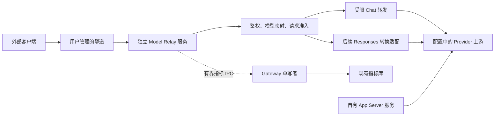

# Provider 模型 API 转发重规划

状态：2026-09-28，P0 合同与 P1/P2 代码已落实并完成已有隔离验证；第 14.7 节四类问题及第 14.8 节再次审查确认的三类问题均已修复并完成针对性回归。P3 的真实账户、隧道和多平台实机验收尚未完成。不得据此标记首版可上线。
实施基于 main `9007e6e2`，功能分支 `feat/provider-api-relay`；已核对指标 Schema 为 v20。

## 1. 目标与首版范围

向自己控制的异机客户端提供模型 API：客户端使用独立访问 Key，入口选择已配置的 Provider 账户，
隐藏上游凭据，并将脱敏模型指标送回现有 Gateway 指标库。首个适配对象为已接入的 CLP Chat 上游。
外部调用不使用 Codex App Server，不创建 Thread、Turn、审批、工作区或渠道消息。

首批协议已由用户明确选择为 Chat Completions。首版提供 Chat Completions JSON/SSE 与裁剪后的
模型列表；Responses 留待后续真实需求，不与首版捆绑。
不得为尚未实现的协议提供别名、自动探测或静默转换。

首版同时交付：独立服务、单 Key 到单账户的明确映射、多 Key 隔离、模型白名单、请求限制、
入口全局并发与速率控制、Key 禁用、取消清理、基础诊断和真实调用方指标。
默认回环监听，跨机器通过用户管理的隧道访问。远端客户端拥有模型使用权，不拥有本机管理权。

首版不做：公网监听、浏览器管理界面、自动账户轮换、跨账户故障切换、Token/费用硬预算、
完整 OpenAI API 兼容、模型工具执行、远程图片下载、会话历史持久化或代理报文转储。
不新增项目依赖；如实现中发现必须引入依赖，另行说明必要性、影响与移除方式。

## 2. 已核实的复用边界

| 现有能力 | 可以复用 | 不能据此宣称 |
| --- | --- | --- |
| `provider-proxy` | 公开的代理、Chat 桥、受控指标类型与 IPC；网络背压、错误分类等实现经验 | 现有回环代理已经具备外部鉴权和调用方隔离 |
| `model-api` | 纯 Responses/Chat 转换，无 HTTP、数据库或会话状态 | 所有 Responses 字段和工具都受支持 |
| Runtime Provider 账户模块 | 账户解析、凭据读取、模型目录和统一代理选择 | 允许外部指定地址、凭据路径或任意账户 |
| `observability` | Gateway 单写者及有界指标写入、聚合、查询 | 可丢失的指标就是额度账本 |
| 服务模板与生命周期 | 安装、状态、日志、受控关闭的现有机制 | 同进程新增 HTTP Server 就隔离了崩溃和服务重启 |

依据：[代理模块](../src/provider-proxy/README.md)、[转换模块](../src/model-api/README.md)、
[指标模块](../src/observability/README.md)、[Provider 接入指南](provider-integration-guide.md)、
[Runtime 索引](../runtime/README.md)。

现有代理终态转发会等待指标提交，IPC 使用一秒 Socket 空闲超时；普通增量不等待指标。
这不是严格的一秒总期限，也不是完全不影响终态交付。新服务单独定义有界指标发送，不能改动
自有 App Server 为完成卡片保持的先后约束。

## 3. 架构决定

### 3.1 独立服务进程

推荐新增可选 `model-relay` 服务目标，由 `codexc service` 管理，拥有自己的进程、监听端口、
连接池、取消域和所有权锁。它与 Gateway、App Server 服务并列，不装配进两者的进程。
复用代码和账户定义，不复用现有 App Server 服务中的代理对象或引用计数。



| 操作或故障 | 预期影响 |
| --- | --- |
| 重启 Gateway | Relay 模型请求继续；指标接收中断期间可能丢样本 |
| 重启 App Server 服务 | Relay 继续，自有 Agent 连接按现有合同恢复 |
| 重启 Relay | 只中断 Relay 在途请求；不停止共享 App Server |
| Relay 进程异常退出 | 不直接终止其他服务；已开始的上游请求结果可能未知，不自动重试 |
| 共享同一上游账户 | 额度与上游限流仍共享，独立进程不能消除该影响 |
| 宿主机 CPU、内存或网络耗尽 | 仍会相互影响，不能宣称绝对隔离 |

首版只支持同机部署 Relay 和 Gateway，以复用私有指标 IPC。异机客户端不等于异机 Relay；
跨主机指标汇集不在首版范围。建议专用上游账户，但允许明确配置共享账户，并显示其额度共享事实。

### 3.2 模块职责

新增一级模块 `src/model-relay/`，因为外部身份、模型授权、限流与撤销是独立业务职责，
不应继续塞入本地透明代理。模块与进程边界分别管理，不以文件数决定拆分。

| 模块 | 拟承担职责 |
| --- | --- |
| `model-relay`（新） | HTTP 入口、访问 Key 校验、账户/模型授权、资源准入、请求生命周期、脱敏诊断 |
| `provider-proxy` | Provider 网络转发、协议观测、取消和背压；将确需共享的能力整理为窄公开接口 |
| `model-api` | 纯转换与字段验证；仅通过公共入口复用 |
| `runtime` | 配置与账户凭据解析、代理环境、进程装配、生命周期和私有 IPC 位置 |
| `observability` | 来源/调用方维度、入库及查询；仍由 Gateway 独占数据库写入 |
| `bootstrap` | 扩展指标接收验证与归属，不运行 Relay HTTP 入口 |
| `scripts`、服务模板 | 显式服务目标、Key 管理、帮助、安装与更新 |
| `webui`、指标展示 | 请求查询与来源筛选；不把 API 调用显示成 Codex 会话 |

拟议依赖为 `model-relay -> provider-proxy`，需要纯转换时再依赖 `model-api`；配置、凭据与指标发送
通过 runtime 注入窄端口。不得跨模块导入内部文件。先定义责任和接口，再更新模块依赖测试；
不能仅为通过检查放宽白名单。不动 App Server RPC、StateStore、Conversation Core、审批和渠道投递。
不建立通用插件框架，也不一次性重构全部代理实现。

### 3.3 架构取舍与复杂度控制

本方案针对可长期维护的外部模型访问：独立 Key、可撤销、可限流，并按调用方进入同一个指标库。
这些目标使独立生命周期、身份模型和指标升级有实际依据；若目标缩减为单人偶尔借用一个账户，
实现成本会偏高。但当前不据此删减已确定的访问控制与统计目标，也不继续增加未来功能。
架构审查通过表示没有已知设计阻断项，不表示该方案在任何使用规模下成本最低。

| 决策 | 收益 | 需要承担的成本与边界 |
| --- | --- | --- |
| 独立进程 | Relay 重启和进程异常不直接终止自有 App Server | 增加服务安装、更新、状态与跨平台生命周期；仍共享宿主资源和可能共享上游额度 |
| 独立模块 | 外部授权与限流责任明确，本地透明代理不承载调用方业务 | 新增窄公共接口和边界测试；不能复制基础实现 |
| Gateway 单写指标库 | 复用查询与保留策略，没有第二个数据库写入者 | Gateway 不在线时可能丢指标；调用方维度需要显式 Schema 升级 |
| 控制与指标 IPC 分离 | 撤销确认和可丢失指标各自有明确语义 | 两个最小合同及关闭路径；复用私有传输，不做通用管理总线 |

实施时遵循“访问控制与生命周期独立，成熟基础能力共享”：

- Provider 账户、凭据路径、目录验证、共享代理环境只保留现有受信解析源。Relay runtime 组合它们，
  不复制路径规则，也不建立第二套配置框架。监听的计时器、取消与缓存属于 Relay 自己。
- 现有 `ProviderProxy` 是 Responses 本地代理，不直接充当 Chat 公网入口。Chat 侧缺失的协议能力
  可以新增；相同的 HTTP/SSE 传输、背压、取消和错误分类若确需两处使用，则提取最小公共能力，
  不复制整份代理，也不让 Chat 请求被迫经过 Chat→Responses→Chat 的往返转换。
- 纯协议验证与转换归 `model-api`，网络归 `provider-proxy`，调用方授权和准入归 `model-relay`。
  不因一个函数暂时不公开就跨模块导入内部文件，也不为只有一个使用点的代码建立通用框架。
- 指标归约按协议各有必要适配，但同一次调用只能有一个负责生成终态样本的所有者。不能同时由
  Relay 与下层代理上报重复样本，再依赖数据库去重掩盖双重所有权。
- 首版 WebUI 仅扩展既有请求明细和来源/调用方筛选，不新增调用方管理门户或一整套报表系统。
  CLI 仅覆盖服务与身份的必要管理能力；不引入远程配置编辑、任意命令执行或动态插件注册。
- P0 为每个拟复用能力记录现有公共入口、确有缺口和最小调整；P1/P2 按垂直请求链路分批实现。
  共享能力提取与新功能分别验证，旧消费者行为不变。发现必须复制账户解析、网络出口、流解析或
  指标结算时先调整接口，不让重复实现成为既成事实。

只有明确的现有接口证据、协议证据或隔离测试失败才触发设计修订；记录影响后做最小完整调整。
不因偏好换框架，不把 P0 再变成无限架构讨论，也不以架构已审查为由忽略实施中发现的真实问题。

## 4. 完整请求链路

1. 连接进入仅回环监听的入口；先限制连接、Header、路径、方法和读取期限。
2. 检查单一 Bearer 身份。未通过鉴权时不读取上游凭据，不查询远端模型目录。
3. 从当前已验证配置获取不可变请求快照：callerId、keyId、凭据代次、精确 Provider 账户 ID、
   模型白名单和策略版本；同步登记取消控制器，再进入任何异步正文读取或解析。
4. 原子预占全局有界上传/等待名额和正文预算；等待期间不占执行并发或消耗速率令牌。
5. 有界读取并验证请求体及本地 model/messages/stream/n 边界；其他模型参数保留给上游判断。验证失败释放预留资源，不触达上游。验证后进入有界队列，获得全局执行许可及可选速率令牌才继续准备。
6. 由受信 Runtime 解析目标和凭据，保留普通应用请求头并重建鉴权与传输头。外部请求不能改变目标、账户或统计归属。
7. 出站前重新核验当前策略、账户材料版本、模型权限与取消信号。最后一次复核与创建上游请求
   在同一同步步骤中完成；任何异步解析之后都不得跳过复核。只发送一次，不自动重试或切换账户。
8. 按协议交付 JSON 或 SSE；模型状态、客户端交付状态和 Usage 可用性分别归约。
9. 只结算一次，释放许可和连接，将脱敏指标加入有界发送器；客户端响应不等待该发送器的完成。

许可覆盖正文上传、上游等待和慢客户端发送。同步异常、超时、取消、禁用 Key 和关闭服务均进入
同一清理路径。速率令牌表示已接收的一次尝试，不因失败返还；并发许可必须释放。
鉴权前还要有全局连接限制及鉴权失败速率限制，避免未知 Key 绕过资源预算。
取消使请求进入不可逆终态，迟到的正文、凭据或网络解析不得创建连接、恢复许可或重复结算。
限制变更后已有计数不清零；降限不接收超出新限额的请求，权限收窄则取消受影响请求。

## 5. API 与数据边界

### 5.1 首版协议

拟定规范路径为 `POST /v1/chat/completions` 与 `GET /v1/models`，不提供省略 `/v1` 的别名。
Responses 实现时再开放 `POST /v1/responses`。其他路径或方法不转发。
`/models` 从已验证的本地账户目录与 Key 白名单取交集，返回同一组可实际调用的公开模型 ID。
账户已删除、模型已撤销或映射不存在时拒绝，不能回退到默认账户。

请求按第 14.1 节保留解析后的 JSON 字段和值，由上游判断模型参数、消息和扩展字段是否支持。
Relay 仅检查本地路由、资源和单选择交付所需的边界，不解析执行工具或下载远程资源。
响应仍遵循已验证的单选择 JSON/SSE 合同；请求保留不表示支持全部上游输出能力。
实现 API 语义前按项目官方资料索引核对；本文不冒充完整的上游协议合同。

### 5.2 输入与输出过滤

- 保留普通端到端应用请求头，清除连接级头，重新构造 Host、Authorization 和正文传输头，详见第 14.1 节。
- 丢弃 Cookie、代理认证、Codex 私有元数据、账户路由头及调用方伪造的指标字段。
- Provider、caller、request ID 均由服务确定；Thread/Turn 始终为空。
- 报文中的 URL、文件路径及资源引用仅作为上游输入，不用于本机路由、文件读取或远程下载。
  不跟随上游重定向，防止凭据换域。
- 响应头同样使用白名单，不透传 Set-Cookie、私有账户信息或未经校验的 Location。
- 非成功响应只返回固定文案与稳定错误码，限制上游错误读取大小；流内错误同样过滤。
- 成功正文按已支持协议传递，工具参数是数据；不声称能够替客户端过滤模型内容本身。
- Relay 首版不接入现有模型报文转储，即使自有代理开启 debug 也不保存外部正文。

### 5.3 流式、失败与重试

发送响应头之前可返回对应 HTTP 错误；开始 SSE 后不能再改变 HTTP 状态，必须按所选协议发送
可表示的失败终态并关闭。连接已经不可写时只关闭并记录脱敏原因，不承诺一定送达错误事件。
模型流无合法结束标记、工具参数被截断、超时或取消都不能伪造成功终态。

不把所有超时标为可安全重试。错误区分“尚未发送上游”和“上游可能已接收”；后者重试可能
重复消耗额度。首版不提供幂等去重保证，不保存请求正文，也不自动续传断流。
客户端在模型明确完成后断开不改写已有模型成功和 Usage；完成前断开则记取消或未知。
客户端交付结果单独记录，不能把模型计量等同于下游确认。

## 6. 身份、配置与撤销

唯一配置来源仍是 Gateway TOML。拟增加 `[model_relay]` 严格配置段，缺省关闭；实际键名与
运行时声明在实现阶段一并定稿。不得创建第二份独立 YAML/JSON 配置。未知键和非法组合拒绝启动。

### 6.1 调用方、Key 与轮换

每个稳定 `callerId` 拥有一个稳定 `keyId`，Key 带单调递增的 `credentialGeneration`，精确映射
一个账户和一组模型。首版每个调用方只保留一个有效凭据，不提供新旧 Key 重叠窗口。
凭据轮换保持 callerId/keyId/账户映射不变，只更换随机秘密、哈希并递增代次；旧代次在途请求取消，
历史指标继续归属同一调用方。变更账户或模型权限属于策略更新，同样使旧请求快照失效。

新 Key 至少含 256 bit 随机秘密；按精确格式提取非秘密 keyId，秘密只保存 SHA-256 哈希并作
常数时间比较。明文仅签发时显示一次，不接受查询参数中的 Key。配置中的 callerId/keyId 唯一、
长度有界，不得分配给另一个调用方。禁用记录留作 tombstone，不提供删除后复用标识的管理操作；
首版 caller/Key 总数各最多 128，停用记录计入上限，不建立无限增长的历史注册表。
上游凭据仍通过现有私有凭据机制读取，不复制到 TOML、StateStore 或命令行。

### 6.2 撤销的生效边界

本机管理操作通过既有配置事务机制原子保存，再向 Relay 的当前用户私有控制 IPC 请求应用
精确配置摘要，最多等待 2 秒。服务在切换策略版本、取消旧请求后返回匹配摘要的确认。
控制入口只提供应用通知和脱敏状态，不读取/写入任意文件、不提供模型代理或远程管理。
Unix 权限和 Windows 认证命名管道沿用现有私有 IPC 公共机制，不能裸开本地 HTTP 管理接口。

CLI 区分“已保存且已生效”“已保存、服务未运行”“已保存、生效未确认”。最后一种不回滚已写入的
撤销，也不宣称旧 Key 已失效；给出停止 Relay 的明确操作。服务不运行时下次启动必须读新配置。
公开签发/轮换/禁用命令支持两种 help，敏感输出不得写日志，保存失败不显示可用 Key。

服务观察到新配置后先关闭受影响请求的准入，验证完整新快照，再原子发布版本。非法或不可读的
Relay 配置使其全部新请求失败关闭并取消在途请求；修正后重新验证才能开放。
禁用、轮换和账户/模型撤销都覆盖上传、凭据解析、出口解析与上游发送阶段。取消不能撤回已经
送达上游的请求或费用。应用确认只证明本机新策略生效，不证明远端计算停止。
手工编辑仅有检测后的生效语义，不承诺磁盘写入瞬间撤销；需要确认时使用管理命令。

### 6.3 Provider 材料与监听所有权

Relay runtime 自己持有 watcher、缓存、取消和关闭期限；复用路径解析能力，不复用 Gateway 内
会重启 App Server 的 `ProviderSettingsWatcher` 实例。

| 来源 | 变化处理 |
| --- | --- |
| Gateway TOML 的 Relay 段 | 发布新的身份/权限/限额版本；无关段有效变更不重置额度或取消请求 |
| CLP `accounts.json` 与受管账户标记 | 重新解析账户集合；移除或不可读时撤销相关映射并取消请求 |
| 账户凭据、私有 Profile、模型目录及 manifest | 更新受信材料版本并取消相关旧快照；删除或校验失败关闭该账户 |
| Codex `.env` 和支持的系统代理设置 | 复用统一出口选择与失效规则；新连接用新选择，不擅自重发旧请求 |

监听路径只能由受信 Runtime 推导；不得读取旧 Gateway `.env` 或外部请求提供的路径。
文件事件只作提示，辅以每 1 秒有界轮询；出站前重新读取/验证本次依赖的材料，核对前后摘要与
配置代次。多文件不一致或读取中变化时拒绝本次请求，等待下一轮完整验证，不能拼接新旧材料。
已有账户配置本身没有跨文件事务时，不宣称此检查等于磁盘事务；目录/manifest 和受管标记仍需
满足现有一致性验证。取消后返回的文件/系统查询不得替换当前快照。每类刷新最多一个在途任务，
新提示合并为一个待刷新标记；单轮最多 2 秒，不能每秒启动一批无法取消的后台任务。超时使相关
账户准入关闭，原任务未退出前不重复派发；迟到完成只能清理资源，不能发布快照。

新增、删除账户会重新计算监听集合，停止时取消轮询、关闭控制 IPC，最多等待 2 秒，迟到任务
不得恢复准入。进程重启重新验证磁盘，不恢复旧秘密缓存。仅 Relay Key 变更不得触发其他服务重启；
用户主动修改共享 Provider 配置仍可能触发现有 App Server 重启机制，不能由 Relay 保证隔离。


## 7. 有界资源与额度语义

下列是首版拟议初始上限，须经隔离负载测试定稿；不是当前可用配置，也不是上游公布额度。

| 资源 | 初始建议与约束 |
| --- | --- |
| HTTP 连接 | 全局 64；Header 16 KiB，读取期限 10 秒；关闭闲置 Keep-alive |
| 请求体 | 1 MiB、读取期限 15 秒；包含保留的多模态输入，不放宽为无界图片正文 |
| 并发 | 仅全局默认 10；慢客户端占用执行许可，等待请求不占执行许可 |
| 请求速率 | 全局默认 0（不启用）；可启用全局分钟与突发限制，模型目录请求也计入 |
| 请求期限 | 总计 300 秒，从接受请求起；上游首次响应 60 秒、空闲 60 秒，均受总期限裁剪 |
| 流缓冲 | SSE 帧最多 1 MiB，解析缓冲最多 2 MiB；输出使用有界背压，不积攒完整流 |
| 响应总量 | JSON 8 MiB，流累计 32 MiB；超限停止，不能无限占用网络 |
| 关闭期限 | 停止准入后最多排空 5 秒，再取消；指标发送另有最多 1 秒关闭期限 |

实现须确定固定窗口或令牌桶算法及突发容量，配置测试覆盖边界；空闲心跳不延长总期限。
独立账户保护只覆盖 Relay 流量；若共享自有账户，无法在 Relay 侧控制自有 Codex 消耗。
进程重启会重置短期速率计数；这是防滥用限制，不宣称跨重启消费预算。

首版明确不实现硬 Token/费用预算。Usage 缺失保持 unknown，不填零、不估算费用。以后若确需
硬预算，必须另行设计预占、结算、未知消耗、崩溃恢复和持久账本，并获得对应存储变更授权；
不能从可能丢样本的展示指标反推可用余额。

## 8. 统计归属与指标可靠性

### 8.1 不伪造会话

所有 Relay 请求保持 `threadId = null`、`turnId = null`，使用明确的 `source`、`callerId` 和
服务生成的随机 `relayRequestId` 表达归属，同时记录 keyId 与 credentialGeneration。
调用方、凭据身份和上游 Provider 账户 ID 分开保存，不由模型响应或外部输入覆盖。
新增字段需贯通受控指标类型、私有 IPC 验证、数据库、查询与展示，不能只增加发送字段。

Gateway 按已有账户 Provider ID 校验 Relay 指标，未知账户明确拒收。指标的 source 固定为 relay，
caller/key/代次/请求 ID 必须满足受控格式，Thread/Turn 必须为空；非法组合拒绝后不得进入 Core。
撤销后的迟到结算可以记录其历史身份，不因 Key 已停用删除真实消耗；记录指标不授予执行权限。
指标 IPC 随 Gateway Writer 存活，不随 Relay HTTP 入口启停；按当前私有原子配置核对 caller/key、
账户归属及代次上限，避免等待 Gateway 的延迟配置热加载。整体禁用仍允许保留身份的历史结算；
未知身份、未来代次、无效配置与未知账户拒收，不回退为宽松接收。
配置读取和身份校验在隔离 Worker 内限时执行，保留任务有界；断连或关闭即取消，
异步准备完成后、入队前再次复核取消状态，迟到结果不得入队。
指标不触发 Core 事件、子代理结算或渠道输出。
不把调用方 ID 填入 Thread，也不创建供 WebUI 展示的假会话。

请求明细增加来源和调用方筛选；会话/Turn 页面继续仅表示真实 App Server 会话。
全局用量默认包括全部来源并明确标注，可筛选自有/Relay；渠道完成卡片保持原来按 Turn 的口径。
Usage、模型结果和下游交付结果分开，终态只生成一个样本。鉴权失败等未出站尝试只进入安全计数，
不伪造模型耗时和 Usage。

### 8.2 指标不是可靠账本

Relay 指标发送器拟限制为等待与在途合计 256 条、1 MiB，单条 16 KiB，最多 2 个并行 IPC 请求；
单次从出队起总期限 1 秒，零自动重试。每次请求只生成一个终态样本，关闭时总计最多再等待 1 秒。
本地回写日志同样限速，不能为每个丢失样本生成无限错误日志。

新增专用 Relay 指标 IPC 端点，复用私有 IPC 的所有权和传输能力，不改变现有自有代理的 `ok` 帧
与终态等待行为，也不让新客户端把旧 `ok` 当作成功。端点由 Gateway 单独持有，固定版本封套包含
版本、Provider ID、relayRequestId 与有界样本；只接受当前版本。响应携带同一请求 ID，结果为
accepted 或 rejected 加受控原因。畸形或超长帧可直接断开，未知版本明确拒绝，不做旧协议回退。

Gateway 在成功校验并加入指标写队列后才发 accepted；队列满/关闭等异常不能在组合层吞掉后
照常确认。accepted 仅表示内存接收，不等于 SQLite 事务提交；落盘失败继续在 Gateway 报告。
服务端封套上限 32 KiB、并发连接最多 8、读取总期限 1 秒；未启用 Relay 时不开放该端点。
控制 IPC 同样设置有界帧、连接数和总期限，精确数值在实现合同中统一固定。客户端发送器限制
不是服务端的资源防线。两种 IPC 都只接受当前用户，不暴露网络监听。

| 诊断结果 | 可证明的含义 |
| --- | --- |
| local_dropped | 尚未发送，因本地队列满、关闭或样本超限而丢弃 |
| rejected | 收到关联 ID 匹配的明确拒收响应 |
| accepted | 收到关联 ID 匹配的内存接收确认，不承诺落盘 |
| unconfirmed | 已尝试发送但超时、断线或确认非法；可能已入库，也可能未收到 |

四种结果分别计数，确认检查同时核对协议版本、结果枚举和请求 ID。未确认不得算作确定丢失或成功。进程崩溃会丢内存样本和计数，查询明确说明
统计不完整；不持久化第二套账本。不自动重发 unconfirmed，不能用指标重试补偿模型请求。
Gateway 接受的 Relay 请求 ID 使用部分唯一索引约束，重复样本不重复聚合；该约束不代表整个
模型调用具备幂等性，也不保留无限期去重记录，随指标保留策略清理。数据库采用仅针对该唯一键
的冲突不写入策略，第一条已写入记录不被后来载荷覆盖；不得使用宽泛 IGNORE 吞掉其他约束错误，
也不能让重复 Relay 样本导致同批自有指标回滚。单独覆盖混合批次与冲突 ID 回归。

Gateway 为该端点设独立连接/帧准入，并为自有指标预留写队列空间；Relay 指标在共享 10,000 条
队列中最多占用 256 条待写记录，原子计数随批次取出释放，自有流量仍按既有总预算限制。
不增加无限缓冲、不降低自有终态确认的正确性。负载验证覆盖自有与 Relay 并发、队列满和关闭。
Relay 不产生 OutputEvent，但仍共享 Gateway 写入资源，不能宣称零影响。

## 9. 持久变更的实施前置方案

原基线指标库为 v20，本分支实现 v21。首版调用方维度需要显式升级；下述设计已获用户授权实现与隔离验证，但不包含实际用户数据操作。方案文本本身不构成实际执行迁移的授权。不得在启动时静默 ALTER、删库或兼容读未知版本。

- 支持范围：当前 v20 到届时唯一目标版本；已有其他升级占用下一版本号时先重做差异审查。
- 数据处理：保留历史行和现有计时语义；历史来源填为自有代理，caller/request/交付字段留空。
  新增列、来源组合约束及 Relay 请求 ID 部分唯一索引以事务执行；旧行新增身份与交付字段为空，
  检查完整性、行数、约束和旧查询一致性后再更新版本。迁移不得依赖仍在线的旧写入者。
- 备份：停止 Relay 与 Gateway 指标写入，用 SQLite 一致性备份机制生成私有备份并验证可读性，
  记录版本及校验值；不能仅复制活动数据库主文件而遗漏 WAL。
- 失败：事务回滚、保留备份，Gateway 与 Relay 保持停止；共享 App Server 不因指标升级而主动终止，
  维护期间可能产生的自有指标缺口需明确记录。
- 回滚：停止写入，保留升级后数据库作为独立归档，恢复旧程序、对应配置和升级前完整备份；
  备份之后的新指标不会自动回灌，不得悄悄覆盖唯一副本。
- 验证：升级/失败注入/回滚夹具覆盖索引、隐私字段、旧数据、旧新查询与当前版本拒绝路径。

新增 TOML 字段及 Key 管理同样需要私有配置备份和失败原子性。回滚先停用并禁用 Relay
自动重启，保存最新配置与身份记录，再恢复不含新增段的旧配置；旧 Key 的远端副本无法撤回，
以后重新启用必须根据保留的撤销记录轮换，不能从旧备份复活已撤销凭据。
实现开始前一并提交精确 schema、命令与迁移审查，获得持久格式变更授权。无授权时只做纯模块
及隔离夹具开发，不修改用户配置、现有数据库或服务。

## 10. 服务与上线合同

拟增加 `model-relay` 服务目标；服务配置、帮助、平台模板、安装打包与更新器一起适配。
既有 `app-server`/`gateway` 目标含义不变。`all start/restart` 只启动已启用并安装的 Relay；
`all stop/status` 必须涵盖已安装实例，即使配置已禁用或损坏仍能停止和诊断。禁用会关闭已有监听，
不能只跳过下次启动。未启用时不创建端口。卸载不删除调用方配置、凭据或历史指标。
服务启动先验证配置、账户、目录、端口及所有权；Relay 运行依赖失败只影响 Relay。共享 TOML
的结构错误仍按现有严格 Schema 失败关闭，不能承诺对其他消费者无影响。首版是现有已初始化
Gateway 部署的可选服务，保留“至少一个渠道与工作区”的配置要求，不隐式增加纯 Relay 安装模式。
更新器在替换程序目录或迁移指标库之前停止已安装 Relay，完成验证后按原启用/运行状态恢复；
失败保持相关服务停止并报告，不让旧进程继续使用已替换的代码或新协议。

首版拒绝非回环监听。公网发布需要另一阶段的 TLS、可信代理边界、访问审计和运维合同，
不以一个 `allow_public` 布尔值绕过。本文不判断上游授权条款；实际对外提供前核对所用账户的许可范围。

上线顺序：完成隔离验收 → 审查配置/数据升级并取得授权 → 备份和升级 → 安装但保持关闭 →
使用专用 Key 本机验收 → 用户授权真实上游冒烟 → 启用隧道。真实冒烟记录请求次数和已知 Usage，
不使用无上限压力测试消耗用户额度。停用入口后，自有 Codex 与渠道应继续正常运行。

## 11. 分阶段交付与验收

| 阶段 | 内容 | 出口条件 |
| --- | --- | --- |
| P0 合同定稿 | 首批协议、CLP 账户模式、字段支持表、服务/配置/指标格式与升级方案 | 所需持久变更已授权，待定项不伪装为支持能力 |
| P1 隔离核心 | 独立模块、假上游、鉴权/授权、所有资源上限、取消/撤销、Chat JSON/SSE、一次性指标归约 | 不访问真实账户的完整请求链路通过；无无限缓冲和隐式重试 |
| P2 集成闭环 | 独立服务、Key 管理、现有凭据与网络出口、指标升级/IPC/查询与展示 | 三服务生命周期独立，备份恢复通过，Caller 可查且无假 Thread |
| P3 首版验收 | 安装升级、多平台服务验证、自有链路回归、明确授权的真实请求与隧道 | 全部门禁通过、限制可观测、故障恢复可操作，才能标记可用 |
| P4 后续扩展 | 按实际客户端需要加入 Responses、更多能力或独立预算账本 | 每项单独确认合同、风险和验收，不捆绑公网、多账户轮换 |

P1 是开发阶段，不是可对外上线的最小版本。可交付首版必须完成 P0–P3，不能延期安全控制。
Responses 后续实现须复用既有纯转换边界，并继续满足相同的统计与准入门槛。

必须覆盖的跨模块回归：

- 未授权、停用 Key、删除账户、撤销模型、热加载失败均无法发起上游请求；在慢上传、凭据读取、
  出口解析期间触发撤销，验证迟到结果不出站，应用确认不提前返回。
- Key 轮换保持 caller 历史且旧代次失效；Provider 文件删除、多文件不一致、轮询关闭覆盖缓存失效。
- 调用方无法伪造账户、来源、Thread/Turn、请求 ID；输入/响应头不泄漏凭据。
- 慢上传、慢下游、畸形 SSE、大帧、无终态、上游错误、取消和重启均在预算内结束，许可归零。
- 多 Key 共享账户同时触发限制，不通过切 Key 绕过账户/全局限制；自有账户共享风险可见。
- 模型完成后下游断开不清除 Usage；完成前取消不产生假成功；指标只结算一次。
- Gateway 停止、IPC 半开、拒收及队列满不阻塞 Relay 响应；接受后丢确认归类 unconfirmed，
  不误报丢弃、不自动重发；畸形/旧版本和伪造归属拒收，重复 ID 不重复入库。
- Relay 重启不关闭 App Server Socket；Gateway/App Server 重启不终止 Relay 请求。
- Schema 升级失败与回滚保留数据；禁用或坏配置下仍能 stop；回滚不会复活旧 Key。
- 查询与 WebUI 不展示假会话，现有 Turn 卡片不变；Relay 队列满仍为自有指标保留空间。
- 安装包包含新入口，公开帮助完整；验证 Linux/macOS/Windows 的实际支持范围，缺失项明确禁止上线。

## 12. 当前决策与剩余确认

本方案明确推荐独立进程、单 Key 单账户、默认回环、无自动重试、真实调用方字段和首版无硬预算。
首批协议已确认 Chat Completions 优先；是否使用专用账户由部署时选择，不影响模块开发。
端点字段表、精确配置键、服务命令与指标目标版本在 P0 锁定。仅缺少真实账户不阻塞假上游开发，
缺少持久格式授权则不执行相关迁移。后续不为可选功能无限扩展首版范围。


## 13. 本轮设计复审结论（2026-09-28）

已按入口、异步准备、撤销、上游流式交付、指标确认、关闭及升级回滚逐段复查，并修正：

| 原缺口 | 当前合同 |
| --- | --- |
| 入口检查后异步撤销失效 | 请求先登记，出站前复核，取消不可逆，迟到结果不出站 |
| 只监听 TOML，遗漏 Provider 材料 | 独立有界 watcher，材料版本复核，多文件变化失败关闭 |
| Key 轮换切断调用方历史 | caller/key 稳定，凭据代次递增，无旧秘密重叠窗口 |
| IPC 超时误报丢失、旧 ok 冒充接收 | 专用版本端点，区分四类结果，accepted 不承诺落盘 |
| 重复指标影响同批自有样本 | 特定唯一键冲突不写入、不覆盖，混合批次验证 |
| 指标压力挤占自有队列 | Relay 独立接收上限及共享写队列分额 |
| 禁用或坏配置后无法停止 | stop/status 依据已安装实例，不依赖启用状态 |
| 回滚恢复已撤销秘密 | 先禁用服务、保留身份记录，重新启用必须轮换 |
| 错把同文件配置和进程隔离等同 | 明确保留共享 Schema、Provider 配置与宿主资源的实际影响 |

复查后未发现本方案范围内尚未处理的架构或生命周期阻断项。此结论不等于代码已经实现或通过
运行验证。Chat 字段支持表、精确公开命令/配置类型与迁移 SQL 属于 P0 的实现合同交付物；
资源建议值须通过 P1/P3 负载验证。以上门槛明确保留，不允许用文档通过替代授权、测试或上线验收。

## 14. P0 实施合同（2026-09-28）

本节是实施规格，不是现有能力清单。持久格式实施授权与真实环境操作授权分开，后者仍未授予。

### 14.1 官方证据与请求保留合同

官方资料：[Cline Chat](https://docs.cline.bot/api/chat-completions)、
[Cline 错误](https://docs.cline.bot/api/errors)、[Cline Models](https://docs.cline.bot/api/models)。
Cline API 属于动态平台合同，项目没有锁定的本地服务端源码。直接 Chat 不绕行 Responses。
用户已明确要求保留请求，由 CLP 上游验证模型参数和处理远程资源；Relay 不承诺所有参数均被
特定上游模型支持，也不把未在简略文档中列出的字段自动视为非法。

| 输入 | Relay 本地合同 |
| --- | --- |
| 请求体 | 必须为 JSON 对象；HTTP 正文仍限 1 MiB、上传 15 秒 |
| `model` | 非空字符串，最多 200 字符，不含控制字符；精确匹配本地目录与调用方模型授权 |
| `messages` | 1–256 个对象；内部角色、内容、工具历史和扩展字段原样保留，由上游校验 |
| `stream` | 如提供必须为布尔；省略时仍显式补 false，保持本地 JSON 默认合同 |
| `n` | 省略、null 或 1；当前响应和指标仅支持单选择，其他值在出站前拒绝 |
| 其他字段 | 原样保留，包括 null、采样/长度参数、stream_options、结构化输出、工具、推理和未知扩展；不删除、不转换、不猜测别名 |
| URL、工具和 schema 引用 | 仅作为请求数据交给上游；Relay 不抓取远程图片、不读本地文件、不执行工具或 schema 引用 |
| 路由与凭据 | 只来自已鉴权的本地配置与 Provider 材料；报文中的 provider/url/authorization 等字段不会被本机用于选账户、目标或请求头 |

保留的是解析后 JSON 字段和值，重新序列化不承诺字节级相同。普通端到端请求头保留（含 User-Agent、HTTP-Referer、X-Title、自定义业务头）。
复用共享跳级头清理，包括 Connection 指定的头。Authorization 改用本地上游凭据，Host、
Content-Length、Content-Type、Accept 按实际出站生成，Accept-Encoding 固定 identity；Cookie、
代理凭据、API Key 头、Expect、Forwarded/X-Forwarded-*、X-Real-IP、X-Provider、
X-Codex-*、X-Relay-* 不透传，避免入口秘密、伪造身份或压缩/长度冲突。入口校验错误返回安全 param 与固定原因；上游拒绝继续使用受控
错误映射，不泄露任意上游消息或敏感报文。响应处理合同保持下述有界单选择 JSON/SSE 归约。

只允许一个选择，响应 choice index 缺省或 0；多个选择拒绝。响应公开字段限于 id、object、created、
model、choices、usage；消息/增量仅 role、content、tool_calls，普通明文 reasoning 可作为有界输出
保留，并支持 assistant.reasoning 原样回传。输入中的 reasoning_content 与其他推理历史保留给上游；响应侧仍只交付已支持字段，
不因此宣称签名推理或任意模型工具会话已获完整验收。
未知上游扩展字段不进入下游或指标。模型函数调用只交付数据，绝不执行。

CLP 非流式响应可为标准 Chat 对象，或 `{success:true,data:<Chat 对象>}` 包装。
真实结构诊断确认该包装与官方示例有差异：直接 Chat 网络适配只拆一层、显式要求 success 为 true，
内部仍使用相同响应与 Usage 校验；包装失败、内部错误、嵌套包装或同时存在顶层 choices 时不猜测修复。
JSON 必须有明确 finish_reason；SSE 必须同时有明确 finish_reason 和 `[DONE]`，允许终态后的独立
usage 块，禁止终态后继续内容、第二个选择或冲突终态。stop/tool_calls 为 completed，length/content_filter
为 incomplete；error、畸形帧、断流、缺少 DONE 为 failed。工具参数按调用索引累计且有界，合法完成
前不交付可执行的完整工具调用；截断不补齐 JSON。SSE 以 UTF-8 字节限制帧与累计响应，不按字符计数。
模型终态与交付终态分开：模型终态已确认后，下游失败不清除 Usage 或改写模型状态。
Usage 仅提取安全非负整数 prompt_tokens、completion_tokens、total_tokens 和缓存/推理明细；缺失为 null，
不推算 total 或费用。Cline 的 cost、路由 metadata 不写入指标。

错误封套为 `{error:{type,code,message,upstream_attempted,phase,request_id}}`；收到上游响应头时附加
`upstream_status`，入口字段错误可附加安全 `param`。`X-Relay-Request-Id` 与指标的 relayRequestId 相同。
message 仅使用受控文案与本地产生的诊断字段，不包含上游自由文本、请求内容或凭据。
响应诊断以 `invalid_upstream_` 加 content_type/json/envelope/metadata/choices/message/tools/finish/usage 区分，
同一错误码进入现有指标字段；未知异常仍为通用受控错误。除具有安全 param 的入口字段错误外，message 也包含错误码、
阶段、已知上游 HTTP 状态及请求编号，便于只显示 message 的客户端定位。
400 参数、401 入口认证、403 模型授权、404 路径、405 方法、408 上传超时、413 大小、415 编码、
429 本地限流、502 上游/协议错误、503 配置失效/关闭、504 上游期限。上游认证错误返回 502，
不能误导调用方轮换 Relay Key；上游 429 可映射 429，但不透传响应头或原文。
SSE 已开始时发送 `data: {"error":...}` 后关闭，不附加伪成功 DONE；连接不可写只记录交付失败。
upstream_attempted 一旦提交发送即为 true，仅表示可能产生消耗，不等于上游确认收到。

### 14.2 复用证据与窄接口

| 能力 | 已检查入口与缺口 | 最小调整 |
| --- | --- | --- |
| 账户/凭据 | `runtime/cline-pass-accounts.mjs`、`model-provider-runtime.mjs` 的 loadConfiguredProviderCredential / loadManagedModelProviderSettings | 复用解析；在原受管模块公开按账户读完整材料快照及受信依赖路径，不另写路径规则；固定/切换两模式都覆盖 |
| 出口 | `runtime/network-proxy.mjs` 的 createRefreshableHttpProxySelector | Relay 自持 selector 与连接 Agent 生命周期，复用选择和 invalidate；不共享 App Server 对象 |
| Chat 网络 | `provider-proxy/index.ts` 目前只有 ChatCompletionsBridge | 新增直接 Chat 网络调用；提取桥内部有界正文读取、取消等待、SSE 分帧/背压为窄共享能力，不复制桥 |
| 协议 | `model-api/index.ts` 目前只公开转换器 | 新增严格 Chat 请求验证和直接 Chat 响应归约；独立于 HTTP 和身份 |
| IPC | `runtime/private-ipc.mjs` 的 PrivateIpcServer/createPrivateIpcConnection | 新端点复用私有传输；帧、期限和确认语义由新合同拥有 |
| 配置 | `runtime/gateway-config.mjs` 的 withGatewayConfigLock/writeGatewayConfig | 沿用同步锁、原文冲突检查、私有原子写；IPC 在锁外等待；不把异步函数放进同步锁 |
| 指标 | BufferedModelRequestMetricsWriter.enqueue 抛错表示拒收 | 增加 Relay 在队列中的原子分额；组合层不吞异常确认；旧终态等待不变 |

model-relay 的注入端口为 `prepare(providerId, signal)`，返回材料版本、允许模型及已准备的网络目标；
`recheck(prepared, snapshot)` 必须同步且无副作用，随即同步创建出站请求，中间不得 await。
异步材料复读在 prepare 内完成，重读前后摘要一致才返回；recheck 比较当前已发布版本、撤销状态及
signal。此边界保证已观察撤销不出站，不承诺磁盘写入与远端发包具备原子事务。
指标端口 `enqueue(sample): void` 仅入有界内存发送器；只有请求生命周期所有者生成一次终态样本。

### 14.3 精确配置与命令（已授权实现与隔离验证）

保留 Gateway TOML `version = 1`；新增可选严格表，缺省关闭，不自动填充身份。旧程序不认识该表，
回滚需恢复旧配置。只有以下字段，其他全部拒绝；下例资源值为保守默认值，不再作为配置上限。
仅全局允许并发 1–32、速率 0–600 次/分钟、突发 1–32；速率默认 0 表示不启用分钟与突发检查。
账户与 Key 限流字段已移除，旧配置需要第 15.4 节的显式转换，不自动修改已有配置。

```toml
[model_relay]
enabled = false
host = "127.0.0.1" # 仅允许此值或 ::1
port = 4119       # 1024–65535，不允许自动分配生产端口
max_concurrency = 10
requests_per_minute = 0 # 不启用该层速率与突发检查
burst = 10

[[model_relay.accounts]]
provider = "clp-example" # 必须精确存在，不允许 clp 默认账户别名

[[model_relay.callers]]
caller_id = "client-a"
key_id = "key-a"
credential_generation = 1
secret_sha256 = "<64 lowercase hexadecimal characters>"
enabled = true
provider = "clp-example"
models = ["cline-pass/deepseek-v4.1-flash"]
```

账户最多 128、调用方最多 128，停用身份计入上限；caller_id/key_id 各自唯一且匹配
`[a-z0-9][a-z0-9_-]{0,63}`。generation 为 1–9007199254740991 的安全整数，溢出拒绝轮换。
每个 caller 只一把 key，一个精确 provider；models 非空、去重、最多 64 项，每项最多 200 字符。
Key 格式 `cr1.<key_id>.<43字符base64url随机秘密>`，秘密取 32 随机字节，哈希只计算秘密原始字节。
拒绝非规范 Base64URL。禁用不可重新启用旧秘密：重新启用也必须通过 rotate 递增代次。
请求速率采用单调时钟全局令牌桶，调度时检查并同步扣除；等待不消费，已准入失败不退还速率。
降限裁剪容量但不补满桶；身份轮换不重置全局计数。
鉴权前固定 64 连接和全局失败桶（60/分钟、burst 8），不按未知 Key 建无限 Map。
其余期限/帧/字节上限按第 7 节固定为代码常量，首版不暴露几十个调优键。

公开命令均支持 -h/--help，无隐式别名：

- `codexc relay status`、`codexc relay callers`：脱敏只读，包含是否运行/启用、材料状态与四种指标确认计数。
- `codexc relay issue --caller <id> --key <id> --provider <id> --model <id>`：model 可重复，唯一身份，不覆盖现有记录。
- `codexc relay upgrade-limits`：显式备份并移除旧账户/Key 限流字段；不改身份或数据库，不重启。
- `codexc relay rotate --caller <id>`：保持 ID/账户/模型，递增代次并启用新秘密。
- `codexc relay disable --caller <id>`：保留 tombstone；重复禁用幂等。
- `codexc relay enable`、`codexc relay disable`：服务整体配置开关；禁用需确认当前进程关闭监听。
- `codexc service start|stop|restart|status|logs model-relay`：沿用服务入口；安装/卸载复用既有平台命令结构。
- `codexc metrics upgrade --from 20 --to 21`：显式保留数据升级，默认只预检并输出计划；实际执行需 `--apply`。
- `codexc metrics rollback --from 21 --to 20 --backup PATH --sha256 HASH --apply`：停止进程并禁用 Relay 后，先归档新库，再恢复经摘要验证的 v20；配置和程序恢复由操作者单独执行。

配置变更在锁内读、验证、创建不可覆盖的私有完整备份、原子保存；写入失败保留原文与备份。
签发/轮换仅在保存成功后向终端输出新秘密一次，不写日志；进程若在保存后输出前退出，使用再次轮换恢复，
不提供读取秘密的命令。IPC 失败不撤销已保存的禁用。备份仅含哈希，但同样按私有敏感配置保护。

### 14.4 IPC 合同

路径由配置规范路径摘要派生到既有私有运行目录；两个逻辑端点为 relay-control 和 relay-metrics，
Windows 由共享 PrivateIpcServer 映射认证命名管道。不能由请求或配置指定任意 Socket 路径。
每连接一个 UTF-8 JSON 换行帧，禁止额外帧；控制最大 8 KiB、4 连接、总期限 2 秒，指标最大
32 KiB、8 连接、总期限 1 秒。服务关闭销毁全部持有 Socket；期限从接受连接起计，不能靠滴字节续期。

- 控制请求 `{version:2,requestId,operation:"apply",digest}` 或 `{version:2,requestId,operation:"status"}`。
  requestId 是 UUID；digest 为完整已验证 Relay 策略规范序列化的 SHA-256，不含秘密原文。
  apply 只通知重读当前固定配置，不接受配置正文。确认 `{version:2,requestId,result:"applied",digest}`
  只在匹配摘要发布并取消旧快照后返回；状态返回脱敏固定字段及 queue.pending/waiting/bytes；旧控制版本拒绝，不混用；失败用 rejected 及受控原因。指标 IPC 仍为 v1。
- 指标请求 `{version:1,providerId,relayRequestId,sample}`，sample 至多 16 KiB；ID 与 sample 身份一致。
  确认 `{version:1,relayRequestId,result:"accepted"}` 或 rejected 加 reason：invalid_sample、unknown_provider、
  queue_full、closing、unsupported_version。未知字段拒绝，不能把旧 ok 帧视为成功。
- 指标 sample 固定 source=relay、threadId/turnId=null，只有出站调用才可发送；不带正文、凭据或转储关联。
  身份格式、账户归属由 Gateway 验证，但历史停用 key 不阻止真实终态记录。确认仅承诺内存入队。

### 14.5 v20 → v21 精确升级方案（已授权）

目标是现有 `request-metrics.sqlite3` 的 v21，不新建第二套账本。已有存储列及主键、其他表、索引、
计时语义不变；在现有列末尾顺序附加下面的列。实施前再次检查 v21 未被其他任务占用。

```sql
ALTER TABLE model_request_metrics ADD COLUMN source TEXT NOT NULL DEFAULT 'owned'
  CHECK (source IN ('owned', 'relay'));
ALTER TABLE model_request_metrics ADD COLUMN caller_id TEXT;
ALTER TABLE model_request_metrics ADD COLUMN key_id TEXT;
ALTER TABLE model_request_metrics ADD COLUMN credential_generation INTEGER;
ALTER TABLE model_request_metrics ADD COLUMN relay_request_id TEXT;
ALTER TABLE model_request_metrics ADD COLUMN delivery_status TEXT CHECK (
  (source = 'owned' AND caller_id IS NULL AND key_id IS NULL
    AND credential_generation IS NULL AND relay_request_id IS NULL AND delivery_status IS NULL)
  OR
  (source = 'relay' AND thread_id IS NULL AND turn_id IS NULL
    AND transport = 'http' AND operation = 'response'
    AND caller_id IS NOT NULL AND length(caller_id) BETWEEN 1 AND 64
    AND caller_id NOT GLOB '*[^a-z0-9_-]*' AND substr(caller_id,1,1) GLOB '[a-z0-9]'
    AND key_id IS NOT NULL AND length(key_id) BETWEEN 1 AND 64
    AND key_id NOT GLOB '*[^a-z0-9_-]*' AND substr(key_id,1,1) GLOB '[a-z0-9]'
    AND credential_generation IS NOT NULL AND typeof(credential_generation) = 'integer'
    AND credential_generation BETWEEN 1 AND 9007199254740991
    AND relay_request_id IS NOT NULL AND length(relay_request_id) = 36
    AND delivery_status IS NOT NULL AND delivery_status IN ('finished', 'disconnected', 'failed')
    AND traffic_label IS NULL AND traffic_session IS NULL AND traffic_interaction IS NULL)
);
CREATE UNIQUE INDEX model_request_metrics_relay_request
  ON model_request_metrics(relay_request_id) WHERE source = 'relay';
CREATE INDEX model_request_metrics_source_caller
  ON model_request_metrics(source, caller_id, recorded_at_ms);
```

relay_request_id 必须为服务生成的规范小写 UUID，在 IPC/Store 入口验证；SQL 进一步限制身份组合。
delivery finished 只证明本机响应写完，不表示客户端已收到。模型 completed/failed/incomplete/unknown
继续使用原 status；source owned 同时覆盖原有代理和 Gateway Turn 级错误，不改旧记录含义。
新库使用等效建表合同，严格检查列顺序、索引与 CHECK；升级不允许未知/残缺 v20。
写入语句仅增加 `ON CONFLICT(relay_request_id) WHERE source = 'relay' DO NOTHING`；重复不覆盖，
其他约束仍抛错，混合批次必须验证 owned 行不会因合法重复样本回滚。

精确执行顺序：

1. 预检旧程序/目标版本、配置私有权限、数据库严格 v20 结构、磁盘空间和完整性；列出安装/运行状态。
   `--apply` 要求已停止 Gateway 和已安装 Relay 并禁用 Relay 自动重启；用现有数据库排他锁再次确认无写入者。
   不主动结束 App Server，维护期间自有指标可能缺失。
2. 持锁使用 SQLite `VACUUM INTO` 生成唯一随机后缀私有备份，不覆盖任何已有文件。备份再次打开执行
   integrity_check、schema_version、各表行数校验，记录 SHA-256；失败不修改原库。
3. 原库单事务执行上述 SQL，比较旧列内容、各表计数、旧聚合查询及约束/索引结构；最后更新
   schema_metadata 的 schema_version=21 并提交。事务任何错误回滚；不通过删库重试。
4. 提交后用 v21 只读入口复查；失败保留新库和备份，相关服务保持停止并报告，不能自动替换为备份。
5. 回滚先停写并保留升级后数据库的一致性归档，恢复旧程序及无 model_relay 段的配置，再从已校验备份
   原子恢复完整 v20；SQLite 连接全部关闭后处理 WAL/SHM，不能把新库 WAL 配到旧备份。
   新指标只保留在新库归档、不自动回灌；tombstone/最新代次配置单独保留，重新启用 Relay 前必须轮换全部凭据。

隔离验证必须覆盖：v20 旧数据逐列保留、表计数与 sqlite_sequence 不变、备份可独立打开、每个 DDL
切点失败回滚、版本未知/残缺拒绝、混合批次重复 ID、关闭与锁占用、回滚恢复、配置并发冲突与写失败、
撤销备份不能复活凭据。迁移代码和上述 DDL 故障切点已实现隔离验证；未执行任何用户数据操作。

### 14.6 进度与出口证据

工作分支为 `feat/provider-api-relay`，从实际 `main` 的 `9007e6e2` 建立，保留本方案和原索引改动。
用户已授权持久格式实现与隔离验证；未操作实际配置/数据库、未部署、未重启实际服务、未提交或推送。

| 阶段 | 当前结果 | 证据与限制 |
| --- | --- | --- |
| P0 | 完成合同落实 | 第 14.1–14.5 节记录官方证据、字段/错误/流式语义、配置/命令、公共接口、IPC 和精确升级/回滚 |
| P1 | 独立模块及隔离请求链路通过 | 身份、准入（当前仅全局）、迟到取消、模型列表、直接 Chat JSON/SSE、背压、超时、上下游字节上限、一次指标结算 |
| P2 | 服务/CLI/指标/查询接线通过隔离验证 | 私有凭据 Worker、配置摘要确认、轮换/撤销、Gateway 唯一 Writer、v21 去重与约束、升级/归档恢复、来源/调用方查询、WebUI 展示 |
| P3 | 已完成本机隔离部分；未通过全部首版门禁 | 安装包、Linux 模板、真实 Codex + 本地假 Chat、故障注入与关联检查通过；真实账户/隧道、macOS/Windows 实机和生产负载验收未执行 |

验证证据（不重复运行已通过且输入未变的检查）：

- 成批执行 14 个关联测试文件，207 项通过；包括 direct Chat、Relay、配置、指标迁移、模块边界、服务安装、共享网络出口与 WebUI 数据 API。后续新增帧上限、服务状态和故障恢复用例也分别通过定向检查。
- 最终当前构建复验指标升级、安装预检、Relay Runtime 和 HTTP/SSE Server 4 个文件，48 项通过，覆盖最新空间预检与聚合帧限制改动。
- `tests/model-relay-runtime.test.ts` 4 项：配置签发/写失败/轮换与停用、私有 IPC 畸形帧、重复进程、损坏配置与恢复；另覆盖配置/真实私有凭据→鉴权→共享代理选择→JSON/SSE→IPC→Gateway Writer→SQLite。只替换 TLS 代理传输到本地假上游，不访问真实账户。
- `tests/model-relay-server.test.ts` 17 项：含绝对请求头截止时间、chunked 上传超限、上游头超时、慢客户端背压/断开、迟到准备结果、模型状态与交付状态分离、聚合工具帧上限及关闭等待指标收尾。
- `tests/request-metrics-relay-upgrade.test.ts` 12 项：旧列与计数保留、独立可读备份、7 个 DDL 中断点、残缺 Schema 拒绝、混合重复批次、Relay 队列分额与回滚归档；`tests/local-installation.test.ts` 同时验证目标版本更新入口与显式 CLI 回滚。
- `RUN_CODEX_CONTRACT=1 TMPDIR=/tmp npx vitest run tests/real-app-server-chat-provider.test.ts`：当前共享 SSE 基础下 12 项通过。使用真实 Codex 与本地假上游；文件工具夹具按环境要求获准在沙箱外执行。
- `npm run check`、`npm run lint`、`npm run docs:check`、`git diff --check` 通过；WebUI 构建、Lint、`npm run i18n:check` 通过。
- `npm run test:package:tarball-prepared`：临时目录 tarball 安装、帮助与入口文件验证通过。npm 工具缓存受沙箱只读限制后按环境要求提权重跑，没有全局安装或实际服务操作。
- `tests/systemd-install.test.ts` 的 Linux 隔离控制器/模板检查通过；launchd/Windows 定义渲染与入口合同已覆盖。实机启动、ACL/计划任务和用户隧道仍不能由模板测试替代。

关联审查中的实际修复：

- 异步文件读取失败时串行关闭监听；显式确认与出站准备等待当前读取结束后取得新快照。
- 网络选择器公开只读 revision，失效后的迟到准备不得出站；Provider 材料复核目录、Profile、manifest、注册表和模式。
- 请求关闭等待结算；指标确认保持 accepted/rejected/unconfirmed/local_dropped 四类，不把入队说成落盘。
- 停用凭据不得同代次复活，代次不得回退，身份/账户不能重绑定。重启后的防回退依赖保留当前配置及回滚流程，不能声称可抵抗用户手动恢复整个旧配置。
- `all` 按已安装/启用状态选择 Relay，停止先于 Gateway；坏配置不妨碍停止；Windows 宿主、CLI 菜单和 WebUI 既有服务管理白名单同步加入规范目标。
- 更新器目标入口复用同一显式 v20→v21 能力；不足空间、未知状态或活动进程失败关闭，不通过删除库或自动恢复旧凭据处理失败。

证据驱动的方案调整：最低 Node 为 22.13，当前类型的 node:sqlite backup API 从 23.8 引入；
使用 [SQLite 官方 VACUUM INTO 一致性备份](https://www.sqlite.org/lang_vacuum.html)，强制 FULL 同步、独立读回和 SHA-256。
升级/回滚空间预检计入 WAL；恢复前保留 v21 一致性归档，检查 checkpoint 后再处理 WAL/SHM。

剩余事项仅限未授权或当前平台无法完成的运行验收：真实 CLP 小额 JSON/SSE 请求及用量核对、用户隧道、
macOS/Windows 实机安装与关闭、生产混合负载观察。执行前需相应授权与环境。本轮未运行完整提交门禁
`verify:commit`，也未进行生产部署；不能把当前结果表述为 P3 全部门禁通过。

### 14.7 全面链路关联审查与修复

首次审查通过临时隔离复现确认下面四类问题；用户随后授权继续修复。现已修复并补足交界场景回归，
不再以已有成功路径测试代替这些验证。

| 优先级 | 确认问题与证据 | 修复及回归结果 |
| --- | --- | --- |
| P2 | 每秒无条件 invalidate 网络选择器，导致跨轮询的未变代理查询也无法通过出站复核。 | 增加共享选择器的周期 refresh：在途查询合并，仅有效设置变化或显式失效递增 revision。1.1 秒慢查询跨轮询仍通过；实际设置变化递增版本；显式撤销期间的迟到结果不能被已观察新版本的调用者使用。 |
| P2 | Relay 与 Gateway 配置发布时点不同，轮换后快速请求被旧代次拒收；整体停用关闭接收端，挡住在途终态。 | 接收端随 Writer 存活，鉴权读取当前私有原子配置，与 HTTP 启停及 Gateway 热加载分离。Runtime 链路改用与 Gateway 相同的实际鉴权工厂：签发前接收端已存在，启用后 JSON、轮换后 SSE、整体停用时在途失败共三条记录进入 SQLite；另验证未知身份、错配账户、未来代次、坏配置拒收及停用身份的历史结算。 |
| P2 | 合法响应模型 `vendor/model@2026` 被更窄的指标字符白名单拒收。 | IPC 模型字段与响应的长度/控制字符合同一致，错误码仍保留窄白名单。JSON/SSE 交付并入库均保留该模型名；控制字符模型及非法错误码继续拒收。 |
| P2 | systemd/launchd 普通文本 status all 误用 start 筛选，隐藏禁用实例并因坏配置阻断诊断。 | 查询参数增加明确 status 语义，两个 shell 控制器同步使用；目标选择覆盖已安装禁用实例，真实控制脚本配合假服务管理器验证坏配置时文本与 JSON 均包含 Relay。 |

验证批次：网络/Runtime/IPC/服务选择/systemd 5 文件 48 项通过；新增身份负例、跨平台控制脚本、
launchd 与模块边界 4 文件 26 项通过、1 项平台相关跳过；IPC/服务选择/HTTP-SSE/热加载关联回归
4 文件 70 项通过。批次有重叠，不累加为独立用例数。共享网络改动后的真实 Codex＋本地假 Chat
合同 12 项通过；没有真实账户请求。完整 Gateway 进程及真实渠道未启动，指标验证使用其实际鉴权
工厂、组合层、IPC 和 Writer 接线。所有数据与服务管理器均为临时隔离夹具。

升级事务、备份校验、回滚归档及锁的代码关联检查未发现新增确定缺陷；断电恢复、多平台实机和
真实 CLP 验收仍未执行。本节四类已确认问题已关闭，不代表 P3 全部门禁通过。

### 14.8 再次全链路审查与修复

再次审查保留上一轮四项修复的功能结论，并确认以下隔离性、错误合同和更新恢复问题。表中保留修复前证据，后文记录本轮实现与验证。

| 优先级 | 位置与确认问题 | 证据、影响与修复要求 |
| --- | --- | --- |
| P1 | `createRelayMetricAuthorization` 在 Gateway IPC 回调中同步检查私有配置、读取/解析完整 TOML 并读取账户注册表。Windows 私有文件检查还会进入没有 timeout 的 `spawnSync(pwsh)`。 | 本地注入 350 毫秒同步读取延迟，10 毫秒同事件循环心跳实际延迟约 358 毫秒；这是故障注入，不是 Windows 实机测量。实际 Windows 同步 ACL 调用链由源码确认。慢磁盘/ACL 会阻塞自有 App Server Reader、指标队列和关闭，IPC 的 1 秒定时器不能中断同步阻塞。需将新鲜身份校验移入有界可取消的异步准备或隔离 Worker，并保留轮换立即结算及停用历史结算语义；不能仅增加主线程定时器。 |
| P2 | `sendDirectChat` 在响应头后使用 request.destroy(upstream_timeout)，但正文读取收到的是通用 aborted 错误，丢失超时分类。 | 本地假上游先返回 200 JSON 响应头及部分正文后停顿，仅将现有 60 秒 idle timer 缩短为 50 毫秒：实际 Relay 返回 502/upstream_error，指标也记录 upstream_error，而合同要求超时为 504/upstream_timeout。需跨响应头保留超时原因，补 JSON 正文及 SSE 中途空闲超时回归。取消后的未捕获异常猜测经独立复现未成立，不作为发现。 |
| P2 | 更新器只记录核心服务是否安装，恢复时统一执行 service start all，没有记录 Relay 更新前运行状态。 | `inspectStagedInstallation`、`inspectCoreServiceInstallation`、恢复分支和 `serviceControlDefinitions` 的实际调用链确认：已安装、enabled=true、但被用户手动停止的 Relay 会被更新过程启动，与第 10 节按原启用/运行状态恢复的合同不一致。未执行真实更新。需保存 Relay 原运行状态，成功及失败恢复路径均按该状态处理，并补启用但原本停止、原本运行、恢复失败的更新夹具。 |

检查仍覆盖配置/凭据、准入、异步出站、JSON/SSE、指标接收与存储、撤销/关闭及升级/回滚。
本轮复现只使用 /tmp、本地假上游及当前构建；未重跑输入未变的完整测试批次，未使用真实账户、
配置、数据库或服务。未发现新的确定鉴权绕过、重复指标写入或迁移数据损坏问题；该有限结论
不代替 P3 实机、故障恢复和真实运行验收。以下三项修复已完成，本轮已确认问题关闭；P3 验收仍未完成。

修复与验证：

- 指标鉴权复用材料读取 Worker 的固定身份用途，最多保留 8 个检查、单次准备截止 750 毫秒；Windows ACL 子进程增加 2 秒退出上限。IPC 的接收名额直到实际任务结束才释放，断连（含半关闭）和 Gateway 关闭均取消，入队前再次检查。350 毫秒阻塞注入不再阻塞主线程心跳；饱和、超时、断连迟到结果和关闭迟到结果共 5 项回归通过。Windows ACL 尚未进行实机性能验收。
- Direct Chat 跨响应头保留 idle timeout 原因。JSON 部分正文超时返回 504/upstream_timeout；SSE 已发送响应头后输出结构化超时错误且不伪造 DONE，指标保留上游 200 与失败原因，租约释放。JSON/SSE 两项故障注入回归通过。
- 更新器在停止服务前读取 Relay 运行状态，恢复按 app-server、gateway、原本运行且仍启用的 Relay 分别启动；无法确认原状态时在停止前失败。新增 4 项隔离用例覆盖原本停止/运行、成功恢复及失败恢复，不执行真实服务操作。

本轮目标测试批次 5 文件共 81 项：首次 80 项通过，1 项更新测试夹具缺少必需 codex 配置；
修正夹具后，4 项新增更新场景全部通过（其余 39 项按筛选跳过）。类型检查与 Lint 通过。
文档索引检查和 diff 格式检查通过；tarball 临时安装冒烟通过，包含新增指标鉴权运行时文件。
安装冒烟首次因沙箱内 npm 缓存只读退出，取得执行授权后重跑通过，未进行全局安装。
批次结果有重叠，不累加为独立用例；没有提交、部署或实际账户请求。

提交门禁首次完整测试为 4844 项通过、100 项跳过、2 项失败：WebUI 服务目标旧断言遗漏
model-relay，代理失效测试仍等待旧查询完成，未按新合同完成第二次查询。已更新前者的四目标
断言，后者明确验证原调用与后续调用均只取得重新发现的代理，并在结束时关闭选择器。

### 14.9 提交基线关联审查

审查基线为 `d0d1881b`。该提交的正常 pre-commit 完整门禁已通过：361 个测试文件通过、
10 个跳过，4846 项测试通过、100 项跳过；类型、Lint、WebUI 构建与翻译、文档索引、Shell
语法和 tarball 安装冒烟均通过。跳过项不视为运行验收证据。

本轮串联检查独立 Runtime 的配置/材料发布、准入租约与出站复核、JSON/SSE 交付、指标发送与
Gateway 唯一 Writer、撤销/关闭，以及更新器恢复和数据库升级/回滚。复核了以下不变量：

- 轮换、账户材料失效和配置失效取消旧租约；准备迟到结果不能越过同步出站复核。
- 模型终态与下游交付独立；流式失败不伪造 DONE，指标仅由请求所有者生成一次。
- 指标发送零重试，物理发送任务与鉴权任务有界；Gateway 接收确认不等于落盘，关闭后不得迟到入队。
- 更新器保留 Relay 原运行状态；迁移失败保留旧库与备份，回滚保留 v21 归档，不恢复旧凭据配置。

补充了现有覆盖不足的隔离组合，`tests/model-relay-server.test.ts` 与
`tests/request-metrics-relay-upgrade.test.ts` 共 33 项通过：

- Gateway 指标 IPC 缺失时 JSON 仍成功交付，指标记为 unconfirmed；接收端恢复后不重发，
  数据库无伪造记录，发送调用恰好一次，准入许可归零。
- 上游持续发送 SSE 心跳时，总请求期限仍生效；输出 request_timeout、不输出 DONE，
  上游连接关闭，只结算一次且准入许可归零。仅缩短隔离测试中的总计时器。
- 原有七个迁移 DDL 故障切点分别验证事务回滚与备份后，再执行显式升级并重新打开 Store，
  历史记录仍完整，验证失败后的锁释放与重启恢复路径。

本轮未发现新的确定业务缺陷，未修改生产实现；这不代表所有故障组合均已验证。
真实账户、用户隧道、断电恢复与 macOS/Windows 实机验收仍属于未完成的 P3。

### 14.10 实际部署后的升级阻断与保留方案

用户安装并执行重启后，只读诊断确认 App Server 运行、Gateway 自动重启；Gateway 日志明确
报告指标库当前 v20、程序需要 v21。实际库与 `9007e6e2` 的 v20 sqlite_master 对照仅多出
`model_request_costs(metric_id INTEGER PRIMARY KEY, cost_usd_micros INTEGER NOT NULL CHECK (cost_usd_micros >= 0))`。
因此显式升级的严格旧结构检查拒绝继续；不是重启等待命令本身卡死。

当前源码、文档和可见 Git 历史未找到该附加表的定义。需先确认来源和数据保留要求，再确定
保留附加数据的显式处理方案并隔离验证；不得删库、删表或放宽未知结构校验。尚未修改实际
数据库、配置或服务。之前隔离验收的标准 v20 夹具不覆盖这个实际结构，不能据此声称实际升级通过。

处理方案：只读确认附加表有 122 条、类型及非负约束有效、没有孤立关联，库 integrity_check 为 ok。
显式升级的 v20 合同增加一个可选的精确附加表：仅接受本节记录的两列和 CHECK 定义，不接受
其他表、额外索引、触发器或变体。新建 v21 不创建该表，运行时不查询、写入或计算费用。
旧库存在该表时，原样保留，纳入迁移前、SQLite 一致性备份和迁移后的完整逐行摘要比对。
原有锁、空间检查、事务迁移和失败保留备份不变；回滚保留含费用表的 v21 归档，恢复经摘要
验证且含费用表的 v20 备份。不得通过删表、清库或仅改版本号解除阻断。

实际执行前：完成精确结构与拒绝变体的隔离测试，再以实际库的只读一致性快照验证升级、重开
和回滚。实际停服、备份迁移和启动 Gateway 仍需授权；仅操作 Gateway 与已运行的 Relay，
不重启正常 App Server，不恢复旧凭据。附加费用表的来源仍未确认，保留不等于恢复其写入功能。

修复验证：精确附加表升级/备份/回滚保留和未知表、缺约束变体、附加触发器拒绝均通过；
升级与安装更新关联测试共 31 项通过，类型、针对性 Lint、文档索引及 diff 格式检查通过。
以实际库只读创建私有临时一致性快照，仅在临时副本执行 v20→v21、只读 Store 重开、v21→v20；
4253 条指标与 122 条费用记录保留，v21 归档和恢复的 v20 库 integrity_check 均为 ok。
临时目录已删除，实际库仍未迁移，实际服务未操作。

### 14.11 客户端兼容性补齐与参考

用户实际客户端被笼统 invalid_request 拦截后，重新核对 Cline 官方 Chat、Models、SDK 示例及
ClinePass 外部使用说明。不能把简略参数表当成排他白名单，也不能把 OpenAI-compatible
宣传等同于特定模型的全部字段都已验证。本轮仅落实已有证据的支持范围，不调用真实账户。

Cline 官方仓库在线读取时固定提交
`b0a6a4518dc0d5ef2c6bdb52633c5d2e93fd6f5c`：
[实现](https://github.com/cline/cline/blob/b0a6a4518dc0d5ef2c6bdb52633c5d2e93fd6f5c/sdk/packages/llms/src/providers/vendors/cline.ts)、
[合同测试](https://github.com/cline/cline/blob/b0a6a4518dc0d5ef2c6bdb52633c5d2e93fd6f5c/sdk/packages/llms/src/providers/vendors/cline.test.ts)
覆盖 max_tokens、max_completion_tokens 以及 cline/cline-pass 的 reasoning.enabled/max_tokens 转发。
这是官方客户端行为证据，不等同于当前 Pass 模型的服务端逐字段验收。reasoning.effort、
assistant.reasoning 和 response_format.json_schema 沿用本项目 CLP 既有验证记录。
[官方 Models](https://docs.cline.bot/api/models) 明确展示文本/内联图片内容数组。

用户随后明确选择请求保留模式，替换了先前逐字段扩白名单的实现，最终合同见第 14.1 节。
仅检查本地路由、资源和交付不变量；模型参数及远程图片处理交给 CLP。安全字段路径错误继续
用于本地拒绝；未知参数本身不再触发本地错误。上游错误仍脱敏，绝不把任意报文回显给客户端。

用户指定的 CLIProxyAPI 已下载到忽略目录并锁定提交，具体参考位置见
[本地上游源码工作流](upstream-sources.md#模型转发实现参考)。仅参考直接 Chat 保留请求的设计，
不引入其账户轮换、Responses 自动识别、管理门户或新运行依赖。

隔离验收覆盖原参数、null、扩展字段、developer 消息和远程图片 URL 的保留，验证报文中的
伪造 provider/url/authorization 不改变本机出站目标或凭据。未部署、重启或发真实请求。

本批最终验证：请求保留边界与真实 HTTP 假上游交付共 2 文件 34 项通过；普通请求头确实出站，
跳级头、入口秘密、伪造内部身份被剔除，上游使用本地凭据。模型授权、单选择、取消、背压、
超时与指标原回归保持通过。请求透传不扩大 Relay 的执行能力，也不承诺上游处理任意字段。

### 14.12 非流式失败诊断补齐

只读检查本机指标发现：用户报告的 JSON 请求上游 HTTP 为 200，Relay 错误为
`invalid_upstream_response`；相邻 SSE 请求正常完成。该证据只能定位到响应校验，不能证明
具体字段或上游正文有误。旧记录未保存正文和更细的失败类别，无法追溯具体拒绝点。

已按第 14.1 节补齐安全错误类别、失败阶段、上游 HTTP 状态与请求关联编号，不改变响应接受
合同，不记录报文，也不增加持久字段。WebUI 现有失败状态提示可查看 errorCode；历史记录
不会自动补出未知原因。客户端下一次失败的 message 足以区分格式、消息、工具、终态和用量校验。
隔离验证 3 文件 117 项通过，覆盖 8 类响应错误、上游拒绝脱敏及既有 JSON/SSE 正常链路；
类型与相关 ESLint 通过。实际网页失败的具体原因仍待更新后的诊断，未发真实账户请求或重启服务。

后续 403 排查确认模型授权错误在入口阶段仍显示通用文案，已补齐 `model_not_allowed` 的明确原因
与 `/v1/models` 指引；其他入口错误也在 message 中携带错误码与请求编号。Key 模型列表和
Provider 目录两处拒绝均有隔离测试，保证不出站、不生成上游调用指标、不回显请求模型值。

用户随后提供请求 d943007a-120f-4369-b8bc-d32d229d63ee，指标确认 JSON、HTTP 200、
`invalid_upstream_choices`。再次核对 Cline 官方 Chat 文档的 Non-Streaming Response：
明确支持 stream:false，示例为单个 choices 项、message 和 index:0；当前标准 JSON 夹具可通过。

经用户单次授权，用 clp-main 向同一模型发送一次最小真实诊断（Reply OK.、stream:false、
max_tokens:32），复用现有网络出口选择；未重试、未改配置、未重启。结果为 HTTP 500、
application/json、51 字节、顶层对象且 error 为字符串、choices 缺失；只输出结构摘要，
未输出或保存正文与凭据。该结果与网页 HTTP 200 不同，不能据此确定网页失败的根因。

进一步为 choices 校验添加固定原因：非数组/缺失、空数组、多选择、选择项非对象、索引异常。
保持原响应接受边界，不猜测补齐或伪造成功。后续通过细分诊断和单次结构探测定位如下。

后续请求 3390a228-c744-47a8-99b4-601f202be616 确认为 HTTP 200、JSON，具体失败是
顶层 choices 缺失或非数组；已只读核对实际目标为 https://api.cline.bot/api/v1/chat/completions，
本地原先直接解析 JSON，无包装拆解或 Responses 转换。

另获用户单次授权后，使用同账户、模型和网络出口发送 Reply OK.、stream:false、max_tokens:256、
reasoning.effort:none，仅输出预定义字段类型与数组数量。该次返回 HTTP 200、application/json、
2629 字节；顶层只有 data 对象与 success 布尔，data 内含单元素 choices、model、id、created、
object 与 usage，choices 内含 message、finish_reason 和 index。未输出正文、凭据或 success 原值，
未重试、未修改配置、未重启。官方非流式示例没有这一层包装，实际证据足以定位原解析入口不匹配。

在 provider-proxy 的直接 Chat JSON 路径增加上述明确包装合同：仅 success 严格为 true 时拆一层，
沿用同一 model-api 校验、Usage 归约及 Gateway 指标路径；标准 JSON 与 SSE 不变。
失败包装、无效 data、内部错误、嵌套包装和歧义顶层 choices 均保持失败，不建立通用解包规则。
真实账户诊断调用授权均已用完。用户自行更新后报告成功；只读核对 2026-09-29 02:48 UTC
的最新 3 条 Relay 指标（数据库记录 4358–4360）：均为 local-test / clp-main 的 JSON 请求，
HTTP 200、模型 completed、交付 finished，错误字段为空，且每个 relayRequestId 仅有一条记录。
请求模型为 cline-pass/deepseek-v4.1-flash，上游响应模型为 deepseek/deepseek-v4.1-flash；
三次耗时约 2.38/2.40/2.63 秒，输入 Token 合计 573、输出 509、总计 1082，推理 Token 为输出
中的 488。结合用户客户端成功反馈，确认这三次真实非流式交付与指标落盘链路通过；未扩展为
全部响应类型验收。该核对未发模型请求、未改配置或重启服务。

### 14.13 历史批次（三级限流已由第 15.4 节替代）：网页翻译限流调整

用户最终明确：全局、账户、Key 三层默认不限制每分钟请求数，但必须保留限流方式；全局默认
并发 10，账户与 Key 并发也默认 10。以 requests_per_minute=0 表示不启用该层速率/突发检查，正数恢复令牌桶；并发始终
生效。三层均可独立配置；鉴权失败固定保护不受影响。默认值与上限分开，
并发范围 1–32、速率 0–600、突发 1–32；此方案替代之前提高三级速率的临时计划。

不新增字段、数据库或凭据格式；更新严格 TOML 对 0 的含义及默认值。既有显式值不自动改写，
新发行 Key 和新增账户默认速率为 0。提高或切换限制不重置已消耗的速率额度；不启用时不扣减
也不补充额度，恢复正数后按当时保留的额度和新速率继续计数。

修改实际配置前必须安装支持 0 的程序，否则旧校验会使配置失效；修改时先完成私有备份，
使用配置锁、原文冲突检查与原子写入。失败保留备份，不部署时不提前写入不兼容值。
回滚先将三个对象的速率改回原正数，再回退代码；只回退限流字段，不用历史整份配置覆盖
后续凭据变化。生产安装及服务重启仍需获得对应授权。

### 14.14 上批修改关联审查（已提交 62d6cf05）

审查覆盖本批请求字段/请求头保留、CLP 非流式包装、受控错误信息、三级速率开关与默认并发、
CLI 新身份默认值、可选 v20 历史费用表保留，以及对应接口、测试与文档。未更改 App Server
协议、生产配置或服务状态；提交范围不包含本地只读 upstream 仓库和 /tmp 诊断脚本。

发现并修复一处包装歧义：同时带 success/data 和顶层合法 choices 时，原解析可能忽略包装
失败标记。现要求显式成功且没有顶层 choices，拒绝歧义；正反用例均确认失败不结算成功 Usage。
CLI 签发配置也补充验证，确保全局、账户和 Key 都写入并发 10、速率 0，保留重新启用令牌桶能力。

最终关联验证：13 文件 283 项通过（direct Chat、旧 Chat 桥、Relay、配置/凭据运行时、指标
发送/鉴权、显式升级回滚、指标写入和模块边界）；新增 CLI 默认值断言后重跑 runtime 文件通过。
构建、npm run check、相关生产/测试 ESLint、文档索引与差异格式检查通过。
首次实际提交门禁完整测试为 4876 项通过、100 项跳过、2 项失败：两个服务测试未隔离用户服务
定义目录，读到了本机已安装的 Relay。已将 CLI 服务和状态测试的服务目录隔离至临时目录，
不修改实际配置或服务；完整 verify:commit 仍由实际提交的 pre-commit 重新执行。

本次审查未发现其余阻断本批提交准备的已知问题。限制仍包括：响应遵循受控单选择合同；
未采集 Relay 正文/客户端标识，不提供请求等待队列；新限流默认值未自动替换实际用户配置。
先前用户验证的真实 JSON 成功链路不等于新默认限流已在生产生效，也不等于全部 OpenAI 能力验收。

## 15. WebUI 调用详情与请求等待队列

调用详情与 WebUI 队列展示仍为后续方案；本轮实现内存请求队列和 CLI 状态计数，不转储正文。
保持第 3.3 节的模块边界，不建立通用任务平台。

### 15.1 Relay 调用详情

现有 `#/requests` 与 `/api/v1/requests` 读取指标库，已有 source、callerId、keyId、代次、
relayRequestId、模型、状态、交付、HTTP、错误码、Token 和耗时；现有 `#/traffic` 读取自有代理
报文转储。Relay 的 traffic 与 Thread/Turn 均为空，不能伪造关联到该转储或 Codex 会话。

第一步复用现有请求表及指标查询公共接口，补精确单条查询与详情入口，不把列表分页当完整检索。
详情展示真实调用方、请求编号、请求/响应模型、JSON/SSE、模型完成与交付状态、Token、耗时、
错误分类；失败的 HTTP 200 与 Relay 502 必须区分。仅已有持久字段可直接展示，未知信息显示未记录。
不新增存储格式也能先交付这一层。若需要错误阶段、细分原因、下游 HTTP 状态，应补可枚举字段的
指标 IPC 合同与数据方案；不能从通用错误码猜测，更不能把任意异常或响应原文塞入 errorMessage。

客户端名称以独立 callerId 的管理名称为可靠归属；User-Agent/X-Title 如需展示，只能作为调用方
自报的有界非可信信息，不参与鉴权。只采集明确字段，不保存整组请求头、Cookie 或 Authorization。
现有 Relay 指标没有这些信息，不能对历史记录补造客户端名称或请求思考参数。

如果“调用详情”还包含提示词、翻译原文、请求参数和完整回答，这是独立的报文采集范围：必须先
明确 opt-in 开关、字段脱敏、单次/总容量、保留期限、删除行为和 WebUI 访问权限，再获得相应
持久格式与数据授权。不得自动复用自有代理 debug 开关采集所有 Relay 正文；尽量复用既有
有界转储能力，但格式、归属及保留边界需先审查。

### 15.2 请求等待队列

队列属于独立 `model-relay` 的准入生命周期。复用 Provider 准备、HTTP 交付、取消和指标结算；
不用 Codex Thread Queue，不复用 Surface 消息/投递队列或指标发送队列。本轮只做内存等待，
不承诺进程重启恢复，不在磁盘保存模型请求，也不自动重放已经可能出站的请求。

已实施边界：上传与等待合计最多 32 个，无每 Key 配额；正文预算总计 16 MiB，
每请求继续受 1 MiB 上限；等待上限 30 秒并计入现有 300 秒总期限，TCP 连接总数仍有独立上限。
上传前每请求预留 1 MiB，验证后按序列化字节归还多余预算；排队 30 秒从验证完成计起。
这是固定资源边界，不新增 TOML 调优字段。队列满或等待超时明确返回结构化错误，不能无限接受连接或正文。

准入须拆分已验证身份、等待名额与执行许可，保持单一授权实现：

1. 先鉴权并原子预占有界等待/上传名额，再有界读取正文；未完成鉴权者不能占用模型等待队列。
2. 保存当前 caller/key/代次及策略快照；仅持有该请求生命周期所需的内存正文。挂接客户端断开、
   禁用/轮换、模型撤销、Provider 材料变化、总期限和关闭取消，等待阶段也须能即时释放内存与名额。
3. 同一 Key 内 FIFO，不同 Key 轮转，跳过尚未上传完的 Key，避免单个慢上传阻塞其他 Key。
   并发许可和启用的速率令牌在真正获得执行名额时一次性扣除；等待者不占执行并发。
4. 出队时再次核验身份、模型、代次与取消，随后走既有异步 Provider 准备和出站前同步复核。
   取消后的迟到结果不得发送。不能通过重排、配置刷新或轮换重置已消耗的令牌。
5. 等待调度必须有明确 owner；按许可释放或最近令牌恢复期限唤醒，不用忙轮询，不创建无界计时器。
   关闭时先拒绝新请求、取消所有等待者，再按现有期限处理执行中请求。

排队不是成功响应，不提前发 HTTP 200 或伪造 SSE 内容。请求被取消或超时后不会留后台任务继续
消耗账户。浏览器/SDK 自己的请求超时可能早于服务器等待上限，必须在验收中覆盖。

### 15.3 展示与验收边界

WebUI 队列概览可通过现有 Relay 私有控制 IPC 增加有界只读快照，暴露等待数、执行数、等待时长、
调用方和模型，不暴露正文。WebUI 后端负责管理鉴权，Relay 不新开公网管理入口。历史等待耗时、
排队取消与拒绝如需持久化，必须单独定义数据口径与精确 Schema 后授权实施。

未出站的排队超时/撤销不能冒充一次模型调用，不能污染 Token、上游请求量和模型失败率。
已出站仍只生成同一 relayRequestId 的一个模型样本；排队时长与上游耗时分开，不改写现有
从出站到模型终态的 totalDurationMs 口径。

验收应覆盖：10 个执行中请求与有界等待、同 Key 顺序与跨 Key 公平、慢上传、队列满、正文
总量上限、客户端断开、等待超时、Key 轮换/禁用、迟到准备、速率开关/降限、关闭/重启不重放，
以及 JSON/SSE 交付到 Gateway 指标去重与 WebUI 展示。此阶段不扩展账户轮换、持久任务系统或自动重试。

### 15.4 本轮调整：仅全局限流与内存队列

用户将本轮目标调整为仅保留全局执行并发和可选分钟速率，默认 10 并发、速率 0；账户/Key
仍承担身份和授权，不再拥有执行限额。队列只保留全局数量、正文预算和等待期限，按 Key 公平
轮转属于调度策略，不是第二层/第三层限流。此前三级限流目标以本节为准。

配置格式变更方案（用户已授权实现与隔离测试，不操作实际用户数据）：

- `[model_relay]` 保留 `max_concurrency`、`requests_per_minute`、`burst`；accounts 每项只保留
  provider；callers 删除这三个限流字段，其余身份、哈希、代次、启用状态、模型白名单完全保留。
- 当前严格 Schema 拒绝旧的账户/Key 限流字段，不能静默忽略。新增显式
  `codexc relay upgrade-limits`，仅处理经旧版严格 Schema 校验的配置，删除上述六类路径的字段；
  不修改全局限额、Provider 配置、凭据或数据库，不启动/重启服务。
- 升级在既有私有配置锁内读取原文、核验完整旧配置；用唯一名称创建 0600 备份，fsync 并逐字节
  校验；用新版 Schema 核验变换结果，再复用原子配置写入。任何验证/备份失败不写配置，替换失败
  保留备份并报错；原子写成功后不因服务确认失败恢复旧文件。
- 回滚旧程序时无需回放整份旧配置：旧 Schema 支持缺省账户/Key 限额。若要恢复原来的各层限额，
  只从备份提取三个数值字段并人工核对后写入当前配置；禁止用旧备份覆盖当前身份、哈希、代次或
  禁用记录，避免复活已撤销凭据。所有数据验证仅使用隔离临时配置。
- 验证覆盖旧配置精准转换、全局值/身份逐字段不变、备份一致性、新版拒绝旧字段、重复升级、
  畸形配置和备份/写入失败；数据库不变，不需要数据库迁移。


### 15.5 本轮实现与验证记录

已实现内存队列、仅全局并发/分钟速率、上传预留与正文预算、Key 间轮转及同 Key FIFO、
30 秒等待截止、客户端断开/凭据变更/Provider 失效/关闭取消。出队检查实际截止时间，避免事件循环
延迟使已到期请求抢在超时回调前出站。等待不占执行许可，执行计时仍从实际提交上游开始。

控制 IPC 升为 v2，CLI status 暴露 active 和 queue.pending/waiting/bytes；指标 IPC 保持 v1，
数据库不变。upgrade-limits 严格校验旧字段及完整配置，复用锁/私有备份/原子写入；普通运行时
拒绝旧字段。用户已授权本次格式实现与隔离测试；未转换实际配置，未部署或重启。

关联验证：8 文件 136 项通过，覆盖准入、JSON/SSE 完整请求链路、配置/运行时、鉴权、指标发送、
数据库升级回归及模块边界；其中验证 10 个执行中请求后的队列交付，每次出站仅一个指标样本，
未出站撤销不生成样本。npm run check、相关 ESLint 和文档索引检查通过。

范围限制：没有 Redis、队列持久化、自动重试、WebUI 队列界面或正文历史；队列满和超时仍明确拒绝。
开发阶段未执行真实账户请求或生产压力测试；完整门禁由正式提交的 pre-commit 执行。旧配置需按第 15.4 节
显式转换后再使用新程序，转换不会把已有全局值改成默认 10/0。


### 15.6 队列公平性关联审查修复

审查复现：全局并发 1，等待 A1/A2/B1/C1，旧实现使用剩余 Key 查找 lastKey；B1 出队后 B
从列表消失，轮转从头恢复，实际 A1/B1/A2/C1，违反预期的 A1/B1/C1/A2。

改为维护有界、有序的等待 Key 集合：新 Key 加入队尾；调度后仍有请求的 Key 移到队尾；
排空、超时或取消只移除该 Key，其他 Key 的顺序不变。请求正文仍只由请求生命周期持有，
调度集合不复制正文；集合大小不超过等待请求上限，不增加配置或持久格式。

新增三 Key 排空、取消和重新入队回归测试。关联检查确认上传占位、超时、撤销及关闭沿用同一
移除路径，释放资源时同步维护 Key 集合；调度遍历使用快照，避免移到队尾后在同轮重复遍历。
构建后的准入、HTTP JSON/SSE 与 Runtime 三文件 79 项测试通过；npm run check、相关 ESLint、
文档索引和差异格式检查通过。未修改实际配置或服务，也未调用真实上游。
