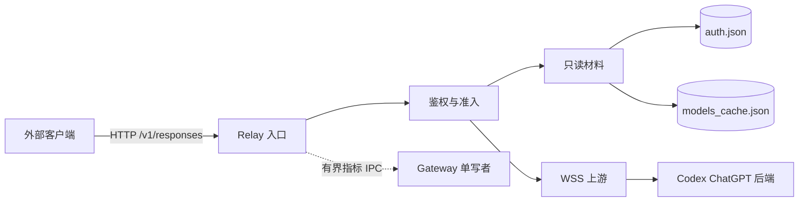

# Relay 只读 Codex 登录转发设计

> 状态标注：本文件是设计稿，尚未实施，不表示该能力已经可用；本文件也不构成实施、提交、
> 发布或部署授权。协议索引中的受控协议边界登记在实施阶段完成，在此之前不写入支持矩阵。

本文定义 Model Relay 只读复用本机 Codex 登录态、向外部客户端提供 Responses API 的方案。
目标是让已经登录的 Codex 直接成为转发上游，不引入第二次登录，也不接入 App Server 的
Thread、Turn、审批或工作区语义。

当前状态：设计稿，已按文档优化重排，尚未改动代码、配置、数据库或服务。

## 1. 结论与范围

- 上游凭据只读 `$CODEX_HOME/auth.json`，取 `tokens.access_token`、`tokens.account_id` 与
  `id_token` 中的账户声明；不刷新、不写回、不复制到配置或其他凭据存储。
- 未登录、使用 keyring 存储、文件缺失或不可读时，该 Provider 不可用并失败关闭，
  不回退到其他凭据来源，也不借用 App Server 的登录态。
- 刷新完全由 Codex 负责；Relay 在每次出站准备时重新读取当前值，不跨请求缓存。
- 第一版上游传输使用 Responses WebSocket（WSS）；客户端入口仍是 HTTP JSON/SSE。
- 只提供 `POST /v1/responses` 与受限的 `GET /v1/models`，只接受流式请求；
  不提供 Chat Completions，不做协议互转。
- 不创建 Thread、Turn、审批、工作区或渠道消息，不连接 App Server，不读取会话文件。
- 新增一个保留 Provider ID（暂定 `codex-auth`），与受管 Provider、自定义 Provider 并列。

明确不做：刷新令牌、写回 `auth.json`、自动重试、账户轮换、响应级会话引用、把登录态复制到
Gateway 配置、TLS 指纹伪装。

与既有能力的关系：这是新增的独立上游类型，不修改受管 Provider、自定义 Provider、
DeepSeek 等既有行为，不修改 StateStore、指标 Schema 或配置 Schema；现有 `[model_relay]`
配置无需迁移，只有显式引用 `codex-auth` 的调用方才受影响。

## 2. 固定事实来源

上游以 [`docs/upstream-sources.md`](upstream-sources.md) 锁定的 `openai/codex` `rust-v0.160.1`
（`d27764b82f7118f674371e6d6e76271d9d606edb`）为准：

- [`login/src/auth/storage.rs`](https://github.com/openai/codex/blob/rust-v0.160.1/codex-rs/login/src/auth/storage.rs)：
  `auth.json` 含 `auth_mode`、`OPENAI_API_KEY`、`tokens`、`last_refresh` 等；`tokens` 含
  `id_token`、`access_token`、`refresh_token`、`account_id`。默认存文件，keyring 由配置启用；
  保存使用原地 truncate 写入，不是原子重命名。
- [`login/src/token_data.rs`](https://github.com/openai/codex/blob/rust-v0.160.1/codex-rs/login/src/token_data.rs)：
  `id_token` 在磁盘上是原始 JWT 字符串，账户、套餐与 FedRAMP 声明需要本地解析。
- [`login/src/auth/manager.rs`](https://github.com/openai/codex/blob/rust-v0.160.1/codex-rs/login/src/auth/manager.rs)：
  access token 距过期 5 分钟内或 `last_refresh` 超期才刷新；刷新响应的 `refresh_token` 可为空；
  `refresh_token_reused`、`refresh_token_invalidated` 属永久失败。
- [`login/src/auth/default_client.rs`](https://github.com/openai/codex/blob/rust-v0.160.1/codex-rs/login/src/auth/default_client.rs)：
  默认 originator 为 `codex_cli_rs`；User-Agent 语法为
  `{originator}/{version} ({os} {osver}; {arch}) {terminal}`，无终端环境时终端标识为 `unknown`。
- [`model-provider-info/src/lib.rs`](https://github.com/openai/codex/blob/rust-v0.160.1/codex-rs/model-provider-info/src/lib.rs)：
  内置 `openai` Provider 为 `requires_openai_auth = true`、`supports_websockets = true`，
  默认携带 `version` 头；ChatGPT 认证下默认基础地址为 Codex 后端。
- [`model-provider/src/bearer_auth_provider.rs`](https://github.com/openai/codex/blob/rust-v0.160.1/codex-rs/model-provider/src/bearer_auth_provider.rs)：
  认证头为 `Authorization: Bearer <access_token>`、`ChatGPT-Account-ID`；FedRAMP 账户额外
  携带 `X-OpenAI-Fedramp`。
- [`core/src/client.rs`](https://github.com/openai/codex/blob/rust-v0.160.1/codex-rs/core/src/client.rs)：
  Responses WebSocket 的 beta 头名称与值为 `OpenAI-Beta: responses_websockets=2026-02-06`。
- [`models-manager/src/cache.rs`](https://github.com/openai/codex/blob/rust-v0.160.1/codex-rs/models-manager/src/cache.rs)
  与 [`models-manager/src/manager.rs`](https://github.com/openai/codex/blob/rust-v0.160.1/codex-rs/models-manager/src/manager.rs)：
  模型缓存文件为 `$CODEX_HOME/models_cache.json`，默认有效期 300 秒。
- [`protocol/src/openai_models.rs`](https://github.com/openai/codex/blob/rust-v0.160.1/codex-rs/protocol/src/openai_models.rs)：
  模型条目字段与 `visibility` 取值；ChatGPT 模式不要求 `supported_in_api`。
- [`app-server/src/request_processors/initialize_processor.rs`](https://github.com/openai/codex/blob/rust-v0.160.1/codex-rs/app-server/src/request_processors/initialize_processor.rs)：
  App Server 按连接客户端名与版本追加 User-Agent 后缀，并把最终值放进 `initialize` 响应；
  可用作头部一致性核对，但本方案不以 App Server 为运行依赖。

上游参考实现 `upstream/CLIProxyAPI`（`d33f63f8`）只用于核对 ChatGPT 后端路径、请求封装与
非流式聚合行为，不作为运行时依赖，不导入其代码。

本项目的既有实现边界：

- [`runtime/model-provider-relay-material.mjs`](../runtime/model-provider-relay-material.mjs)：
  Relay 上游材料形状与跨进程读取入口。
- [`runtime/model-relay-service.mjs`](../runtime/model-relay-service.mjs)：材料发布、revision
  复核、上游目标组装与在途请求取消。
- [`runtime/model-relay-material-worker.mjs`](../runtime/model-relay-material-worker.mjs)：
  私有材料读取、可失败原因与指标授权输入。
- [`src/provider-proxy/direct-model-http.ts`](../src/provider-proxy/direct-model-http.ts)：
  现有 HTTP 出站、客户端头过滤与固定头位置。
- [`src/model-relay/admission.ts`](../src/model-relay/admission.ts) 与
  [`src/model-relay/server.ts`](../src/model-relay/server.ts)：准入、错误码、协议选择、
  指标与转储回调。
- [`scripts/responses-websocket-probe.mjs`](../scripts/responses-websocket-probe.mjs)：已有
  Responses WebSocket 客户端、beta 头与 `response.create` 帧构造。

## 3. 端到端请求链路

1. 客户端携带 Relay Key 调用 `POST /v1/responses`。
2. 入口完成鉴权与准入，解析出调用方、账户与 Provider `codex-auth`。
3. 校验请求体、`stream` 必须为 `true`、模型必须同时位于调用方允许列表与模型目录交集内。
4. 只读读取材料：`auth.json` 提供凭据与身份声明，`models_cache.json` 提供模型清单。
5. 出站前同步复核材料 revision 与网络选择未变，防止吊销后继续出站。
6. 建立到 Codex 后端的 WSS 连接，写入固定请求头。
7. 发送按 WS 协议封帧的 `response.create`。
8. 上游事件按名称与 data 原样转换为客户端 SSE，不做语义改写。
9. 依据既有终态识别完成一次指标结算，Traffic 标签为 `relay.responses`，Thread/Turn 为空。
10. 取消、超时或断开统一关闭 socket、释放许可并进入既有清理路径。

## 4. 凭据只读语义

材料读取在既有 Relay 材料 worker 内完成，遵循现有私有文件校验、超时与失败关闭约定。
读取内容只有三项：`tokens.access_token`、`tokens.account_id`、`id_token` 中已解析的账户声明。

材料 `paths` 必须包含 `auth.json`，使 Codex 刷新后 Relay 能通过现有文件监听读到新值。
材料 revision 只覆盖账户身份（`account_id` 与关键声明）、上游地址与模型清单，
不包含 `access_token`。原因是现有服务在 revision 变化时会取消该 Provider 的全部在途请求；
若把令牌纳入 revision，Codex 每次按需刷新都会掐断正在生成的回答。

读取必须容忍原地 truncate 写入造成的半截 JSON：解析失败只做一次有界重试，仍失败即按
“凭据不可读”失败关闭。凭据缺失与凭据不可读必须给出不同原因，供 CLI、WebUI 与诊断区分。

运行依赖必须明确：Codex 需要保持可用以刷新 access token。Codex 不再运行时，令牌过期后该
Provider 即失败关闭，直到 Codex 重新刷新。这是只读复用登录态的固有边界，不是缺陷。

## 5. 模型目录来源

模型清单不新增配置字段，直接解析 Codex 维护的 `$CODEX_HOME/models_cache.json`，
与登录态同源、同目录、同生命周期。

文件结构为 `fetched_at`、可选 `etag`、可选 `client_version`、可选 `identity` 与 `models`
数组；模型条目以 `slug` 作为 ID，另含 `display_name`、`visibility`、`supported_in_api`、
`input_modalities`、`context_window` 等字段。

解析规则：

- 只接受 `visibility = "list"` 的模型；`hide` 与 `none` 不进入可转发清单。
- 不按 `supported_in_api` 过滤。ChatGPT 模式下上游按 `chatgpt_mode` 决定是否要求该标志，
  与 API Key 模式不同；此处跟随 ChatGPT 模式，避免漏掉仅 ChatGPT 可用的模型。
- `client_version` 必须与本机安装的 Codex CLI 版本一致；不一致时 Provider 不可用，
  不把其他 CLI 版本的目录当作当前目录。
- `identity` 是不透明字段，只做存在性校验，不做语义匹配；账户归属以 `auth.json` 声明为准。
- 缓存过期不单独阻断转发，但需在诊断中可见；模型授权仍受调用方允许列表约束。
- 文件缺失、结构非法、`models` 为空或模型 ID 非法时 Provider 不可用。

材料 `paths` 同时包含 `auth.json` 与 `models_cache.json`，两者变化都触发重读；
模型清单进入 material revision，`access_token` 不进入，理由同第 4 节。

`GET /v1/models` 与请求准入取调用方允许列表与该清单的交集，不请求上游 `/models`，
不从模型名推断能力。

## 6. 传输设计

客户端仍调用 `POST /v1/responses`；Relay 与上游之间建立
`wss://chatgpt.com/backend-api/codex/responses` 连接。

- 每请求建立一条连接：不复用会话、不自动重连、不在失败时回退 HTTP。
- 请求体在客户端 Responses body 基础上按 WS 协议封帧：补充 `type: "response.create"`，
  强制 `store = false`、`stream = true`，其余字段保持上游判断。
- 上游事件按名称与 data 原样转发为客户端 SSE；终态判定复用现有 Responses 观察器，
  不重新解释事件语义，不伪造完成。
- 取消、超时和关闭统一通过 AbortSignal 关闭 socket，进入既有清理与单次指标结算路径。
- 因为 WSS 只能流式，第一版对 `stream` 省略或为 `false` 的请求返回受控错误，
  不做本地聚合；非流式支持留待后续单独评估。

现有探测脚本的 beta 头、帧字段与事件校验可作为实现基础，但正式实现需要补齐背压、取消、
超时、转储、指标与关闭语义，不能复用脚本的探测流程。

## 7. 客户端身份与请求头

握手头按锁定 CLI 构造，客户端提供的同名头在过滤阶段一律剔除，不能被外部覆盖：

- `Authorization: Bearer <access_token>`
- `ChatGPT-Account-ID`
- `X-OpenAI-Fedramp`（仅 FedRAMP 账户）
- `originator`，默认 `codex_cli_rs`
- `version`，取本机安装的 Codex CLI 版本
- `User-Agent`
- `OpenAI-Beta: responses_websockets=2026-02-06`

User-Agent 使用上游同一语法，版本号来自本机 Codex CLI（例如 `codex --version`），不硬编码，
避免 CLI 升级后头部失真；终端标识按上游语义取值，无终端环境为 `unknown`。账户、套餐与
FedRAMP 声明从 `id_token` 解析，不额外查询账户接口。

头部一致性以真实 Codex 请求的 User-Agent 为核对基准。App Server 的 `initialize` 响应会返回
带客户端后缀的最终值，可用于验证；本方案自身对齐的是不带连接方后缀的裸 CLI 形态。

TLS 指纹不做伪装。Codex 使用 rustls，Node 侧与 rustls 的 ClientHello 无法逐字节一致，
额外引入浏览器指纹只会更偏离官方客户端，因此保持运行时原生 TLS。

## 8. 受控协议边界

`responses_websockets=2026-02-06` 属于实验能力。实施时必须先在
[`docs/index.md`](index.md#受控协议边界) 登记该能力、官方来源、本地入口与验证方式，
再接入运行时代码；仅存在生成类型不构成支持依据。该能力只用于本方案描述的
`/v1/responses` 上游传输，不得扩散到其他协议、方法或业务路径。

## 9. 模块职责与改动

| 模块 | 职责 | 改动 |
| --- | --- | --- |
| `runtime` | 只读凭据与模型目录解析、材料 revision、可用性与原因 | 新增 `codex-auth` 材料构造；worker 增加不可用原因；`listRelayProviderIds` 加入保留 ID |
| `src/provider-proxy` | 出站传输、固定头、客户端头过滤与观测 | 目标支持不可覆盖的固定头；新增 Responses over WSS 发送器；过滤补充 ChatGPT 相关字段 |
| `src/model-relay` | 准入、协议与流式校验、错误映射、指标与转储 | 复用既有准入与队列；新增 `stream` 校验与对应错误码 |
| `runtime/model-relay-service.mjs` | 目标组装、网络选择、revision 复核 | 组装 WSS 目标与固定头；revision 仅覆盖身份与配置 |
| `scripts`、WebUI | 展示 Provider、可用性与原因 | `codexc relay providers` 与管理页展示新 Provider 及其不可用原因 |
| `docs` | 受控边界、用户指南、索引与本方案 | 实施时同步更新 |

不新增数据库 Schema：复用现有 `relay.responses` 标签、调用方维度与转储预算。
不新增运行时依赖：`ws` 已是运行时依赖。不新增配置字段：模型清单来自 `models_cache.json`。

## 10. 失败与错误映射

入口对外只暴露既有受控错误结构（`code`、`phase`、`request_id`、已知 `upstream_status`），
不返回文件内容、令牌或上游自由文本。

| 情形 | 表现 | 说明 |
| --- | --- | --- |
| 未登录、`auth.json` 缺失 | Provider 不可用，已鉴权请求返回 503 `provider_unavailable` | `relay providers` 显示独立原因，暂拟 `not_authenticated` |
| keyring 存储 | 同上 | 暂拟原因 `credentials_store_unsupported` |
| `auth.json` 不可读或解析失败 | 同上 | 暂拟原因 `credentials_unreadable` |
| `models_cache.json` 缺失、非法或版本不一致 | 同上 | 暂拟原因 `model_catalog_unavailable` |
| `stream` 省略或为 `false` | 400，新增受控码 | 暂拟 `stream_required` |
| 模型不在授权列表或目录交集 | 403 `model_not_allowed` | 既有行为，出站前拒绝 |
| WSS 握手 401 | 受控上游错误，携带已知 `upstream_status` | 不回显上游正文 |
| WSS 在终态前断开 | 失败终态 | 不伪造成功，不自动重试 |
| 客户端取消、超时或 Relay 关闭 | 既有 499/504/503 语义 | 复用现有清理与结算路径 |

未登录与不可读属于同一条失败关闭路径：请求在出站前结束，不产生上游调用指标。

## 11. 安全与脱敏

- `auth.json` 含长期 refresh token，读取必须走私有文件校验与权限检查；Relay 不保存副本，
  不写入配置、指标或转储；`Authorization` 已由现有遮罩规则覆盖。
- 账户标识会出现在出站头与转储中，实施时确认可见级别与遮罩口径。
- 出站固定头在客户端头过滤之后写入，客户端无法伪造或覆盖身份头。
- 不自动重试任何模型调用；失败进入既有取消与清理路径。

## 12. 验证计划

实现审查范围：

- 材料读取：正常、未登录、keyring、半截 JSON、权限错误、身份声明解析失败。
- 模型目录：正常、缺失、结构非法、空数组、`visibility` 过滤、`client_version` 不一致、
  缓存过期的诊断可见性。
- 头部：UA、originator、`version`、账户头、FedRAMP 分支与 beta 头；客户端同名头不可覆盖。
- 传输：WS 帧封装、事件到 SSE 映射、终态、取消、超时、断连与关闭清理。
- 语义：`stream` 省略或为 `false` 被拒；凭据轮换不取消在途请求；revision 仅随身份与目录变化。
- 指标与授权：新 Provider 可被授权；未知 Provider 与未绑定调用方仍被拒。

人工验收：先用一次最小 WSS 调用确认后端接受，再验证一次 access token 过期后的失败与恢复。
该步骤使用真实账号与额度，需要单独授权后执行。除非后端明确拒绝 HTTP，本方案不验证 HTTP 回退。

## 13. 分阶段实施与回退

| 阶段 | 完成条件 | 当前状态 |
| --- | --- | --- |
| P0 | 登记受控协议边界、确认头部与凭据口径、确定保留 ID 与模型清单来源 | 未开始 |
| P1 | 只读凭据、模型目录与失败路径完成审查，不接出站 | 未开始 |
| P2 | WSS 上游传输、头部对齐、取消与指标贯通，隔离链路通过 | 未开始 |
| P3 | 真实调用验证、CLI 与 WebUI 展示、文档与索引收口 | 未开始 |

回退不需要数据迁移：从 Key 授权模型中移除 `codex-auth` 引用；若不再保留任何模型，删除对应 Key。
不提供 Relay 旧配置回退命令；`auth.json`、`models_cache.json`、
Codex 登录态与历史指标均不修改。

## 14. 未决事项

- 保留 Provider ID 定名，以及已有自定义 Provider 占用同名时的拒绝策略。
- 缓存过期是降级为诊断警告，还是与 `client_version` 不一致一样要求新鲜度。
- `visibility = "hide"` 的模型是否允许通过显式授权 ID 调用；当前默认不进入清单。
- 账户标识在转储中的遮罩级别。
- 上游 User-Agent 是否对齐 App Server 的带后缀形态；当前对齐裸 CLI 形态。
